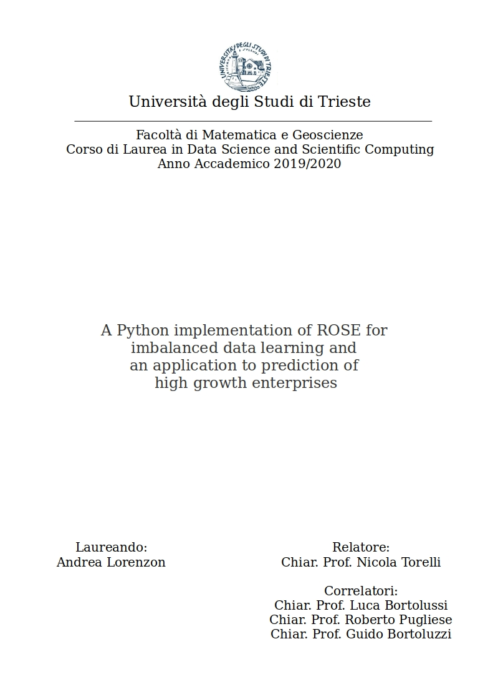

------


**Table of contents**

[TOC]

# Introduction

> *“It is the time you have wasted for your rose that makes your rose so important.”*  - Antoine de Saint-Exupery

Imbalanced learning refers to a classification problems where the distribution of the target variable is extremely skewed: some classes are more frequent than others. Common examples of such problems are churn, fraud and anomaly detection and clinical data, when one of the classes is rare because problematic, costly,  unethical, dangerous to produce, or unexpected. Class unbalancing, specified as the proportion in the number of samples in different classes, can reach values in the orders of $10^2\div 10^4 : 1$ and up to $10^5:1$ [^Provost, 2001]


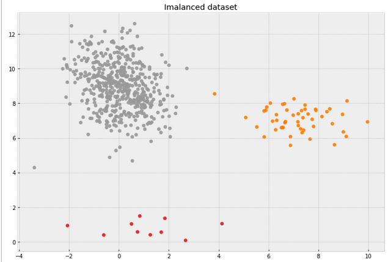

*Fig. 1 Examples of synthetic balanced and imbalanced datasets.*

Most real datasets does not have exactly equal number of instances in each class, and while a small difference seldom matters, a heavy imbalance can quickly become a bottleneck in model training. Most learning methods have been conceived to identify the classification rules that better fits the data by some global accuracy criteria. Their target is to minimize the global error, that may not be influenced enough from the minority class. Some methods, like the broadly used logistic regression, is more vulnerable to this effect, but even non-parametric methods, like trees, and association rules, are not immune from this effect. For example tree generated from imbalanced datasets will have an high accuracy on the prevalent class and a very low precision in identifying the rare event. It appears evident how things become worse when the minority class is the event of interest, like a positive diagnosis of cancer in a patient.

A brief description of the sections of this work:

**More data, less data.** The most heard sentence in machine learning community is "You need more data!". Still, a large dataset might indeed expose a different, and perhaps more balanced perspective on the classes: more minority examples can indeed be useful. Other strategies may include considering more than once one or more minority samples. Chapter 1 will review the bibliography about solution for this  problem, giving a view over cost-sensitive learning and different oversampling and undersampling methods, their advantages and disadvantage.

**Random Over Sampling Examples** In chapter 2 we will focus on one of these techniques, henceforth named just by its acronym ROSE, that propose a smart, albeit simple, way to generate new data from existing ones.

**The Accuracy Paradox**. To assess the performance of a solution a metric is needed. When a class represent almost the totality of a dataset, a learning algorithm can achieve a good accuracy by classifying every test sample as belonging to the majority class. To avoid this problem, different metrics has been developed to assess the real model utility and assessing capabilities. Chapter 3 will review available metrics that can be used to effectively evaluate performance of resampling methods.

**A method is as good as it is available.** Rose is already available since 2014 with the R package ROSE, and it proved to be successful in many situations[^Menardi, 2014]. To make Rose available to a larger community of data scientists is one of the main goals of this work, and it involved incorporating it in the most used Python machine learning package, `scikit-learn` , and in particular in its sub-project `imbalanced-learn`. We will overview the development methods, CI/CD, software testing and documentation, in chapter 4.

**But is it good?** In chapter 5 will set up a wide testing framework for evaluating performance of resampling methods over 27 different famous standard datasets commonly used for classification problems. Different supervised models has been trained and tested on imbalanced and balanced data, and their performance reported. But toy datasets are usually easier to balance. In chapter 6 we used ROSE to dramatically improve classification capabilities of some models for the analysis of a real-world dataset, with the aim of forecasting the economic outcome of small firms.

**How can I use it?** In appendix 1 we will show code snippets, use cases and links to repositories that will facilitate user's experience with ROSE, and guarantee repeatability of all experiments included in the present world.

# Imbalanced learning

## Imbalanced dataset problem

Despite the fact that in literature most imbalanced learning problems are traditionally referred to binary datasets, real world datasets can often be multiclass, as in microarray research[^Yu, 2013], protein classification [^Zhao, 2008], medical diagnostics[^Cerf, 2013], activity recognition[^Gao, 2014], target detection[^Razakarivony, 2016], and video mining[^Gao2, 2014]. Extending imbalanced classification to multi-class scenarios is a natural path, then. As the number of classes increases, so does the challenge of representing the whole problem space accurately, and the need for taking into account the presence of multi-minority and multi-majority classes [^Wang, 2010]. 

In many problem, imbalancing is intrinsically tied to the nature of the data, and not due to lack of sampling, bias, or other sampling errors. In other cases no enough samples of a specific class exists at all.

Most learning methods' loss functions are supposed to be minimized globally, under the assumptions that all class have the same weight. When data are imbalanced, the learning process  often achieves this objective by focusing on majority class, leading to bad performance [^Ganganwar, 2012], with higher errors on minority classes. 

The lack of model effectiveness in prediction of rare classes has been deeply discussed in literature. Both parametric and non parametric methods appear to be sensitive to imbalancing. As an example in logistic regression, one of the most used for binary classification, this effect depends from an underestimation of conditional probability of the rare class [^King, 2001],[^Menardi, 2014]. 

Even the more flexible non-parametric methods, like classification trees and association rules are immune from the effect of asymmetric class distribution. Trees, for example, are being grown finding the recursive divisions of the parameter space that maximize the impurity reduction. The imbalance found in the dataset will be often mirrored in the imbalance of the accuracy over different classes [^Menardi, 2014], [^Chawla, 2003]. Even association rules, being selected by their supports, tend to underperform[^Gue, 2003],[^Ndour, 2012].

## Treating imbalanced datasets

Many solution has been advanced to treat imbalanced data problems. Most fall in one of the following two approaches: using cost-sensitive learning models, and resampling the data.

### Cost-sensitive learning

Cost sensitive learning is an umbrella term for algorithms in whose objective function it is possible to assign a different cost to misclassification of different classes. An intuitive example of this approach can be imagined when talking about a binary clinical cancer test: a false positive will lead to some extra exam, while a false negative will probably cost a life. The most logical decision is to estimate the relationship between these costs, and assign a larger (*hopefully, much larger*) cost to a false negative.

For multiclass data, a cost matrix $\mathbf C$ is computed, where $\mathbf C_{i,j}$ will be the cost of misclassifying a sample belonging to the class $j$ as it were belonging to the class $i$ [^Liu, 2006], [^Zhou, 2010]. Note that introducing a different loss function to deal with different costs in some cases implies modifying the original algorithm.

### Resampling

A different, alternative approach against imbalancing can be tried by preprocessing the data, instead of modifying the learning rules, using sampling methods. This approach has consistently proven effective, with different degrees [^He, 2009],[^Weiss, 2003]. Different resampling methods has been proposed, falling in two categories:

* undersampling methods, where majority class samples are being randomly discarded to remove imbalancing, at the price of sample size, in a non-heuristic way;
* oversampling methods, where different techniques can be used to generate new minority samples from the existing ones. The following sub-chapters (1.1.3 and 1.1.4) gives an overview of these methods.

Oversampling and undersampling presents different pro and cons, leading to the need of an empirical comparison between different methodologies.

| Methods       | Pros                                            | Cons                                                |
| ------------- | ----------------------------------------------- | --------------------------------------------------- |
| undersampling | faster learning                                 | loss of sample size                                 |
| oversampling  | slower learning<br />higher computational costs | introduction of artifacts<br />possible overfitting |
|               |                                                 |                                                     |

Despite those problems, resampling is more commonly used than cost-sensitive learning, that is not supported for all learning methods.

### Undersampling strategies

Undersampling reduces the size of majority class to avoid imbalancing. In this paragraph we will provide an overview over commonly available undersampling strategies.

* **Random UnderSampler (RUS)**: it works by simply choosing random samples from the majority class.
* **Condensed NN**: [^Hart, 1968] uses a 1-nearest neighbor rule to iteratively decide if a sample should be removed or not. It is sensitive to noise and will generate noisy samples. 
* **One Sided Selection** [^Kubat, 1997]and **Tomek Links** instead tends to remove noisy samples. 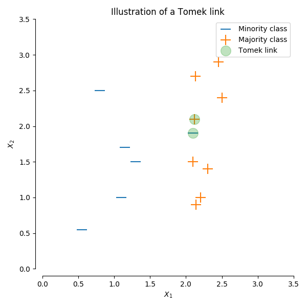
  *Fig 2: Tomek link strategy for undersampling. Tomek links nodes, classified as noise, can be removed.*

* **Edited NN** and **Repeated Edited NN** [^Wilson, 1972]  apply (respectively one of more times) a nearest-neighbors algorithm and “edit” the dataset by removing samples which do not agree “enough” with their neighborhood. For each sample in the class to be under-sampled, the nearest-neighbors are computed and if the selection criterion is not fulfilled, the sample is removed. The criterium can be based on majority, or totality of nearest neighbors belonging to the same class of the inspected sample to be kept in the dataset.
* **All KNN** is another iterative process that does the same of the latter, but incrementing at each iteration the number of  considered neighbors.
* **Near Miss** [^Mani, 2003] is a collection of three different algorithms that respectively:
  * selects the majority samples for which the average distance to the $k$ *nearest* neighbors of the minority class is the *smallest*, or
  * selects the majority samples for which the average distance to the $k$ *farthest* neighbors of the minority class is the *smallest*, or
  * first keel the $M$-nearest neighbors are kept, then, the majority samples selected are the one for which the average distance from the $k$ nearest neighbors is the  *largest*.
* **Neighborhood Cleaning Rule**[^Laurikkala, 2001] focuses on cleaning the data without condensing them.
* **Instance Hardness Threshold** [^Smith, 2014] trains any classifier on the data, and the samples with lower probabilities are removed from the dataset. It is not guaranteed to output a balanced dataset, though.

### Oversampling and synthetic data generations

In this section we present the most commonly used oversampling techniques and their variants:

* Synthetic Minority Oversampling TEchnique (SMOTE) based
* ADAptative SYNthetic sampling (ADASYN).

#### SMOTE based methods

**SMOTE**[^Chawla, 2002] is a class of resampling algorithms that use the following approach:

* a random sample from the minority class is chosen
* his $k$-neighbors are found (default k=5)
* lines are drawn from the original sample to the neighbors
* new examples are drawn randomly along these lines, with $x_{new} =x_i +\lambda * (x_{nn}-x_i)$, where $\lambda$ is drawn from $Uniform(0,1)$, or other distributions.


*Fig. 3 : SMOTE general resampling concept. New samples are generated along the lines connecting minority sample, with different distributions and strategies.*

There are many variants of SMOTE that has been developed to improve its performance. 

**Borderline SMOTE** [^Han, 2005] will classify each sample $x_i$ to be:

1. *noise*, when all k-neighbors are of a different class from $x_i$ 
1. *in danger*, when at least half of the neighbors belongs to the same class
1. *safe*, when all neighbors belongs to the same class.

The algorithm will then use "*in danger*" samples to generate new samples, with the same procedure of SMOTE.

**K-Means SMOTE** [^Last, ArXiV] uses a K-Means clustering method before to apply SMOTE. The clustering will group samples together and generate new samples depending of the cluster density.

**SMOTENC** [^Chawla, 2002] slightly change the way a new sample is generated by performing something specific for the categorical features. In fact, the categories of a new generated sample are decided by picking the most frequent category of the nearest neighbors present during the generation.

**SVMSMOTE** [^Nguyen, 2009] fits a Support Vector Classifier to find support vectors and generate samples considering them. Tuning the $C$ parameter of the SVM classifier allows to select more or less support vectors.

#### ADASYN

ADASYN [^He, 2008] works similarly to the regular SMOTE. However, the number of samples generated for each $x_i$ is proportional to the number of samples which are not from the same class than $x_i$ in a given neighborhood. Therefore, more samples will be generated in the area where the nearest neighbor rule is not respected.

#### Combination and Ensemble methods

Combinations of different methods can be used efficiently. SMOTE based methods can generate noise when generating point between marginal outliers and inliers. After the resampling this issue can be solved by cleaning the space resulting from oversampling.

Two methods used for this purpose are:

* **Tomek's links**: [^Batista, 2004] an undersampling technique used to remove unwanted overlaps between classes, where majority class links are removed until minimally-distanced neighbors pairs belong to the same class. Two instances form a Tomek's link if:

  * one of them is noise (*see Borderline SMOTE definition of noise)*, or
  * both are near a border

  In other words, if they are each other's closest neighbor, and of different classes.

* **Edited nearest-neighbors** [^Batista, 2003] uses asymptotic convergence properties of nearest neighbor rules that use an editing procedure to reduce the number of preclassified samples and to improve performance [^WIlson, 1972]

Ensemble methods can be used generate undersampled subsets of many different oversampled datasets, or by bagging different undersamplers. Additionally, pipelines can be assembled, to chain different methods.

# Random over-sampling examples (ROSE)

ROSE[^Menardi, 2014] provides a different methodology to deal with imbalanced samples. As its alternatives do, it alters the distribution of the classes, using the following solution, based on the generation of new artificial data from the classes, according to a smoothed bootstrap approach [^Efron, 1993]. It focuses on $\mathcal X$ domains included in $\Bbb R^d$ , that is $P(\pmb x)=f(\pmb x)$, a probability density function on $\mathcal X$. We consider that $n_j\lt n $ is the size of $\mathcal Y_j,j=0,1$. The ROSE procedure to generate a single new artificial sample consists in drawing a sample from $K_{\mathbf H_j}(\bullet,\mathbf x_i )$, with $K_{\mathbf H_j}$ a probability distribution centered at $\mathbf x_i $, and $\mathbf H_j$ a matrix of scale parameters, determining the width of the extracted sample neighborhood.

Usually $\mathbf H_j$ is chosen in the set of unimodal symmetric distributions. Once a class has been selected,
$$
\label{eq:sampling}
\begin{align}
\hat f(\mathbf x|y=\mathcal Y_j) &= \sum_{i=1}^{n_j}p_i Pr(\mathbf x|\mathbf x_i) \\
&=\sum_{i=1}^{n_j} \frac{1}{n_j}Pr(\mathbf x|\mathbf x_i) \\
&=\sum_{i=1}^{n_j}\frac{1}{n_j} K_{\mathbf H_j}(\mathbf x - \mathbf x_i).
\end{align}
$$

such as, in this framework, the generation of new examples from the class $\mathcal Y_j$ will correspond to the generation of data from the kernel density estimate of $f(\mathbf X|\mathcal Y_j)$, to generate a new synthetic balanced training set $\mathbf T^*_m$. Usually $m$ is set to the size of majority class, but can be set lower to perform under-sampling. The choice of $K$ and $\mathbf H_j$ was addressed by a large specialized literature on kernel density estimation [^Bowman, 1997]. By letting the elements of  $\mathbf H_j$ to be small or even zero, ROSE collapses to a standard combination of over- and under-sampling.

Apart from enhancing learning, the generation of synthetic examples from an estimate of conditional densities of the classes may aid the estimation of learner accuracy and overcome the limits of both resubstitution and holdout methods. Resampled datasets can be efficiently employed in leave-K-out or bootstrap estimation. 

## Assumptions

ROSE requires that the resampled variables are of numeric type, being impossible to fit a multivariate kernel on unordered categorical variables. This can include variables with limited  numeric support (e.g. $\{0,1\}$, or percentage values. For the latter, problems rise near the extreme values 0 and 100).  In some cases, this problem can be solved using transformations, like taking the logarithm.

Variables belonging to $\mathbb N$ could generate non-integer samples. This problem can be contained by rounding.

Variables belonging to $\mathbb N^+$ or $\mathbb R^+$ domains poses another problem, since samples drawn from the kernel function are not guaranteed to be positive. This particular problem can be contained by a log-transform of the original dataset parameters.

Relatively to our work described in Chapter 4, future development of ROSE will consider the option to extend the class by including type inference or by collecting `numpy.array` and `pandas.DataFrame` dtypes data to dynamically change the random sampling function.

## Kernel methods

Since 90s estimation and learning methods using positive definite kernels have become popular, particularly in machine learning [^Hofmann, 2008]. Real world analysis problems ofter require nonlinear methods to detect the kind of dependencies that allows successful prediction of properties of interests.

The operational use of ROSE requires a prior specification of the  $\mathbf H_j$  matrices. In principle this leads to a criticality, since different choices of the smoothing matrices leads to larger or smaller $K_{\mathbf  H_j}$, namely larger or smaller neighborhoods of the observations from which the synthetic samples are generated. There is a large body of literature on methods of choice of the smoothing parameters [^Silverman, 1986] , [^Bowman, 1997]. The idea beyond these methods is to minimize an optimality criterion, as the asymptotic mean integrated squared error (AMISE).
$$
\begin{equation}
AMISE(h;r)=\frac{R(K^{(r)})}{nh^{2r+1}}+\frac{1}{4}h^4\mu_2^2(K)r(f^{(r+2)})
\end{equation}
$$
Among all possible alternatives, Menardi and Torelli's proposal is to start by using   a Gaussian Kernel with diagonal smoothing matrices $\mathbf H_j = diag(h_1^{(j)},\dots,h_d^{(d)})$ , and minimize AMISE.

This leads to:
$$
\begin{equation}
h_q^{(j)}=\left(\frac{4}{(d+2)n}\right)^{1/(d+4)}\hat\sigma_q^{(j)} (q=1,\dots,d; j=class)
\end{equation}
$$
where $\hat\sigma_q^{(j)}$ is the sample estimate of the standard deviation of the $q$th dimension of the observation belonging to the class $\mathcal Y_j$. Despite the naivety of this approach, authors reports good results, since the only interest is producing a reasonable neighborhood where to sample the new data from, and happens to perform well even if $f(\mathbf x|y=\mathcal Y_j)$ is not $Normal$ , just unimodal.

Choice of $\mathbf H_j$ smoothing matrix gives control on data generation:

In the following image we generated three blobs of examples from multivariate normal distributions. For the three classes, $n$ will be respectively 33, 50 and 170.


*Fig: 4  Example of unbalanced classes before resampling.*

In the next figure, we used ROSE to rebalance the datasets, and bring $n$ to a total of 300 examples per class.


*Fig 5 : rebalanced datasets. Original data points in fig. 4 are marked with gray crosses.*

Rose can use a **shrink factor** vector, to shrink kernels independently for each class. The following figure show how, decreasing the shrink factors, new data will be more and more closely clustered around original data points.

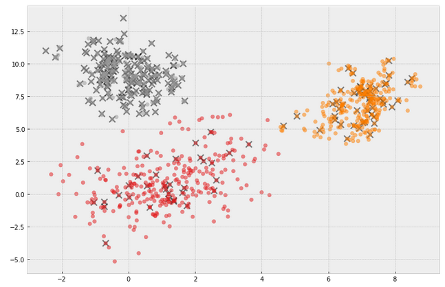

*Fig 6 The same resampling of figure 5, but using different shrink factors: $grey=0.2, orange=0.5, red=1$. Note how new data are more or less tightly clustered around original individual examples.*


# Metrics

Evaluating performance is a critical part of building a machine learning model. In this chapter we will describe some of these tools, and how to choose the best one for our purposes in imbalanced data problems.

## Confusion matrix

Confusion Matrices (henceforth CM) are tables that can be used to describe the performance of a classifier on a test set of data for which true values are known. They are detailed and simple to understand, but does not summarize well the performance.

|     n = 165 | Predicted: NO | Predicted: YES |
| ----------: | :-----------: | :------------: |
|  Actual: No |      50       |       10       |
| Actual: Yes |       5       |      100       |

*Table 1 : An example of a confusion matrix for a binary classifier.*

On the diagonal we find correctly predicted samples (true negatives, or TN, and true positives, or TP), leaving misclassified data on other cells (false positives, or FP, and false negatives, or FN). Confusion matrices can be extended to multiclass classifiers, their size becoming $j\times j$, for classes in $\mathcal Y_j$. Sums over rows and column will describe the total of actual vs predicted predictions. We have seen how secondary indexes can be computed form these values and their ratios.

When describing a model's performance, the simplest yet most common classification metric is its $Accuracy$ , defined as 
$$
Accuracy = (TP + TN)/(TP + TN + FP + FN)
$$
This can be misleading, when the problem uses imbalanced data. Consider a sample with a 100:1 imbalance ratio. Classifying all values as the majority class will gives a $\sim 99\%  Accuracy$ score. [^Mower, 2005]. Different solutions has been proposed to solve this issue. For example, $Balanced Accuracy$ score, defined as 
$$
Balanced\ Accuracy = \frac{\frac{TP}{P}+\frac{TN}{TN+FP}}{2}
$$
can help. Another metric is $Predicted\ positive\ condition\ rate$, defined as
$$
Predicted\ positive\ condition\ rate = \frac{TP+FP}{TP+FP+TN+FN}
$$
which identifies the proportion of the total population correctly identified. Two other commonly used index is $F1$ score and Matthews correlation coefficient. Is this case there is no need of considering a threshold for algorithms that outputs a probability score, instead of the guessed class.

More informative visualizations of model performances can be given not by indices, but by plots, like Receiver Operating Characteristics and $Precision$ vs $Recall$ plots and associated indexes like Area Unde the Curve (AUC), that deserve a dedicated description in the following sub-chapters.

Additional metrics that can be extracted from CM are 

* Cohen's Kappa, that is a measure of how well the classifier performed as compared to how well it would have performed simply by chance. We left it out after bibliography reported unreliable results due to high sensitivity to the distribution of the marginal totals [^Flight, 2015]
* Null Error Rate, that is how often you would have been wrong if you always predicted the majority class. This can be used as a useful baseline metric to compare a classifier against. Still, the Accuracy Paradox tells us that sometimes the best classifier will still have an high error rate than the null error rate.
* $F_1$ score. Since we will use it in our test suite later, we will dedicate next sub-chapter to its description.
* $K$ measure, a theoretically grounded measure that relies on a strong axiomatic base.[^Sebastiani, 2015]
* confusion entropy, a statistical score comparable with Matthews correlation coefficient, treated below.
* Power's informedness and markedness [^Powers, 2011], a couple of interesting alternative metrics that respectively describe how a binary predictor is informed in relation to the opposite condition, and the probability that the predictor correctly marks a specific condition.
* Mattew's correlation Coefficient (MCC), exhaustively treated in a following sub-chapter.

Despite their effectiveness, most of the aforementioned measures does not appear to have achieved such a diffusion in the literature to be considered a solid alternative to MCC and $F_1$ score. They are good single-valued indicators of performance, supported by a strong bibliography, and useful to compare large numbers of tests.

To have a deeper comprehension of a model's performance we used other two plotted tools: Receiving Operator Characteristic and Precision/Recall plots. The following sub-chapters will describe our four tools in depth.

## $F_1$ Score 

Called also F-score or F-measure, is an accuracy metric, calculated from the precision and recall of the test. 


$$
\begin{align}
Precision &= \frac{TP}{TP+FP}\\
Recall&=\frac{TP}{TP+FN}\\
F_1&=2*\frac{precision* recall}{precision+recall}\\
&=\frac{2*TP}{2*TP+FP+FN}\\
\end{align}
$$


It is a particular case of the more general $F_\beta$ score, defined as
$$
\begin{align}
F_\beta&=(1+\beta^2)\frac{precision *recall}{(\beta^2*precision)+recall}
\\
&=\frac{(1+\beta^2)*TP}{(1+\beta^2)*TP+\beta^2*FN+FP}
\end{align}
$$
where recall is considered $\beta$ times as important as precision. a $\beta\gt1$ will increase recall importance, while $0\lt\beta\lt1$ will weight recall lower than precision [^Van Rijsbergen, 1986]. It has recently been criticized as less informative and truthful than Mattews Correlation Coefficient (see below), especially for imbalanced classes.[^Chicco, 2020], and the adoption of new metrics is being suggested, like Informedness (Youden's J statistic)[^Youden, 1950] and Markedness[^Henning, 1989], in fields like biology and linguistics. When using geometric mean instead of harmonic mean of recall and precision it is known as Fowlkes-Mallows index [^Fowlkes, 1983]. In multiclass cases, researchers can employ the $F_1$ micro-macro averaging procedure. [^Tague, 1992]. Micro-averaging puts more emphasis on common labels in the dataset, since it gives each sample the same importance, measuring $F_1$ score of the aggregated contribution of all classes. In macro-averaging the same importance is instead given at every class, regardless of their frequency: a separate $F_1$ score is computed for each class, and then they are averaged. It may overestimate the score for imbalanced problems.


## Matthews correlation coefficient (MCC)

Accuracy and $F_1$ score computed on confusion matrices have been (and still are) among the most popular adopted metrics in binary classification task [^Chicco, 2020]. However these measures can show overoptimistic inflated results, especially on imbalanced datasets. The Mattews correlation coefficient (henceforth, MCC) is instead a more reliable statistical rate which encompass all for confusion matrix categories (TP, FP, TN, FN), proportionally both to the size of positive and negative elements in the dataset. 


$$
\begin{align}
MCC &=  \frac{TP\times TN-FP\times FN}{\sqrt{(TP+FP)(TP+FN)(TN+FP)(TN+FN)}} \\
&=\sqrt{\frac{\chi^2}{n}}
\end{align}
$$

It derives from Guilford's $\phi$ coefficient[^Guilford, 1954]. Originally developed by Mattews in 1975 for comparing chemical structures, it has been re-proposed by Baldi et al [^Baldi, 2000] as a standard performance metric in the multiclass case, and American Food and Drug Administration (FDA) employed it as main evaluation measure in Microarray II / Sequencing Quality Contro (MAQC/SEQC)[^FDA, 2010]. Nonetheless, it has been reported to suffers from instability in case of imbalanced outcomes. [^Brown, 2018]. Despite the existence of Bayesian based improvements and mathematical workarounds, they have not been adopted yet.

## Receiver Operating Characteristic (ROC) and AUC

A Receiver Operating Characteristic (ROC) curve is a plot that summarizes the performance of a binary classification model on the positive class. The x-axis indicates the False Positive Rate and the y-axis indicates the True Positive Rate. 

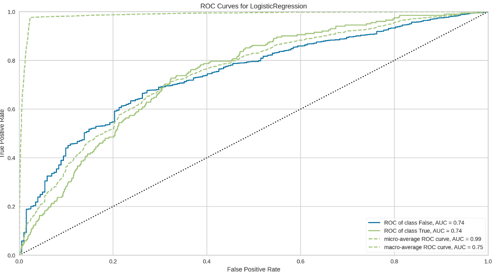

*Fig 7 : Example of ROC curve. AUC (Area under the curve) are shown in the bottom-right legend.*

A ROC gives an intuitive visualization of a classifier performance: the dotted diagonal represent a classifier with no discriminative power, and the more the curve tends to the upper-left corner, the better the classifier is. The area under the curve (AUC) gives a commonly used single-valued index of performance. The threshold is applied to the cut-off point in probability between the positive and negative classes, which by default for any classifier would be set at 0.5, halfway between each outcome (0 and 1) or in some cases, the observed proportions of 1s in the dataset. A trade-off exists between the TP rate an FP rate, such that changing the threshold of classification will change the balance of predictions towards improving the TP rate at the expense of FP rate, or the reverse case.

By evaluating the true positive and false positives for different threshold values, the ROC curve is drawn. An interesting property is that the ROC is unbiased towards model that performs well on the minority class at the expense of the majority class, or vice versa, making it an interesting choice when dealing with imbalanced data.

## Precision-recall plots

Precision-recall plots are a powerful visualization tool to evaluate binary classifiers, closely related to the Receiver Operating Characteristic described in the precedent sub-chapter. It shows the relation between these indexes, at the variation of a threshold


*Fig 8: Precision-recall plot of a logistic regression model. Bands are confidence interval around values. Queue rate can be seen as the "spam folder" or the inbox of the fraud investigation  desk. This metric describes the percentage of instances that must be  reviewed. If review has a high cost (e.g. fraud prevention) then this  must be minimized with respect to business requirements; if it doesn’t  (e.g. spam filter), this could be optimized to ensure the inbox stays clean.*

# Implementation of ROSE in the `imbalanced-learn` Python package

As we said, a tool is useful only if it available. ROSE has an already available R implementation [^ROSE CRAN]. Despite R being the favored programming language among statistician, Python is quickly rising in popularity, and over the years tens of thousands of packages were offered to help researches in mathematic and statistic fields. We decided to avoid contributing on closed source, expensive or ineffective softwares like MatLab, Excel, Stata, SPSS, and contributing to the community by choosing Python.

As of the date of this writing, the best way to start an argument in a group of data scientists is posing the question "So, Python or R?". This work will stay as far as possible from taking a side in this dilemma, both languages offering many pro and cons, opportunities and flaws.

Instead of the simpler choice of publishing a stand-alone library, we decided to maximize the availability of the code extending the already-available `imbalanced-learn` library[^imblearn], that is a contributor of the well known `scikit-learn` project[^sklearn]. 

This package offers a lot of functionalities, models and mathematical tools, and its main characteristic is the standard API of its classes, that makes them versatile.

Computationally speaking, ROSE resampling is obtained with the following algorithm (pseudocode):

```
define make_samples (X,y,n,h_shrink):
	 n = number of samples to be created
	 p = number of features
	 S = subset of samples randomly selected from X
	 minAMISE = (4/((p+2)*n))**(1/(p+4))
	 vars = variance/convariance matrix of all classes
	 hOPT=h_shrink*minAMISE*vars
	 randoms = multivariate_normal(size=(n,p))
	 rose = randoms*hOPT + S
	 return rose
```

It uses the well known `numpy` library for matrix calculations and sampling.

## `scikit-learn` context

`scikit-learn` (also known as `sklearn`) is a free software machine learning library for Python. It features algorithms for classification, regression, and clustering, including Support vector machines, tree-based models, boosted models, k-means, and DBSCAN. It is built around the famous `numpy` and `scipy` packages, with some routines written in Cython, to improve performance. Some functions are just wrapping other libraries, like LIBSVM or LIBLINEAR.

It was born in 2007 for the Google Summer of Code competition as "SciKit" (SciPy Toolkit), a third party extension of `SciPy`. The original codebase has been rewritten in 2010 by Fabian  Pedregosa, Gael Varoquaux, Alexandre Gramfort and Vincent Michel.

It offers a curated integration with different other Python libraries, like `matplotlib` or `plotly` for plotting, `Pandas` dataframes, `sparse` arrays, `numpy` objects, `scipy`, `tensorflow`, `keras`, and more. Among these API-compatible packages we can find `imbalanced-learn`.

At the moment of this writing, the last version number is 0.23.0 (released in May 2020).

## Test driven development

Development in `imbalanced-learn` packages follows strict guidelines, as explained in the project documentation. Pull requests are to be submitted at https://github.com/scikit-learn-contrib/imbalanced-learn/pulls .

If accepted, they can be marked for review by the sender. With a fast and effective peer review process, they enter the project Continuous Integration / Continuous Deployment process (henceforth, CI/CD).

At the moment there are 1588 test units for `imbalanced-learn`, embracing library compatibility, mathematical correctness, error tolerance and numeric problems.

Most test units already encompass mathematical correctness, but we still added a unit to check if the variance/covariance matrix of resampled data is similar to the one of the original dataset, and some check about correct handling of sparse arrays and Pandas dataframes.

Extra test units verify PEP-8[^PEP8] compliance about linting and code style. Commit history  and review process is available. [^commits] An example of a successful pipeline build can be read at https://lgtm.com/projects/g/scikit-learn-contrib/imbalanced-learn/logs/languages/lang:javascript

## Github and Azure CI/CD

CI/CD is a modern DevOps tool. Code is automatically and continuously pushed to the master branch of the project's repository (we used Github, but Gitlab and other repositories offer the same service). `imbalanced-learn` employs an Azure pipeline.

When a code change is detected, the CI/CD pipeline starts:

* the CI/CD cluster reads a YAML file, with a matrix of configurations: different operative systems, different versions of Python, different version of any used library.
* for every combination, a virtual machine (deployed as Kubernetes containers, in our case) are instantiated.
* at the launch, the pod loads the configuration, and runs all the code test units
* the results of the test units are fed back to the repository
* if all tests are passed, the code can be merged.

Our implementation has been correctly merged, and will be published with the next release of the library. Meanwhile, it can be imported from the `ROSE` branch of the official `imbalanced-learn` repository. All details about test operative systems, library versions and virtual machine setup can be found at https://github.com/scikit-learn-contrib/imbalanced-learn/pull/754/checks  Automatic code review is performed through https://lgtm.com services.

## Documentation

Documentation correctness is integral part of the review process. Functions API are automatically harvested from the code by the `sphinx` documentation library, while theoretical descriptions, application and user guide has been written by the author, and can be found at the official website of the project's documentation, at https://imbalanced-learn.readthedocs.io .

# Empirical analysis

With the aim of obtaining benchmark the real effectiveness of ROSE, a simple test suite has been written, in a Jupyter Notebook.

## Materials & methods

The pipeline evaluates the performance every combination on a grid of models, resampling methods, and parameters.

### Datasets

A total of 27 datasets has been used. All datasets come from the following repositories, and are available for repeatability. All datasets are loaded from Zenodo repository through `imblearn.datasets.fetch_datasets()` API. A detailed description of every dataset can be found in Appendix 3. Additional informations can be found on `imbalanced-learn` repository documentation.

| Short name | Source                                                       | Website                                                  |
| ---------- | ------------------------------------------------------------ | -------------------------------------------------------- |
| UCI        | UCI Machine Learning Repository, University of Californa, School of Information and Computer Science | http://archive.ics.uci.edu/ml                            |
| LIBSVM     | National Taiwan University                                   | https://www.csie.ntu.edu.tw/~cjlin/libsvmtools/datasets/ |
| KDD        | SIGKDD International Conference on Knowledge Discovery and Data Mining | https://www.biostat.wisc.edu/~craven/kddcup/index.html   |

*Table 2 : data sources for empirical testing.*

| ID   | Name           | Source repository | Target         | Shape(n,p)  | imbalance<br />ratio |
| ---- | -------------- | ----------------- | -------------- | ----------- | -------------------- |
| 1    | ecoli          | UCI               | imU            | (336,7)     | 8.6:1                |
| 2    | optical_digits | UCI               | 8              | (5620,64)   | 9.1:1                |
| 3    | satimage       | UCI               | 4              | (6435,36)   | 9.3:1                |
| 4    | pen_digits     | UCI               | 5              | (10992,16)  | 9.4:1                |
| 5    | abalone        | UCI               | 7              | (4177,10)   | 9.7:1                |
| 6    | sick_euthyroid | UCI               | sick euthyroid | (3163,42)   | 9.8:1                |
| 7    | spectrometer   | UCI               | $\ge 44$       | (531,93)    | 11:1                 |
| 8    | car_eval_34    | UCI               | good, v.good   | (1728,21)   | 12:1                 |
| 9    | isolet         | UCI               | A,B            | (7797,617)  | 12:1                 |
| 10   | us_crime       | UCI               | $\gt 0.65$     | (1994,100)  | 12:1                 |
| 11   | yeast_ml8      | LIBSVM            | 8              | (2417,103)  | 13:1                 |
| 12   | scene          | LIBSVM            | $\gt$1 label   | (2407,294)  | 13:1                 |
| 13   | libras_move    | UCI               | 1              | (360,90)    | 14:1                 |
| 14   | thyroid_sick   | UCI               | sick           | (3772,52)   | 15:1                 |
| 15   | coil_2000      | KDD               | minority       | (9822,85)   | 16:1                 |
| 16   | arrhytmia      | UCI               | 06             | (452,278)   | 17:1                 |
| 17   | solar_flare_m0 | UCI               | M->0           | (1389,32)   | 19:1                 |
| 18   | oil            | UCI               | minority       | (937,49)    | 22:1                 |
| 19   | car_eval_4     | UCI               | vgood          | (1728,21)   | 26:1                 |
| 20   | wine_quality   | UCI               | $\le 4$        | (4898,11)   | 26:1                 |
| 21   | letter_img     | UCI               | Z              | (20000,16)  | 26:1                 |
| 22   | yeast_me2      | UCI               | ME2            | (1484,8)    | 28:1                 |
| 23   | webpage        | LIBSVM            | minority       | (34780,300) | 33:1                 |
| 24   | ozone_level    | UCI               | ozone          | (2536,72)   | 34:1                 |
| 25   | mammography    | UCI               | minority       | (11183,6)   | 42:1                 |
| 26   | protein_homo   | KDD               | minority       | (145751,74) | 11:1                 |
| 27   | abalone_19     | UCI               | 19             | (4177,10)   | 130:1                |

*Table 3 : Details on dataset used for empirical test. Columns are internal ID, short name, source repository (see above for complete reference), target column, or value, of the binary classifier, dataset shape, and imbalanced ratio, as numbers of samples in the majority class divided by numbers of samples in the minority class.*

### Models

The following list of models has been trained for every different dataset/resampler combination. All models used the relative `scikit-learn` implementation.

* k-neighbors classifier
  * k=3
* Support Vector Classifier (linear kernel)
  * C=0.025
  * max_iterations = 4000
* Support Vector Classifier (RBF kernel)
  * $\gamma$ = 2
  * C=1
  * max_iterations = 4000
* Decision Tree classifier
  * max_depth = 5
* Gaussian Naive Bayes Classifier
* Random Forest Classifier
  * max_depth = 5
  * n. of estimators = 10
  * max_features = 1
* Multi layer perceptron
  * 1 hidden layer, 30 neurons
  * learning rate = adaptive
  * alpha = 1
  * max_iterations = 1000
* ADABoost classifier
* Quadratic Discriminant Analysis

All unspecified parameters were left at default values. For further details on models and default parameters, check `scikit-learn` API reference.

An additional model was tested, a Gaussian Process Classifier, but it was found to be too computational heavy for the large number of tests required.

### Resamplers

We have tested the following already described resamplers:

* no resampling (original dataset)
* Random Over Sampler (ROS)
* Random Under Sampler (RUS)
* SMOTE
* ADASYN
* and, of course, ROSE.

### Chosen metrics

The following metrics has been collected, for every model/dataset/resampler combination:

* precision
* recall
* $F_1$
* support
* AUC
* Matthews correlation coefficient


## Results

We report the tables of Matthews Correlation Coefficient for each model.

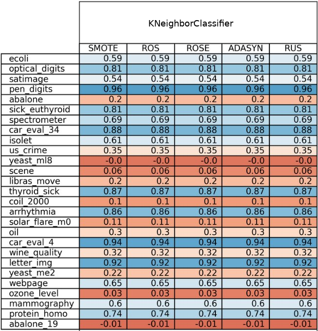

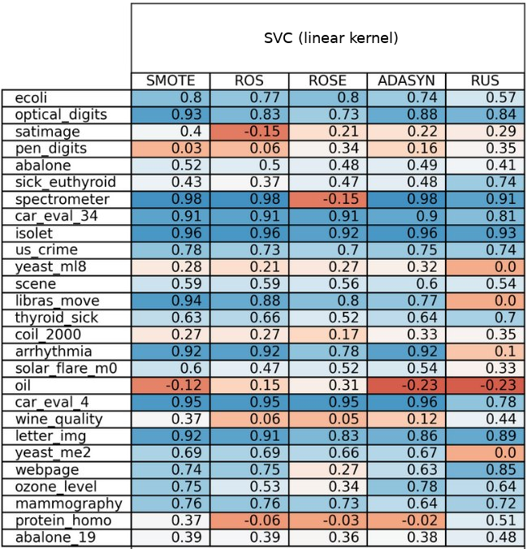

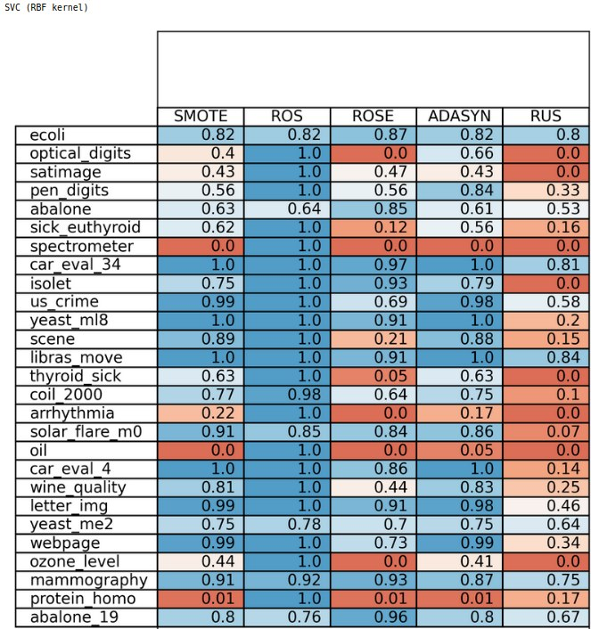

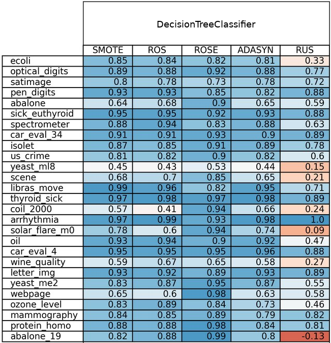

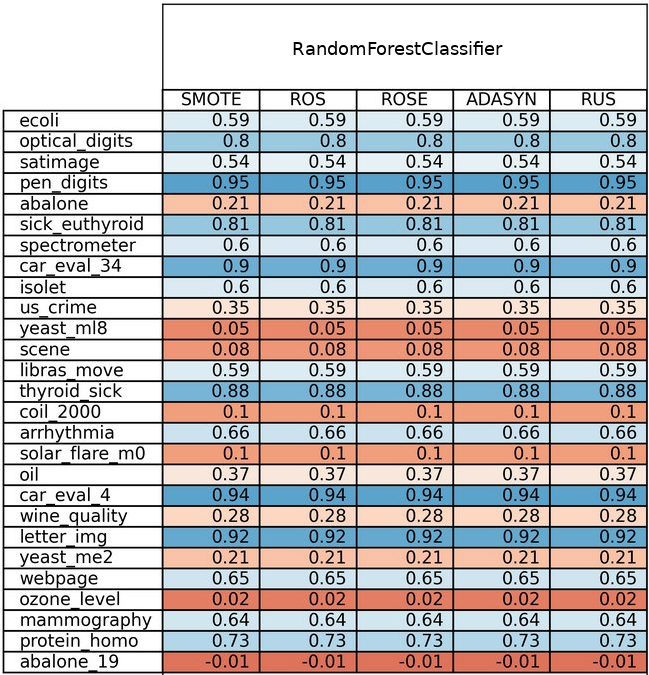

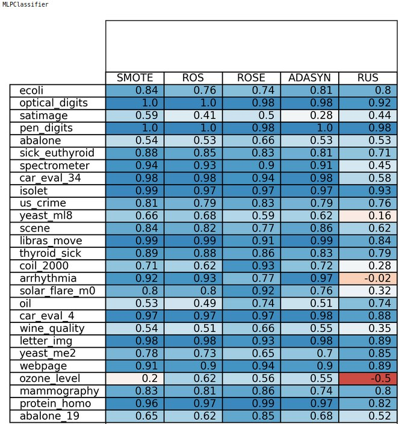


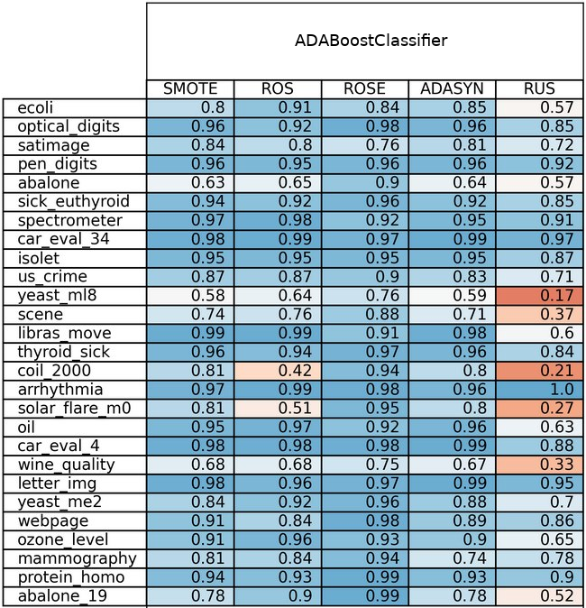

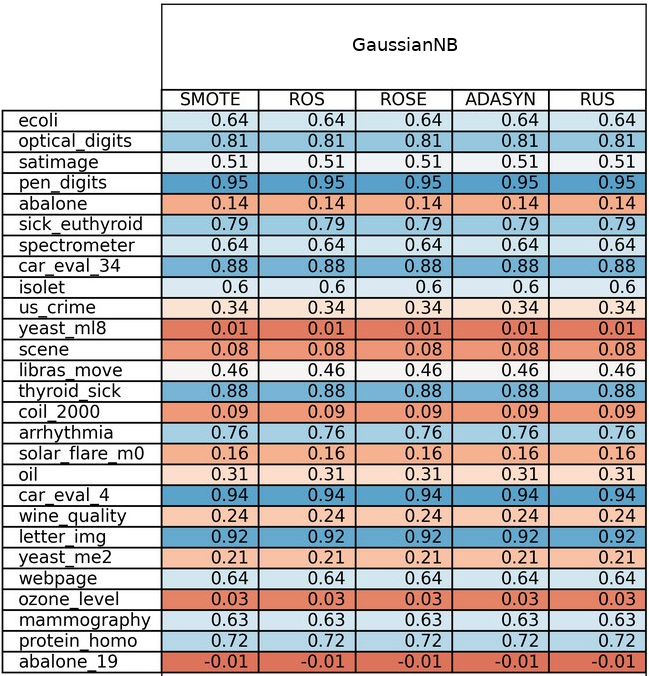

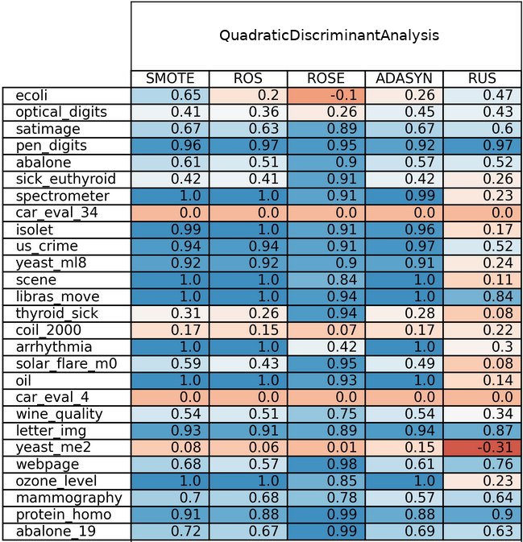

Other metrics are reported in Appendix 2, for completeness.

For different algorithms we can observe different effects of using Rose, compared to other algorithms, for resampling. For K-neighbors classifiers, random forest classifiers, or Gaussian naive Bayes, we observe no difference due to resampling methods.

Some algorithms are not improved by Rose resampling, like support vector machines, on most datasets.

For neural network based models like multi-layer perceptrons, decision tree classifiers, ADABoost classifiers, and quadratic discriminant analysis instead, Rose performs equally or even better that state-of-the-art resamplers, independently from cardinality, sample size, with a tendency to perform better for high imbalance ratio problems, in the lower part of the tables reported above. For some problems, nonetheless, Rose perform inexplicably much better or much worse than other resamplers. This effect nudge to the commonly shared knowledge that asserts than, in these kinds of problems, different resamplers should be tested and benchmarked, and the absence of a universally better algorithm.

# ORBIS Dataset: a real world ROSE application

Benchmark test datasets usually are convenient. The data are clean, there is an actual relationship, all the variables are used.

We decided to test ROSE in a real world problem belonging to a field considered difficult to handle: econometrics. 

## Problem description

In this particular project the Client asked the following question:

> Is it possible to foresee which firm have potential for becoming an High Growth Firm, given their economic status at the first year of activity?

It is generally understood that the outcome of such prevision is not feasible with 100% accuracy, but over last years many techniques were advanced to improve forecast from economic datasets.[^Coad, 2019] One of the main issues about this topic is the imbalanced nature of the problem. Without the aim of generating the best model, we want to explore the effect of data rebalancing using ROSE on this dataset, when training some basic, unoptimized model. Model choice and parameter optimization has been left on for future work, being out of scope for this project.

## Dataset description

The Client provided a dataset that is a subset of ORBIS database, a collection of information on listed company across the globe, curated  by Bureau Van Djik (henceforth BvD), a Moody's Analytics controlled private society. BvD collects information from about 375 millions of public and private firms in a standardized way, allowing for comparison and analytics. ORBIS data comes from more than 160 providers and hundreds of internal sources. The firm activity itself revolves about the reconstruction of proprietary assets and recognition of effective owners, providing firm structure hierarchy diagrams to rebuild dependencies among groups and controlled societies. Those data can be used to find informations about a firm, can be filtered to find firms that satisfy certain criteria, analyze peer groups, retrieve market informations about competitors and potential collaborations, and analyze stakeholders interdependence and financial strength.

ORBIS is used by enterprise, governments and public administrations, academic entities, financial institutes and professional studies, and is focused on efficiency aimed at decisional processes. Different targets can be optimized by ORBIS data:

* Credit risk
* Compliance and financial frauds
* Supply chain risk
* Transfer pricing
* Commercial development
* M&A and corporate finance
* Master Data Management projects

We had no direct source to the original data, that were provided as a comma separated values (CSV) archived version with the data of 115840 firms. Being expensive data, we are not allowed to publish them for repeatability, but we included a MD5 checksum of the provided file.

```
HGFfinal.merge.csv
Size: 44,7 MB (44745032 bytes)
MD5 checksum: 420d345c68dc3998b8403ab07d0fecf8
```

Our datasets encompasses 3 different categories of information:

* Company information, like name, location, contacts, sector, NACE code, etc.
* Economic information:
  * Balance sheet
  * Profit and Loss (P&L) statement
* BvD evaluations, like trust level, default chances, and independence score.

For most of them, where numeric values were not available, qualitative informations where provided. Still, a lot of data were missing.

### Exploratory Data Analysis

We report here the procedure of data import and cleaning that has been done before performing any other test.

#### Data import

Data has been imported in a Pandas DataFrame, and analyzed in a dedicated Python 3.6 `conda` environment in a Jupyter Notebook on a local Linux machine.

Numeric data has been parsed to `int` and `float` data types accordingly, while ordered categories, like `BvD.Independence.Indicator` has been cast in `pd.api.types.CategoricalDtype()` format.

#### Variables Description

A report for univariate analysis can be read in Appendix 1. Every variable has been explored for completeness, cardinality, range, and basic statistics.

## High Growth Firms

The first issue to track was negotiating with the Client an objective definition of High Growth Firm (henceforth, HGF). HGF is a dichotomic variable, defining whether a firm is a good performer.

There are multiple definition of HGF in literature, that leads to the choice of our metric.

### HGF metrics

There are three different accepted definition of HGF:

1. **Compound Annual Growth Rate (CAGR)**. Companies with an average growth rate $\ge$20% for the first 5 years:
   $$
   CAGR =\left(\frac{turnover_{2014}}{turnover_{2010}}\right)^{1/4}-1 \ge 20\%​$
   $$

1. **Gazelle**[^Birch, 1995] gazelles are firm with a growth rate that remains $\gt$20% for the first 5 years
   $$
   Gazele = all \left( \frac{turnover_t}{turnover_{t-1}}\ge 20\% \right), for\ t=2010,\dots,2014
   $$

1. **Eurostat**[^Chianca, 2008], employed by Eurostat, being HGF means having a growth rate $\ge$20% for 3 consecutive years.
   $$
   \begin{align}
   Eurostat =  \exist\ t\in\{2010,2011,2012\}:\\\left( \frac{turnover_t}{turnover_{t-1}}\ge 20\% \and \\\frac{turnover_t+1}{turnover_{t}}\ge 20\% \and \\\frac{turnover_t+2}{turnover_{t+1}}\ge 20\% \right)
   \end{align}
   $$
   

In this dataset the Client chose to compute HGF by the second option, **Gazelle**.

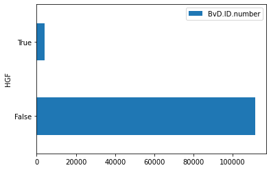

The dataset is heavily unbalanced, with a ratio of $\sim 33:1$ against non-HGF firm.                                       

$p(HGF|country)$:

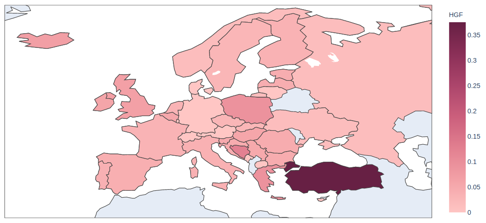

The uneven distribution of the variable frequency on different countries, especially in Turkey, may indicate different dataset inclusion criteria for companies in different countries. This could be due to state-specific requirements, with governments or financial entities requiring the company to give their data to BvD for transparency purposes. Special care should be take for every inference about models, that will be forced to marginalize on firm location data.

## Using ROSE on ORBIS dataset

We applied ROSE on the dataset, and checked the performance of different models pre- and post- resampling. To be able to do that, we cleaned the dataset, assigning correct data types, filtering typos, dropping redundant columns. The entire process is explained in this sub-chapter.

### data cleaning

From bibliography, consultation with financial experts and understanding the dataset we recognized that a lot of columns where just sum of other columns. The graphs in variable descriptions (Appendix 1) helps understanding this collinearity. It was judged safe to just drop derived variables, keeping only original ones. The following variables were dropped:

```
'Fixed.assets.th.EUR.2010',
'Current.assets.th.EUR.2010',
'Total.assets.th.EUR.2010',
'Shareholders.funds.th.EUR.2010', 
'Non.current.liabilities.th.EUR.2010', 
'Other.current.liabilities.th.EUR.2010',
'Sales.th.EUR.2010',
'Financial.revenue.th.EUR.2010',
'Financial.expenses.th.EUR.2010', 
'Taxation.th.EUR.2010',
'Cash.flow.th.EUR.2010',
```

For the same reason, we dropped variables derived from NACE code:

```
'NACE.Rev..2.main.section',
'NACE.Rev..2.Primary.code.s.'
```

The client wanted to focus only on private small companies, so the dataset was filtered in that sense, and the variable was dropped.

```python
df = df[df['Standardised.legal.form']=='Private limited companies']
df = df.drop('Standardised.legal.form', axis=1)

df = df[df['Category.of.the.company']=='Small company']
df = df.drop('Category.of.the.company', axis=1)
```

Consolidation Code was deemed irrelevant by the Client, and hence dropped. Given ROSE inability to work on string values, and the excessive cardinality of postcodes, the following variables were dropped:

```
"Company.name",
"City",
"trust",
"Postcode",
"Postcode2"
```

Categorical variables were then one-hot-encoded:

```python
for var in ["Country.ISO.Code",
           "BvD.Independence.Indicator",
           "NACE.Rev..2.Core.code..4.digits.",
           "BvD.major.sector",
            "trustVal",
            "Trademarks...Type",]:

    temp = pd.get_dummies(df[var])
    df = df.join(temp)
    df = df.drop(var, axis=1)
```

After the cleaning, the dataset's shape was 90711 examples, with 832 variables, most of them due to the one-hot-encoding. Of these, in 2343 samples $HGF=True$, while in 88368 $HGF=False$.

### Data visualization

Given the high dimensionality, we used $t$-distributed stochastic neighbor embedding ($t$-SNE) to plot a representation of the original data. The parameters of the $t$-SNE were: $perplexity=100, iterations = 250, n\_components=2$. Extra iteration and different perplexities has been tested, withtout significant improvement. 


Fig _ $t$-SNE of original dataset. Green sample ($HGF=True$) size has been exaggerated on purpose. 


### ROSE Resampling

A default `imblearn.over_sampling.ROSE()` instance has been generated, with `random_state` parameter set on 42 for reasons pertaining the life, the universe, and everything else. We used the same $t$-SNE methodology as above to visualize the balanced dataset. 


Fig _ $t$-SNE plot of resampled dataset

The resampler was used to even the classes, and different models has been tested, without optimization. To begin, we tested a Gaussian Naive Bayes model:

**Performance on original dataset:**

| HGF   | Precision | Recall | F1    | Support |
| ----- | --------- | ------ | ----- | ------- |
| True  | 0.029     | 0.762  | 0.055 | 202     |
| False | 0.985     | 0.376  | 0.545 | 8343    |

**Performance on balanced dataset:**

| HGF   | Precision | Recall | F1    | Support |
| ----- | --------- | ------ | ----- | ------- |
| True  | 0.691     | 0.956  | 0.738 | 8332    |
| False | 0.894     | 0.367  | 0.521 | 8358    |

Then we checked ROC Curves for a non-optimized logistic regression model, encompassing all variables.

**Performance on original dataset:**

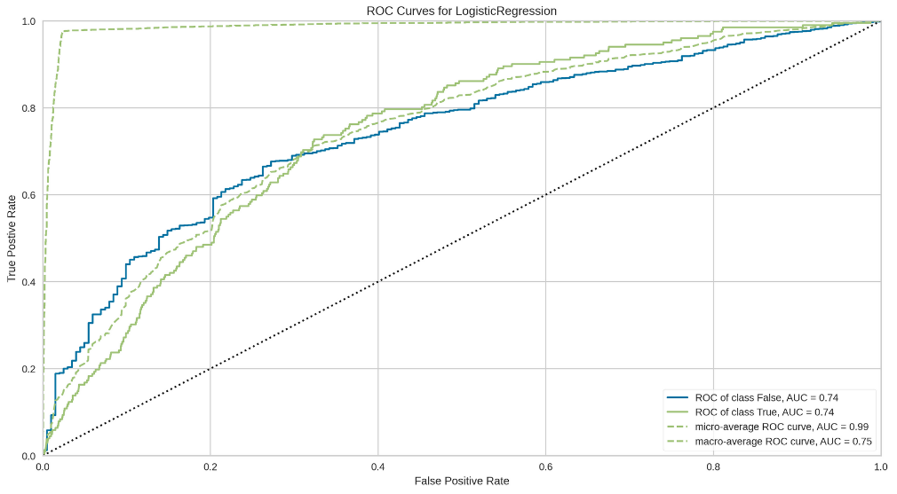

**Performance on balanced dataset:**

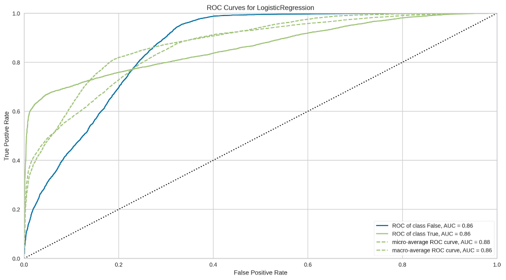

To better visualize the tradeoff between precision and recall in both models, we plotted threshold plots of the logistic classifier, and precision/recall curves of a ridge classifier:

**Performance on original dataset:**

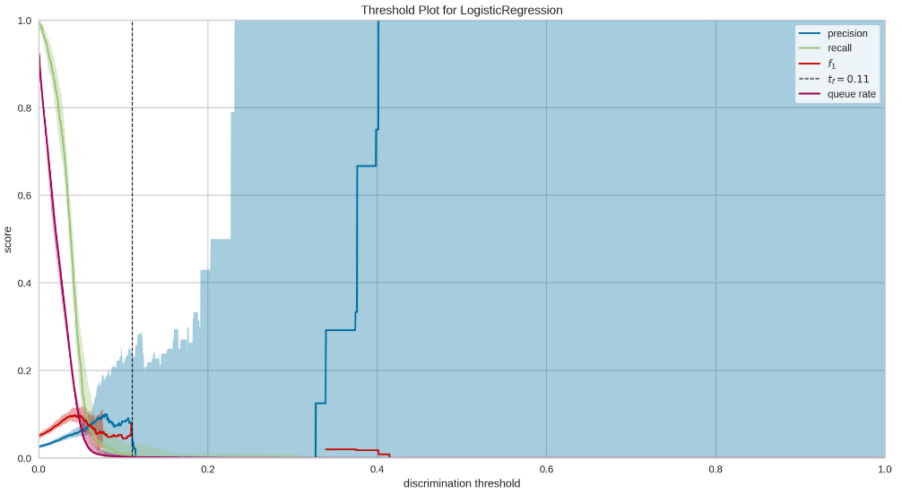


**Performance on balanced dataset:**

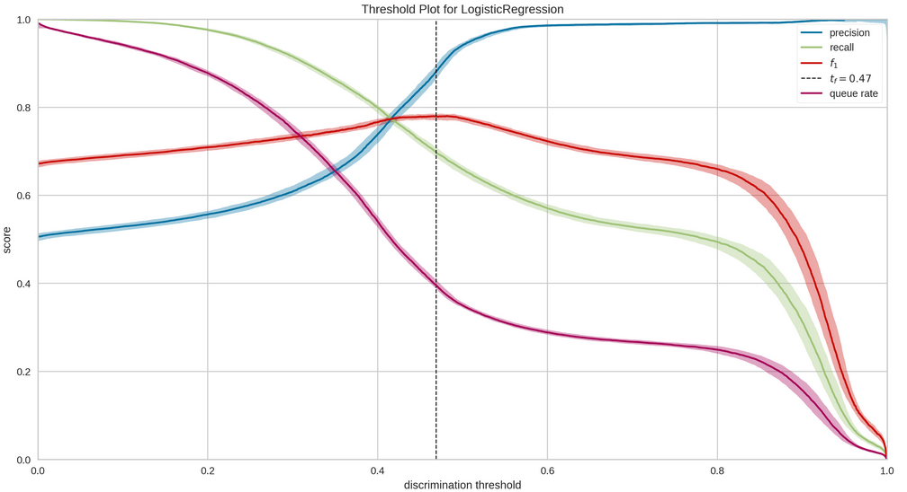

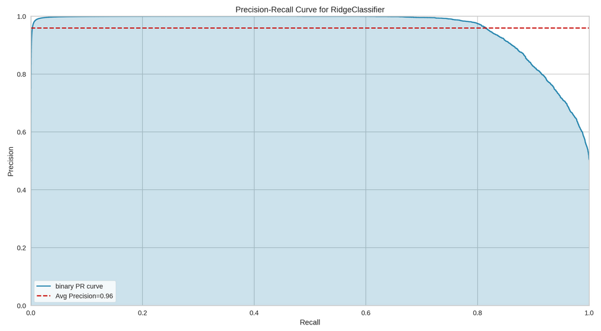

# Discussion

This work's first objective, ROSE implementation in Python's package `imbalanced-learn` has been successfully achieved, and with the next release it will be available for all users.

Binary classifier metrics evaluation and choice has proven a big challenge. Matthews correlation coefficient has proven a severe judge, performing better than $F_1$ score in describing, in a single number, the model performance.

Additional models could have been tested, like bigger ANNs, different NN architectures, or Gaussian Process classifiers, but additional computational power is required to do that, given the number of models to train and compare. By expanding the set, given the high repeatability of the tests, we could be able to propose a standard suite for testing resamplers.

Testing ROSE under different datasets and algorithms shown that, in some cases, its performance can equal and even be better than other resamplers. The difference is exacerbated when the imbalance ratio of the dataset is higher.

This is only the first part of ROSE development for Python. The algorithm still have unsolved issues, like incapacity of treating categorical data, or variables with limited support. Ideas for solution has been discussed, and will be implemented in the future, but their implementation and validation was out of scope for this project.

# Bibliography

[^Yu, 2013]: Yu, H., Hong, S., Yang, X., Ni, J., Dan, Y., Qin, B.: Recognition of Multiple imbalanced cancer types based on DNA microarray data using ensemble classifiers. BioMed Res. Int. 2013, 1–13 (2013)
[^Zhao, 2008]:Zhao, X.M., Li, X., Chen, L., Aihara, K.: Protein classification with imbalanced data. Proteins Struct. Funct. Bioinf. 70(4), 1125-1132(2008)
[^Cerf, 2013]:Cerf, L., Gay, D., Selmaoui-Folcher, N., Crémilleux, B., Boulicaut, J.F.: Parameter-free classification in multi-class imbalanced data sets. Data Knowl. Eng. 87, 109–129 (2013)
[^Gao, 2014]: Gao, X., Chen, Z., Tang, S., Zhang, Y., Li, J.: Adaptive weighted imbalance learning with application to abnormal activity recognition. Neurocomputing 173, 1927–1935 (2016)
[^Razakarivony, 2016]: Razakarivony, S., Jurie, F.: Vehicle detection in aerial imagery: a small target detection benchmark. J. Vis. Commun. Image Represent. 34, 187–203 (2016)
[^Efron, 1993]: Tibshirani, Robert J.; Efron, Bradley. An introduction to the bootstrap. *Monographs on statistics and applied probability*, 1993, 57: 1-436.
[^Gao2, 2014]: Gao, Z., Zhang, L., Chen, M.-yu., Hauptmann, A.G., Zhang, H., Cai, A.N.: Enhanced and hierarchical structure algorithm for data imbalance problem in semantic extraction under massive video dataset. Multimed. Tools Appl. 68(3), 641–657 (2014)
[^Wang, 2010]: Wang, S., Chen, H., Yao, X.: Negative correlation learning for classification ensembles. In: 2010 International Joint Conference on Neural Networks (IJCNN), pp. 1–8. IEEE (2010)
[^Provost, 2001]: Provost, Foster & Fawcett, Tom. (2001). Robust Classification for Imprecise Environments. Machine Learning. 42. 203-231. 10.1023/A:1007601015854. 
[^Ganganwar, 2012]: Ganganwar, Vaishali. (2012). An overview of classification algorithms for imbalanced datasets. International Journal of Emerging Technology and Advanced Engineering. 2. 42-47. 
[^King, 2001]: King, Gary, and Langche Zeng. "Logistic regression in rare events data." *Political analysis* 9.2 (2001): 137-163.
[^Menardi, 2014]: Menardi, Giovanna, and Nicola Torelli. "Training and assessing classification rules with imbalanced data." *Data Mining and Knowledge Discovery* 28.1 (2014): 92-122.
[^Chawla, 2003]: Chawla, Nitesh V., et al. "SMOTEBoost: Improving prediction of the minority class in boosting." *European conference on principles of data mining and knowledge discovery*. Springer, Berlin, Heidelberg, 2003.
[^Gue, 2003]:Gue, Kevin R. "A dynamic distribution model for combat logistics." *Computers & Operations Research* 30.3 (2003): 367-381.
[^Ndour, 2012]: Ndour, Cheikh, Aliou Diop, and Simplice Dossou-Gbété. "Classification  approach based on association rules mining for unbalanced data." *arXiv preprint arXiv:1202.5514* (2012).
[^Liu, 2006]:Liu, Xu-Ying, and Zhi-Hua Zhou. "The influence of class imbalance on cost-sensitive learning: An empirical study." *Sixth International Conference on Data Mining (ICDM'06)*. IEEE, 2006.
[^Zhou, 2010]:Zhou, Zhi‐Hua, and Xu‐Ying Liu. "On multi‐class cost‐sensitive learning." *Computational Intelligence* 26.3 (2010): 232-257.
[^He, 2009]: He, Haibo, and Edwardo A. Garcia. "Learning from imbalanced data." *IEEE Transactions on knowledge and data engineering* 21.9 (2009): 1263-1284.
[^Weiss, 2003]:Weiss, Roger D., et al. "Long-term outcomes from the national drug abuse treatment clinical trials network prescription opioid addiction  treatment study." *Drug and alcohol dependence* 150 (2015): 112-119.
[^Chawla, 2002]: N. V. Chawla, K. W. Bowyer, L. O.Hall, W. P. Kegelmeyer, “SMOTE: synthetic minority over-sampling technique,” Journal of artificial intelligence research, 321-357, 2002.
[^Han, 2005]: Han, Hui, Wen-Yuan Wang, and Bing-Huan Mao. "Borderline-SMOTE: a new over-sampling method in imbalanced data sets learning." *International conference on intelligent computing*. Springer, Berlin, Heidelberg, 2005.
[^Batista, 2004]: G. Batista, R. C. Prati, M. C. Monard. “A study of the behavior of several methods for balancing machine learning training data,” ACM Sigkdd Explorations Newsletter 6 (1), 20-29, 2004.
[^Batista, 2003]:G. Batista, B. Bazzan, M. Monard, “Balancing Training Data for Automated Annotation of Keywords: a Case Study,” In WOB, 10-18, 2003.
[^Wilson, 1972]: Wilson, Dennis L. "Asymptotic properties of nearest neighbor rules using edited data." *IEEE Transactions on Systems, Man, and Cybernetics* 3 (1972): 408-421.
[^Hart, 1968]:P. Hart, “The condensed nearest neighbor rule,” In Information Theory, IEEE Transactions on, vol. 14(3), pp. 515-516, 1968.
[^Kubat, 1997]: M. Kubat, S. Matwin, “Addressing the curse of imbalanced training sets: one-sided selection,” In ICML, vol. 97, pp. 179-186, 1997.
[^Mani, 2003]: I. Mani, I. Zhang. “kNN approach to unbalanced data distributions: a case study involving information extraction,” In Proceedings of workshop on learning from imbalanced datasets, 2003.
[^Smith, 2014]: D. Smith, Michael R., Tony Martinez, and Christophe Giraud-Carrier. “An instance level analysis of data complexity.” Machine learning 95.2 (2014): 225-256.
[^Nguyen, 2009]:H. M. Nguyen, E. W. Cooper, K. Kamei, “Borderline over-sampling for imbalanced data classification,” International Journal of Knowledge Engineering and Soft Data Paradigms, 3(1), pp.4-21, 2009.
[^Last, ArXiV]: Felix Last, Georgios Douzas, Fernando Bacao, “Oversampling for Imbalanced Learning Based on K-Means and SMOTE” https://arxiv.org/abs/1711.00837
[^He, 2008]:He, Haibo, Yang Bai, Edwardo A. Garcia, and Shutao Li. “ADASYN: Adaptive synthetic sampling approach for imbalanced learning,” In IEEE International Joint Conference on Neural Networks (IEEE World Congress on Computational Intelligence), pp. 1322-1328, 2008.

[^Hofmann, 2008]: Hofmann, Thomas, Bernhard Schölkopf, and Alexander J. Smola. "Kernel methods in machine learning." *The annals of statistics* (2008): 1171-1220.
[^Bowman, 1997]: Bowman, Adrian W., and Adelchi Azzalini. *Applied smoothing techniques for data analysis: the kernel approach with S-Plus illustrations*. Vol. 18. OUP Oxford, 1997
[^Silverman, 1986]:Silverman, Bernard W. *Density estimation for statistics and data analysis*. Vol. 26. CRC press, 1986.
[^Mower, 2005]:Mower, Jeffrey P. "PREP-Mt: predictive RNA editor for plant mitochondrial genes." *BMC bioinformatics* 6.1 (2005): 96.
[^Van Rijsbergen, 1986]:Van Rijsbergen, Cornelis J. "A new theoretical framework for information retrieval." *Acm Sigir Forum*. Vol. 21. No. 1-2. New York, NY, USA: ACM, 1986.
[^Chicco, 2020]: Chicco, Davide, and Giuseppe Jurman. "The advantages of the Matthews  correlation coefficient (MCC) over F1 score and accuracy in binary  classification evaluation." *BMC genomics* 21.1 (2020): 6.
[^Fowlkes, 1983]: Fowlkes, Edward B., and Colin L. Mallows. "A method for comparing two hierarchical clusterings." *Journal of the American statistical association* 78.383 (1983): 553-569.
[^Henning, 1989]:Henning, Andersen. "Markedness: The First 150 Years." *Markedness in Synchrony and Diachrony, Olga M. Tomic (ed.), Mouton de Gruyter, Berlin–Germany* (1989): 11-46.
[^Youden, 1950]:Youden, William J. "Index for rating diagnostic tests." *Cancer* 3.1 (1950): 32-35.
[^Guilford, 1954]: Guilford, Joy Paul. "Psychometric methods." (1954).
[^Baldi, 2000]:Baldi P, Brunak S, Chauvin Y, Andersen CA, Nielsen H. Assessing the  accuracy of prediction algorithms for classification: an overview.  Bioinformatics. 2000; 16(5):412–24.
[^FDA, 2010]:The MicroArray Quality Control (MAQC) Consortium. The MAQC-II Project: a comprehensive study of common practices for the development and  validation of microarray-based predictive models. Nat Biotechnol. 2010;  28(8):827–38.
[^Brown, 2018]: Brown JB. Classifiers and their metrics quantified. Mol Inform. 2018; 37:1700127
[^Tague, 1992]: Tague-Sutcliffe J. The pragmatics of information retrieval experimentation, revisited. Informa Process Manag. 1992; 28:467–90.
[^Flight, 2015]: Flight L, Julious SA. The disagreeable behaviour of the kappa statistic. Pharm Stat. 2015; 14:74–8.
[^Sebastiani, 2015]:Sebastiani F. An axiomatically derived measure for the evaluation of  classification algorithms. In: Proceedings of ICTIR 2015 – the ACM SIGIR 2015 International Conference on the Theory of Information Retrieval.  New York City: ACM: 2015. p. 11–20.
[^Powers, 2011]: Powers DMW. Evaluation: from precision, recall and F-measure to ROC,  informedness, markedness & correlation. J Mach Learn Technol. 2011;  2(1):37–63.
[^ROSE CRAN]: Nicola Lunardon, Giovanna Menardi, Nicola Torelli: https://cran.r-project.org/web/packages/ROSE/ROSE.pdf
[^imblearn]: https://imbalanced-learn.org/stable/
[^sklearn]:https://scikit-learn.org/stable/
[^PEP8]: https://www.python.org/dev/peps/pep-0008/
[^commits]: https://github.com/scikit-learn-contrib/imbalanced-learn/pull/754

[^Birch, 1995]: Birch, David L., Anne Haggerty, and William Parsons. *Who's creating jobs?: 1995*. Cognetics, Inc., 1995.
[^Chianca, 2008]: Chianca, Thomaz. "The OECD/DAC criteria for international development evaluations: An assessment and ideas for improvement." *Journal of Multidisciplinary Evaluation* 5.9 (2008): 41-51.

[^Coad, 2019]:Coad, A., Srhoj, S. Catching Gazelles with a Lasso: Big data techniques for the prediction of high-growth firms. *Small Bus Econ* **55,** 541–565 (2020).

# Appendix 1: Univariate analysis

## Company informations

### BvD.ID.number

This is our dataset primary key. Unique (cardinality = n). It is composed by 2 letters and 8$\div$12 digits. The two letters appear to be the `Country.ISO.Code`.

```
CategoricalIndex(['IS4203100990', 'GR997722505', 'BG201066368', 'BG201251947',
                  'BG201331418', 'IS4102101180', 'BG201222746', 'BG201124711',
                  'BG201005899', 'BA4281217330002',
                  ...
                  'SK45369747', 'SK45284300', 'SK45349304', 'SK45457824',
                  'SK45432112', 'SK45480371', 'SK45452245', 'SK45407851',
                  'SK45430268', 'SK45418527'],
                 categories=['AT9010104250', 'AT9030242392', 'AT9070278738', 'AT9070279036', 'AT9090150166', 'AT9110712698', 'AT9110713446', 'AT9110713447', ...], ordered=False, name='BvD.ID.number', dtype='category', length=115840)
```

### Company.name

`dtype: string`

Contains the firm name. All caps, sometimes includes firm's juridic form.

```
BvD.ID.number
BG201056516               AW TRONICS OOD
IT02637960606       HOME DESIGN - S.R.L.
FR519561369                FINANCIERE HL
SK45371296         EU MANAGEMENT, S.R.O.
FR529210692      TOTAL E&P WELL RESPONSE
Name: Company.name, dtype: string
```

### Country.ISO.Code

`dtype: string`

Contains a two-letter ISO 3166 alpha-2 code from 38 countries. 

```python
data['Country.ISO.Code'].unique()
```

```bash
['IS', 'GR', 'BG', 'BA', 'BE', 'IE', 'CY', 'DE', 'AT', 'DK', 'GB', 'CH', 'CZ',
 'EE', 'ES', 'FI', 'FR', 'HR', 'HU', 'IT', 'RS', 'PL', 'UA', 'ME', 'NL', 'LU',
 'MT', 'MK', 'TR', 'LT', 'LV', 'NO', 'PT', 'RO', 'RU', 'SE', 'SI', 'SK']
 Length: 38, dtype: string
```


*Involved countries*

```
Country.ISO.Code  AT  BA   BE   BG  CH  CY    CZ  DE  DK    EE  ...   PL  \
HGF                                                             ...        
0                 19  97  190  626   2   3  1985  28   1  2489  ...  446   
1                  0  14   11   31   0   0    60   0   0   114  ...   46   

Country.ISO.Code    PT     RO   RS     RU    SE    SI    SK  TR   UA  
HGF                                                                   
0                 6535  15500  361  11731  2512  1693  3497   5  374  
1                  265    758   20    192    76    92   106   3    6  

[2 rows x 38 columns]

Chi² =  4.79e+02
p    =   3.4e-78
degrees of freedom = 37
```

### Postcode

Postcode of the firm. Refers to a different encoding for each country. 

```
BvD.ID.number
FR522454743     81640
RU66322917     129085
EE11951827      10151
FR519806830     18700
RO27831630        nan
Name: Postcode, dtype: category
Categories (29914, object): [00-024, 00-042, 00-066, 00-102, ..., YO19 6ED, YO26 4GB, YO41 5NS, nan]
```

Present only in 107506 rows. Missing in 8334 rows.

### City

All caps name of the firm's city. Missing in 88 entries.

### NACE codes

 Statistical Classification of Economic Activities in the European Community code, known as NACE, is the industry standard classification of European Union. Established by Regulation (EC) No 1893/2006, it uses four hierarchical levels:

- Level 1: 21 sections identified by alphabetical letters A to U;
- Level 2: 88 divisions identified by two-digit numerical codes (01 to 99);
- Level 3: 272 groups identified by three-digit numerical codes (01.1 to 99.0);
- Level 4: 615 classes identified by four-digit numerical codes (01.11 to 99.00).

The first four digits of the code, which is the first four levels of the classification system, are the same in all European countries. National implementations may introduce additional levels. The fifth digit might vary from country to country and further digits are sometimes placed by  suppliers of databases.

links: [Reference to all NACE codes](https://ec.europa.eu/competition/mergers/cases/index/nace_all.html) , [Wikipedia: NACE codes](https://en.wikipedia.org/wiki/Statistical_Classification_of_Economic_Activities_in_the_European_Community). 

### NACE.Rev..2.main.section

Level 1 NACE code. A letter, and the sector description.

```
BvD.ID.number
FR521201111                                       F - Construction
FR523714624      G - Wholesale and retail trade; repair of moto...
ESB85891794                           S - Other service activities
IT03972880235        I - Accommodation and food service activities
PT509412866      M - Professional, scientific and technical act...
Name: NACE.Rev..2.main.section, dtype: category
```

All 21 sections are being represented.

```python
pd.DataFrame(data['NACE.Rev..2.Core.code..4.digits.']).reset_index().groupby('NACE.Rev..2.main.section').count().plot.barh()
```


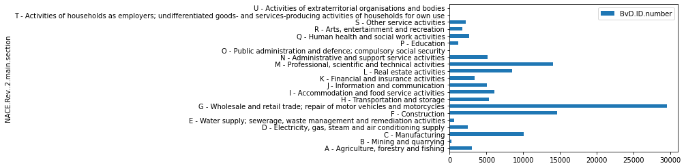

*number of entries per section*

```
NACE     A    B     C     D    E      F      G     H     I     J  ...     L  \
HGF                                                               ...         
0     2938  213  9621  2429  593  14212  28334  5038  5942  4779  ...  8340   
1       99    8   444    33   43    385   1192   294   154   266  ...   146   

NACE      M     N   O     P     Q     R     S  T  U  
HGF                                                  
0     13611  4899  16  1116  2504  1646  2151  2  1  
1       460   244   0    66   129    75    64  0  0  

[2 rows x 21 columns]

Chi² =  3.96e+02
p    =   1.6e-71
degrees of freedom = 20
```

### NACE.Rev..2.Core.code..4.digits.

4 digit NACE code. 729 different categories.

```
BvD.ID.number
NO995138697      4110
PT509493599      4339
RO27726219       4711
FR520957143       161
IT03102890831    4120
Name: NACE.Rev..2.Core.code..4.digits., dtype: category
Categories (729, int64): [100, 110, 111, 112, ..., 9609, 9700, 9810, 9900]
```

```
NACE  100   110   111   112   113   115   119   120   121   122   ...  9529  \
HGF                                                               ...         
0       18    60   571     8   227     1    64    17   117     1  ...    34   
1        2     1    20     0     5     0     1     1     7     0  ...     1   

NACE  9600  9601  9602  9603  9604  9609  9700  9810  9900  
HGF                                                         
0        4   131   957   129   186   351     1     1     1  
1        0     3    20     4     6    16     0     0     0  

[2 rows x 729 columns]

Chi² =  1.69e+03
p    =   9.4e-78
degrees of freedom = 728
```

### NACE.Rev..2.Primary.code.s.                   

4 digit NACE code. Similar to the former, it contains duplicates. 729 different categories.

```
BvD.ID.number
RU65230449      4633
NO995818558     4759
SE5568024276    7311
NO995182165     3312
RO27703886      4613
Name: NACE.Rev..2.Primary.code.s., dtype: category
Categories (729, int64): [100, 110, 111, 112, ..., 9609, 9700, 9810, 9900]
```

### Cons..code

Bankscape Consolidation Code. It indicates the level of consolidation for the different financial statements

- **C1**: statement of a mother company integrating the statements of its controlled subsidiaries or branches with no unconsolidated companion,
- **C2**: statement of a mother company integrating the statements of its controlled subsidiaries or branches with an unconsolidated companion,
- **U1**: statement not integrating the statements of the possible controlled subsidiaries or branches of the concerned company with no consolidated companion.
- **U2**: statement not integrating the statements of the possible controlled subsidiaries or branches of the concerned company  with an consolidated companion.
- **LF**: limited financials: information based on rounded figures officially available, sometimes collected from other directories or websites.

```
BvD.ID.number
RO26440005       U1
IT03232890982    U1
IT11001531000    U1
RU67267304       LF
PT509588980      U1
Name: Cons..code, dtype: category
Categories (5, object): [C1, C2, LF, U1, U2]

```

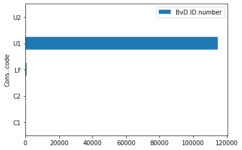

```
CONS   C1   C2   LF      U1   U2
HGF                             
0     116  103  784  110504  140
1       7    3    7    4170    6

Chi² =      18.9
p    =   0.00084
degrees of freedom = 4
```

### BvD.Independence.Indicator

It characterizes  the  degree  of  independence  of a  company  with  regard  to  its  shareholders. It has been mapped to an ordered category, with null value (`U`) being set at the lowest value.

links: [Variable description](https://aisre.it/images/aisre/5583cfea457478.86345032/Succurro1_Costanzo_Explaining%20the%20propensity%20to%20patent_evidence%20from%20Italy.pdf)

```
BvD.ID.number
RO26798381       D
RU67068071       D
FR527515381      U
RU64795818       D
IT06649101216    D
Name: BvD.Independence.Indicator, dtype: category
Categories (13, object): [U < D- < D < D+ ... B+ < A- < A < A+]
```

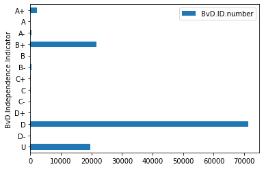


```
INDEP  -   A    A+   A-  B     B+   B-    C   C+      D      U
HGF                                                           
0      3  20  2170  257  1  20777  346  104  197  68757  19015
1      0   1    63   21  0    837   16   13    8   2588    646

Chi² =      46.4
p    =   1.2e-06
degrees of freedom = 10
```

  ### BvD.major.sector

A different sector encoding from BvD. It encompass 19 categories.

```
BvD.ID.number
RO26474245                                          Other services
HR76526891156    Chemicals, rubber, plastics, non-metallic prod...
RU68874348                      Textiles, wearing apparel, leather
CZ28117956                                          Primary sector
RO15587044                                          Other services
Name: BvD.major.sector, dtype: category
Categories (19, object): [Banks, Chemicals, rubber, plastics, non-metallic prod..., Construction, Education, Health, ..., Textiles, wearing apparel, leather, Transport, Wholesale & retail trade, Wood, cork, paper]
```

There are no missing values.

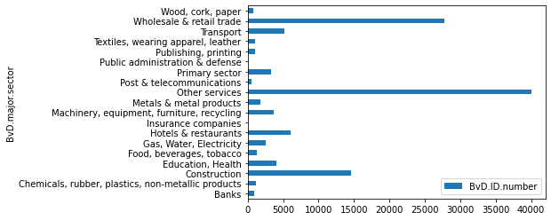


```
SECT  Banks  Chemicals,  Constructi  Education,  Food, beve  Gas, Water  \
HGF                                                                       
0       947        1156       14212        3809        1252        2494   
1        22          58         385         211          74          36   

SECT  Hotels & r  Insurance   Machinery,  Metals & m  Other serv  Post & tel  \
HGF                                                                            
0           5942          19        3466        1712       38654         447   
1            154           2         149          64        1340          39   

SECT  Primary se  Public adm  Publishing  Textiles,   Transport  Wholesale   \
HGF                                                                           
0           3148          17        1042        1000       4919       26666   
1            107           0          43          52        286        1137   

SECT  Wood, cork  
HGF               
0            745  
1             34  

Chi² =   2.7e+02
p    =   7.4e-47
degrees of freedom = 18
```

### Standardised.legal.form 

Two level factor, stating if the company is public or private.

```
BvD.ID.number
ESB85955946    Private limited companies
FR519336481    Private limited companies
PT509284035     Public limited companies
EE11920653     Private limited companies
NO995237563    Private limited companies
Name: Standardised.legal.form, dtype: category
Categories (2, object): [Private limited companies, Public limited companies]
```

![img]()


```
FORM  Private  Public 
HGF                   
0      109204     2443
1        4056      137

Chi² =      21.6
p    =   3.3e-06
degrees of freedom = 1
```

### Category.of.the.company 

4 level factor stating the dimension of the company. It was impossible to retrieve information about objective inclusion criteria anywhere. Different legislations use different criteria, and despite their similarity, this does not allow a unequivocal definition.

To give an approximation of this classification, we will report Australian's definition of large company. A company is considered large if it satisfies at least two of the following criteria:

*  the consolidated revenue for the financial year of the company and the companies it controls is AU$50 millions or more,
*  the value of the consolidated gross assets at the end of the financial year of the company and any entities it controls is AU$25 millions or more, and
*  the company and any entity it controls have 100 or more employees at the end of the fiscal year.

European Union EUROSTAT website reports a different classification, based only on employees:

| number of employees | enterprise size         |
| ------------------- | ----------------------- |
| $\lt10$             | micro enterprise        |
| $10\le e\lt 50$     | small enterprise        |
| $50\le e \lt 250$   | medium-sized enterprise |
| $e\ge250$           | large enterprise        |

```
BvD.ID.number
RO26541921             Small company
RO26543973             Small company
RO27249764      Medium sized company
PT509553923            Small company
SE5568008675           Small company
Name: Category.of.the.company, dtype: category
Categories (4, object): [Large company, Medium sized company, Small company, Very large company]
```

![img]()


```
CAT  Large compan  Medium sized  Small compan  Very large c
HGF                                                        
0            2485         19276         89542           344
1             267          1522          2373            31

Chi² =  1.41e+03
p    =  2.3e-306
degrees of freedom = 3
```

### No.of.companies.in.corporate.group

Number of companies in the corporate group. The largest part of entries has 0 companies in the group (assuming: no group).

![img]()

outliers:

```
BvD.ID.number
IE488184         SKY HIGH III LEASING DESIGNATED ACTIVITY COMPANY
IT07063570969                                    HB SERVIZI S.R.L
IT07182390968                      POLIAMBULATORIO BICOCCA S.R.L.
NO995590271                                         ELKEM RANA AS
RO1590899                        ADAMA AGRICULTURAL SOLUTIONS SRL
RO25221180                                       EDPR ROMANIA SRL
Name: Company.name, dtype: string
```

```
HGF vs non-HGF for No.of.companies.in.corporate.group
Welch's t-test statistic = -0.7536
p-value = 0.4511
```

```
Optimization terminated successfully.
         Current function value: 0.155660
         Iterations 7
                           Logit Regression Results                           
==============================================================================
Dep. Variable:                    HGF   No. Observations:               115840
Model:                          Logit   Df Residuals:                   115838
Method:                           MLE   Df Model:                            1
Date:                Mon, 29 Jun 2020   Pseudo R-squ.:               1.205e-05
Time:                        15:23:49   Log-Likelihood:                -18032.
converged:                       True   LL-Null:                       -18032.
Covariance Type:            nonrobust   LLR p-value:                    0.5098
==============================================================================
                 coef    std err          z      P>|z|      [0.025      0.975]
------------------------------------------------------------------------------
Intercept     -3.2825      0.016   -208.368      0.000      -3.313      -3.252
CORPGRP     2.408e-05   3.39e-05      0.710      0.478   -4.24e-05    9.06e-05
==============================================================================
```

### No.of.recorded.shareholders

Numbers of enterprise recorded stakeholders.

![img]()

```
HGF vs non-HGF for No.of.recorded.shareholders
Welch's t-test statistic = -4.809
p-value = 1.571e-06

Optimization terminated successfully.
         Current function value: 0.155556
         Iterations 7
                           Logit Regression Results                           
==============================================================================
Dep. Variable:                    HGF   No. Observations:               115840
Model:                          Logit   Df Residuals:                   115838
Method:                           MLE   Df Model:                            1
Date:                Mon, 29 Jun 2020   Pseudo R-squ.:               0.0006832
Time:                        15:25:05   Log-Likelihood:                -18020.
converged:                       True   LL-Null:                       -18032.
Covariance Type:            nonrobust   LLR p-value:                 6.913e-07
==============================================================================
                 coef    std err          z      P>|z|      [0.025      0.975]
------------------------------------------------------------------------------
Intercept     -3.3319      0.018   -183.049      0.000      -3.368      -3.296
SHA            0.0315      0.006      5.698      0.000       0.021       0.042
==============================================================================

```

### No.of.recorded.subsidiaries

![img]()

outlier: 

```
BvD.ID.number
RS20661283    AKCIONARSKI FOND
Name: Company.name, dtype: string
```

```
HGF vs non-HGF for No.of.recorded.subsidiaries
Welch's t-test statistic = -3.294
p-value = 0.0009946
```

```
                           Logit Regression Results                           
==============================================================================
Dep. Variable:                    HGF   No. Observations:               115840
Model:                          Logit   Df Residuals:                   115838
Method:                           MLE   Df Model:                            1
Date:                Mon, 29 Jun 2020   Pseudo R-squ.:               8.499e-05
Time:                        15:25:58   Log-Likelihood:                -18030.
converged:                       True   LL-Null:                       -18032.
Covariance Type:            nonrobust   LLR p-value:                   0.08000
==============================================================================
                 coef    std err          z      P>|z|      [0.025      0.975]
------------------------------------------------------------------------------
Intercept     -3.2831      0.016   -208.501      0.000      -3.314      -3.252
SUB            0.0052      0.003      2.045      0.041       0.000       0.010
==============================================================================
```

### No.of.recorded.branch.locations

![img]()

outliers:

```
BvD.ID.number
FR528648892                          CHAUSSON MATERIAUX
FR524237351    S A S LOT AGRICULTURE ET ENERGIE SOLAIRE
Name: Company.name, dtype: string
```

```
HGF vs non-HGF for No.of.recorded.branch.locations
Welch's t-test statistic = -3.193
p-value = 0.001417


Optimization terminated successfully.
         Current function value: 0.155622
         Iterations 7
                           Logit Regression Results                           
==============================================================================
Dep. Variable:                    HGF   No. Observations:               115840
Model:                          Logit   Df Residuals:                   115838
Method:                           MLE   Df Model:                            1
Date:                Mon, 29 Jun 2020   Pseudo R-squ.:               0.0002588
Time:                        15:26:33   Log-Likelihood:                -18027.
converged:                       True   LL-Null:                       -18032.
Covariance Type:            nonrobust   LLR p-value:                  0.002250
==============================================================================
                 coef    std err          z      P>|z|      [0.025      0.975]
------------------------------------------------------------------------------
Intercept     -3.2833      0.016   -208.582      0.000      -3.314      -3.252
BRA            0.0107      0.003      3.303      0.001       0.004       0.017
==============================================================================
```

### Number.of.employees.2010

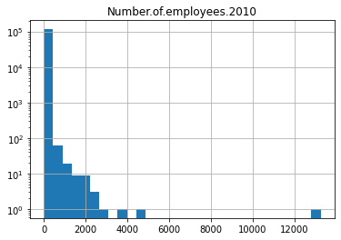


outlier:

```
BvD.ID.number
GB07158140    CARE UK HEALTH & SOCIAL CARE INVESTMENTS LIMITED
Name: Company.name, dtype: string
```

```
HGF vs non-HGF for Number.of.employees.2010
Welch's t-test statistic =  8.77
p-value = 2.022e-18

Optimization terminated successfully.
         Current function value: 0.155502
         Iterations 9
                           Logit Regression Results                           
==============================================================================
Dep. Variable:                    HGF   No. Observations:               115840
Model:                          Logit   Df Residuals:                   115838
Method:                           MLE   Df Model:                            1
Date:                Mon, 29 Jun 2020   Pseudo R-squ.:                0.001025
Time:                        15:41:13   Log-Likelihood:                -18013.
converged:                       True   LL-Null:                       -18032.
Covariance Type:            nonrobust   LLR p-value:                 1.198e-09
==============================================================================
                 coef    std err          z      P>|z|      [0.025      0.975]
------------------------------------------------------------------------------
Intercept     -3.2594      0.016   -201.417      0.000      -3.291      -3.228
E             -0.0070      0.001     -4.796      0.000      -0.010      -0.004
==============================================================================
```

### Innovation.strength...Number.of.patents

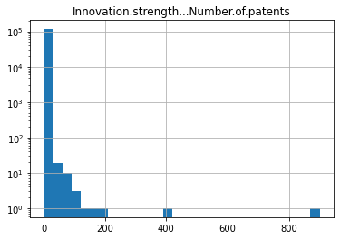

sum:

mean:


outliers:

```
BvD.ID.number
IE507678        HORIZON THERAPEUTICS PUBLIC LIMITED COMPANY
DE8190460728                                 WAVELIGHT GMBH
Name: Company.name, dtype: string
```

```
HGF vs non-HGF for Number.of.patents
Welch's t-test statistic = -2.068
p-value = 0.03868

Optimization terminated successfully.
         Current function value: 0.155654
         Iterations 7
                           Logit Regression Results                           
==============================================================================
Dep. Variable:                    HGF   No. Observations:               115840
Model:                          Logit   Df Residuals:                   115838
Method:                           MLE   Df Model:                            1
Date:                Mon, 29 Jun 2020   Pseudo R-squ.:               5.332e-05
Time:                        15:41:34   Log-Likelihood:                -18031.
converged:                       True   LL-Null:                       -18032.
Covariance Type:            nonrobust   LLR p-value:                    0.1655
==============================================================================
                 coef    std err          z      P>|z|      [0.025      0.975]
------------------------------------------------------------------------------
Intercept     -3.2822      0.016   -208.621      0.000      -3.313      -3.251
PAT            0.0034      0.002      1.641      0.101      -0.001       0.008
==============================================================================
```

### Innovation.strength...Number.of.inventions

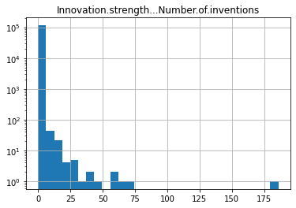

sum: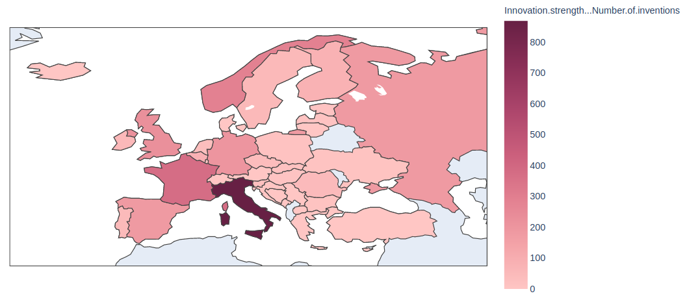

mean:

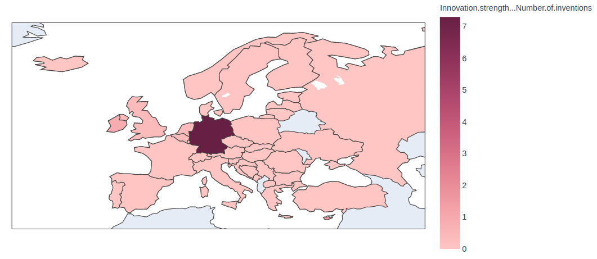

outlier:

```
BvD.ID.number
DE8190460728    WAVELIGHT GMBH
Name: Company.name, dtype: string

```

```
HGF vs non-HGF for Innovation.strength...Number.of.inventions
Welch's t-test statistic = -1.361
p-value = 0.1737

Optimization terminated successfully.
         Current function value: 0.155656
         Iterations 7
                           Logit Regression Results                           
==============================================================================
Dep. Variable:                    HGF   No. Observations:               115840
Model:                          Logit   Df Residuals:                   115838
Method:                           MLE   Df Model:                            1
Date:                Mon, 29 Jun 2020   Pseudo R-squ.:               3.980e-05
Time:                        15:41:56   Log-Likelihood:                -18031.
converged:                       True   LL-Null:                       -18032.
Covariance Type:            nonrobust   LLR p-value:                    0.2309
==============================================================================
                 coef    std err          z      P>|z|      [0.025      0.975]
------------------------------------------------------------------------------
Intercept     -3.2824      0.016   -208.594      0.000      -3.313      -3.252
INV            0.0141      0.010      1.425      0.154      -0.005       0.034
==============================================================================
```

### Number.of.patents

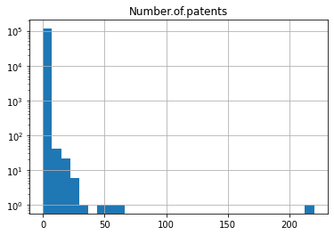

sum:


mean:


outlier:

```
BvD.ID.number
DE8190460728    WAVELIGHT GMBH
Name: Company.name, dtype: string
```

```
HGF vs non-HGF for Number.of.patents
Welch's t-test statistic = -2.068
p-value = 0.03868

Optimization terminated successfully.
         Current function value: 0.155657
         Iterations 7
                           Logit Regression Results                           
==============================================================================
Dep. Variable:                    HGF   No. Observations:               115840
Model:                          Logit   Df Residuals:                   115838
Method:                           MLE   Df Model:                            1
Date:                Mon, 29 Jun 2020   Pseudo R-squ.:               3.073e-05
Time:                        15:42:17   Log-Likelihood:                -18031.
converged:                       True   LL-Null:                       -18032.
Covariance Type:            nonrobust   LLR p-value:                    0.2925
==============================================================================
                 coef    std err          z      P>|z|      [0.025      0.975]
------------------------------------------------------------------------------
Intercept     -3.2823      0.016   -208.605      0.000      -3.313      -3.251
P              0.0116      0.009      1.267      0.205      -0.006       0.029
==============================================================================
```

### Number.of.trademarks

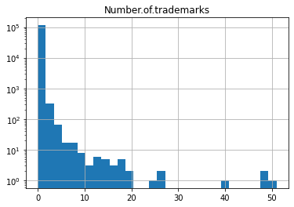

sum:

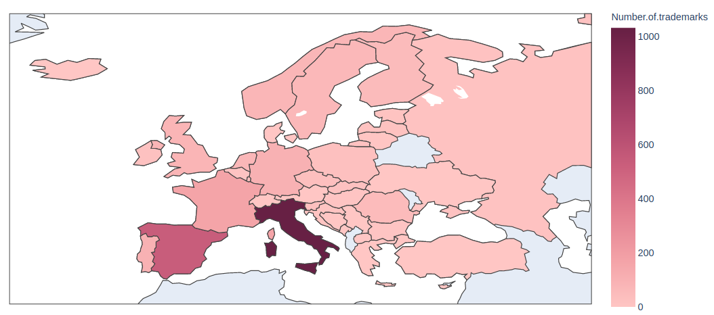

mean (Lituania!):


outliers:

```
BvD.ID.number
DE4250480683         VOLMARY GMBH
DE8190460728       WAVELIGHT GMBH
IT07237530964       SALROS S.R.L.
LULB157784       MEDA PHARMA SARL
Name: Company.name, dtype: string
```

```
HGF vs non-HGF for Number.of.trademarks
Welch's t-test statistic = -5.38
p-value = 7.824e-08

Optimization terminated successfully.
         Current function value: 0.155560
         Iterations 7
                           Logit Regression Results                           
==============================================================================
Dep. Variable:                    HGF   No. Observations:               115840
Model:                          Logit   Df Residuals:                   115838
Method:                           MLE   Df Model:                            1
Date:                Mon, 29 Jun 2020   Pseudo R-squ.:               0.0006523
Time:                        15:42:41   Log-Likelihood:                -18020.
converged:                       True   LL-Null:                       -18032.
Covariance Type:            nonrobust   LLR p-value:                 1.234e-06
==============================================================================
                 coef    std err          z      P>|z|      [0.025      0.975]
------------------------------------------------------------------------------
Intercept     -3.2852      0.016   -208.489      0.000      -3.316      -3.254
T              0.0918      0.018      5.037      0.000       0.056       0.128
==============================================================================
```

### Trademarks...Type

```
BvD.ID.number
RO26941545       No
PT509482171      No
IT06789671218    No
FR519321806      No
NO995113562      No
Name: Trademarks...Type, dtype: category
Categories (4, object): [Figurative, No, Other, Word]
```

| Trademarks...Type | n          |
| ----------------- | ---------- |
| Figurative        | 779        |
| Word              | 400        |
| Other             | 3          |
| No                | 114658     |
| **Total**         | **115840** |

### lat / lon

Geographic coordinates of the firm. Not available for ~8000 samples.


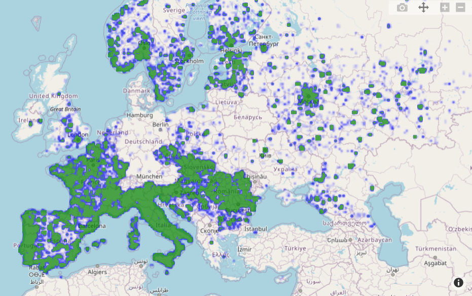


HGF=True:

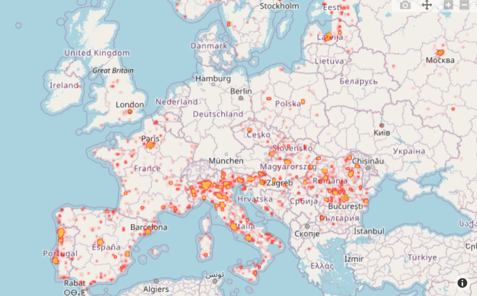

(These maps are navigable like Google Maps on my pc, I can provide an interactive version.)

### trust 

Trust evaluation, as string made of two parts. 

* A class {Low, Medium, High}
* A firm name, maybe the evaluator?

```
BvD.ID.number
RO26547053                                                    <NA>
HR05541138225    Medium: [DAKOVO, 31400, Croatia] instead of [C...
IT06738671210    High: [ESSECI ITALIA S.R.L., POGGIOMARINO, 800...
ESB72172646          High: [NUMENTI SL, PUERTO REAL, 11510, Spain]
IT02439920352      High: [SAN TOMMASO S.R.L., CANTU, 22063, Italy]
Name: trust, dtype: string
```

### trustVal

To give meaning to `trust`, We have transformed the variable, creating a variable with the ranked level of trust. Class labels are in {'Low','Med','Hig'}.

```
BvD.ID.number
IT04844800658    Hig
SE5568281116     Med
IT07016280963    Med
GB07234353       NaN
FR519497507      Hig
Name: trustVal, dtype: category
Categories (3, object): [Low < Med < Hig]
```

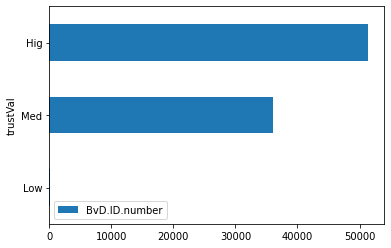

Percentage of companies with "High" rating:

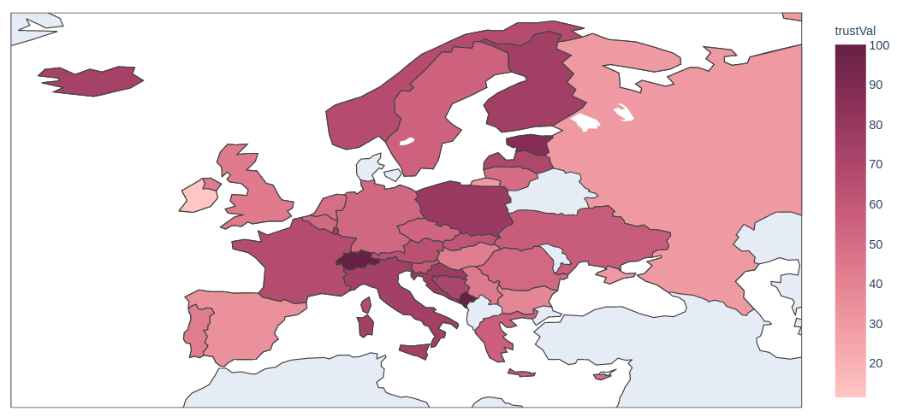

Percentage of companies with "Low" rating (*note the different y axis*):


mean trust: (high = 2, low = 0)

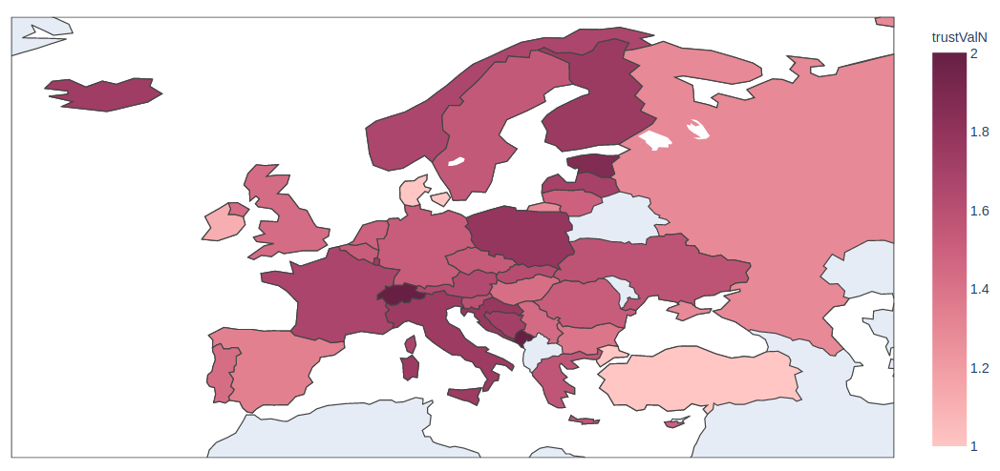


## Balance sheet

This section includes informations about the balance sheet of the company. It represents the description of equities, liabilities and assets of a company. In the following graph we reconstructed the way different variables are obtained by linear combinations of other variables. For every variable included in the balance sheet, we repeated this graph, or part of it, to point out every variable role in the balance sheet itself.

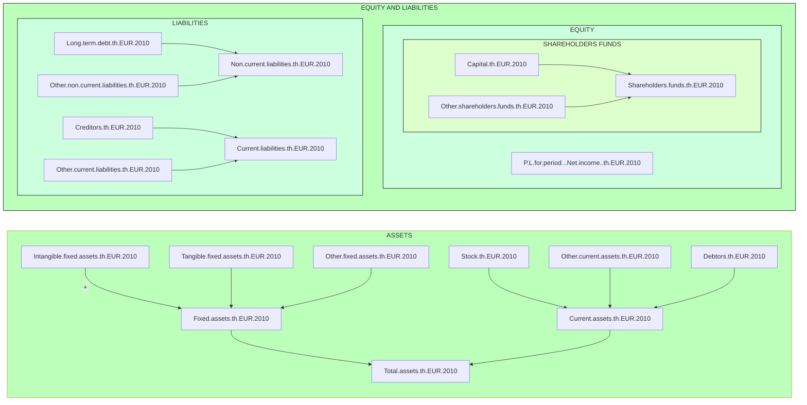
```mermaid
graph LR
subgraph A[ASSETS]
    intF[Intangible.fixed.assets.th.EUR.2010] --> |+| F[Fixed.assets.th.EUR.2010]
    tF[Tangible.fixed.assets.th.EUR.2010] --> F
    oF[Other.fixed.assets.th.EUR.2010]-->F
    S[Stock.th.EUR.2010] --> C[Current.assets.th.EUR.2010]
    OC[Other.current.assets.th.EUR.2010]--> C
    D[Debtors.th.EUR.2010]--> C
    F--> assets[Total.assets.th.EUR.2010]
	C-->assets
end

subgraph 2EL[EQUITY AND LIABILITIES]
 	subgraph EQ[EQUITY]
  		subgraph SHF[SHAREHOLDERS FUNDS]
   			Ca[Capital.th.EUR.2010]-->sf[Shareholders.funds.th.EUR.2010]
   			osf[Other.shareholders.funds.th.EUR.2010]-->sf
  		end
  		pl[P.L.for.period...Net.income..th.EUR.2010]
     end
     subgraph LI[LIABILITIES]
     	ltd[Long.term.debt.th.EUR.2010]--> ncl[Non.current.liabilities.th.EUR.2010]
     	oncl[Other.non.current.liabilities.th.EUR.2010] --> ncl
     	cr[Creditors.th.EUR.2010] --> cl[Current.liabilities.th.EUR.2010]
     	ocl[Other.current.liabilities.th.EUR.2010]-->cl
	end
end

style LI fill:#cfd, stroke:#000
style EQ fill:#cfd, stroke:#000
style SHF fill:#dfc, stroke:#000
style 2EL fill:#bfb, stroke:#000
style A fill:#bfb
```

### Assets

Assets are resources with an economic value controlled by a company. They can be bought or created. They include every entity that, now or in future, can generate cash flow, reduce expenses or improve sales, regardless of its nature.

#### Fixed.assets.th.EUR.2010 

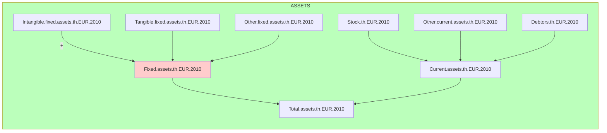
```mermaid
graph LR
subgraph A[ASSETS]
    intF[Intangible.fixed.assets.th.EUR.2010] --> |+| F[Fixed.assets.th.EUR.2010]
    tF[Tangible.fixed.assets.th.EUR.2010] --> F
    oF[Other.fixed.assets.th.EUR.2010]-->F
    S[Stock.th.EUR.2010] --> C[Current.assets.th.EUR.2010]
    OC[Other.current.assets.th.EUR.2010]--> C
    D[Debtors.th.EUR.2010]--> C
    F--> assets[Total.assets.th.EUR.2010]
	C-->assets
end


style A fill:#bfb
style F fill:#fcc
```

A fixed asset is a long-term tangible piece of property or equipment  that a firm owns and uses in its operations to generate income. Fixed  assets are not expected to be consumed or converted into cash within a  year. Fixed assets most commonly appear on the balance sheet as [property, plant, and equipment](https://www.investopedia.com/terms/p/ppe.asp) (PP&E).

![img]()

```
outlier: 
BvD.ID.number
IE486605    SAP IRELAND US-FINANCIAL SERVICES DESIGNATED A...
Name: Company.name, dtype: string
```

```
HGF vs non-HGF for Fixed.assets.th.EUR.2010
Welch's t-test statistic = 3.679
p-value = 0.0002362

Optimization terminated successfully.
         Current function value: 0.155638
         Iterations 9
                           Logit Regression Results                           
==============================================================================
Dep. Variable:                    HGF   No. Observations:               115840
Model:                          Logit   Df Residuals:                   115838
Method:                           MLE   Df Model:                            1
Date:                Mon, 29 Jun 2020   Pseudo R-squ.:               0.0001559
Time:                        15:27:08   Log-Likelihood:                -18029.
converged:                       True   LL-Null:                       -18032.
Covariance Type:            nonrobust   LLR p-value:                   0.01773
==============================================================================
                 coef    std err          z      P>|z|      [0.025      0.975]
------------------------------------------------------------------------------
Intercept     -3.2793      0.016   -207.847      0.000      -3.310      -3.248
FX         -6.137e-06   3.82e-06     -1.607      0.108   -1.36e-05    1.35e-06
==============================================================================
```

#### Intangible.fixed.assets.th.EUR.2010

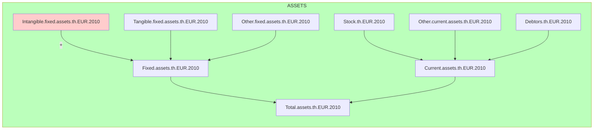
```mermaid
graph LR
subgraph A[ASSETS]
    intF[Intangible.fixed.assets.th.EUR.2010] --> |+| F[Fixed.assets.th.EUR.2010]
    tF[Tangible.fixed.assets.th.EUR.2010] --> F
    oF[Other.fixed.assets.th.EUR.2010]-->F
    S[Stock.th.EUR.2010] --> C[Current.assets.th.EUR.2010]
    OC[Other.current.assets.th.EUR.2010]--> C
    D[Debtors.th.EUR.2010]--> C
    F--> assets[Total.assets.th.EUR.2010]
	C-->assets
end


style A fill:#bfb
style intF fill:#fcc
```

Intangible assets include operational assets that lack physical substance. For example, goodwill is a fixed asset, as are patents, copyrights, trademarks and franchises. A company's  intangible assets are often not reported on a company's financial  statements, or they may be reported at significantly less than their  actual value. This is because assets are accounted for at their  historical cost.

Unlike tangible fixed assets such as a building or machinery, intangibles are often  developed internally without any direct, measurable cost that can be  capitalized. When an intangible is purchased, however, or when costs can be directly traced to the development of the asset, the cost is  recorded as an intangible asset on the balance sheet.

Intangible assets are valued at their cost of acquisition. A purchased intangible is valued based on the amount paid  for the asset. Research and development costs associated with developing an intangible are expensed for the year in which they were incurred.

However, costs of registering patents or trademarks and legal fees incurred to  defend a company's right of use are included in the cost of acquisition, which is reported as an intangible asset on the balance sheet.

![img]()

x 10³ €

outlier:

```
BvD.ID.number
IT10969001006    LOTTERIE NAZIONALI S.R.L.
Name: Company.name, dtype: string
```

```
HGF vs non-HGF for Intangible.fixed.assets.th.EUR.2010
Welch's t-test statistic = 1.822
p-value = 0.06857
```

```
Optimization terminated successfully.
         Current function value: 0.155657
         Iterations 9
                           Logit Regression Results                           
==============================================================================
Dep. Variable:                    HGF   No. Observations:               115840
Model:                          Logit   Df Residuals:                   115838
Method:                           MLE   Df Model:                            1
Date:                Mon, 29 Jun 2020   Pseudo R-squ.:               3.442e-05
Time:                        15:28:39   Log-Likelihood:                -18031.
converged:                       True   LL-Null:                       -18032.
Covariance Type:            nonrobust   LLR p-value:                    0.2652
==============================================================================
                 coef    std err          z      P>|z|      [0.025      0.975]
------------------------------------------------------------------------------
Intercept     -3.2814      0.016   -208.487      0.000      -3.312      -3.251
INT        -9.435e-06   1.24e-05     -0.760      0.447   -3.38e-05    1.49e-05
==============================================================================
```

#### Tangible.fixed.assets.th.EUR.2010

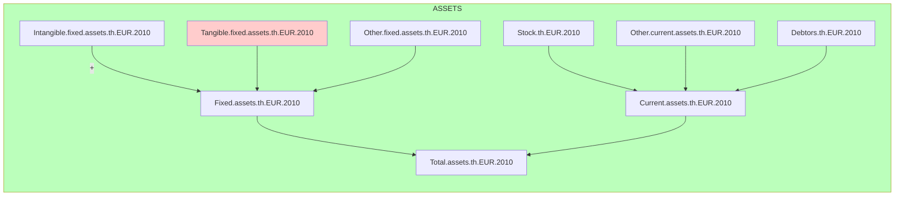
```mermaid
graph LR
subgraph A[ASSETS]
    intF[Intangible.fixed.assets.th.EUR.2010] --> |+| F[Fixed.assets.th.EUR.2010]
    tF[Tangible.fixed.assets.th.EUR.2010] --> F
    oF[Other.fixed.assets.th.EUR.2010]-->F
    S[Stock.th.EUR.2010] --> C[Current.assets.th.EUR.2010]
    OC[Other.current.assets.th.EUR.2010]--> C
    D[Debtors.th.EUR.2010]--> C
    F--> assets[Total.assets.th.EUR.2010]
	C-->assets
end


style A fill:#bfb
style tF fill:#fcc
```

Tangible fixed assets generally refer to assets that have a physical  value. Examples of this are your business premises, equipment, inventory and machinery. Tangible fixed assets have a market value that needs to  be accounted for when you file your annual accounts. Some of these  assets, for example computer equipment, will incur depreciation, which  needs to be factored into your accounts.

![img]()

outlier: 

```
BvD.ID.number
GB07145051    CAPITAL & COUNTIES PROPERTIES PLC
Name: Company.name, dtype: string
```

```
HGF vs non-HGF for Tangible.fixed.assets.th.EUR.2010
Welch's t-test statistic = 1.394
p-value = 0.1635

Optimization terminated successfully.
         Current function value: 0.155655
         Iterations 8
                           Logit Regression Results                           
==============================================================================
Dep. Variable:                    HGF   No. Observations:               115840
Model:                          Logit   Df Residuals:                   115838
Method:                           MLE   Df Model:                            1
Date:                Mon, 29 Jun 2020   Pseudo R-squ.:               4.600e-05
Time:                        15:29:04   Log-Likelihood:                -18031.
converged:                       True   LL-Null:                       -18032.
Covariance Type:            nonrobust   LLR p-value:                    0.1977
==============================================================================
                 coef    std err          z      P>|z|      [0.025      0.975]
------------------------------------------------------------------------------
Intercept     -3.2808      0.016   -208.167      0.000      -3.312      -3.250
T          -4.673e-06   4.82e-06     -0.969      0.332   -1.41e-05    4.78e-06
==============================================================================
```

#### Other.fixed.assets.th.EUR.2010

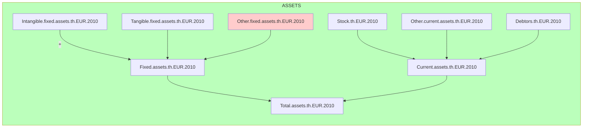
```mermaid
graph LR
subgraph A[ASSETS]
    intF[Intangible.fixed.assets.th.EUR.2010] --> |+| F[Fixed.assets.th.EUR.2010]
    tF[Tangible.fixed.assets.th.EUR.2010] --> F
    oF[Other.fixed.assets.th.EUR.2010]-->F
    S[Stock.th.EUR.2010] --> C[Current.assets.th.EUR.2010]
    OC[Other.current.assets.th.EUR.2010]--> C
    D[Debtors.th.EUR.2010]--> C
    F--> assets[Total.assets.th.EUR.2010]
	C-->assets
end


style A fill:#bfb
style oF fill:#fcc
```


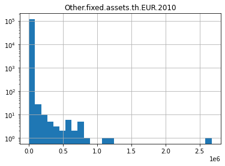

outlier:

```
BvD.ID.number
IE486605    SAP IRELAND US-FINANCIAL SERVICES DESIGNATED A...
Name: Company.name, dtype: string
```

```
HGF vs non-HGF for Other.fixed.assets.th.EUR.2010
Welch's t-test statistic = 4.793
p-value = 1.65e-06

Optimization terminated successfully.
         Current function value: 0.155642
         Iterations 10
                           Logit Regression Results                           
==============================================================================
Dep. Variable:                    HGF   No. Observations:               115840
Model:                          Logit   Df Residuals:                   115838
Method:                           MLE   Df Model:                            1
Date:                Mon, 29 Jun 2020   Pseudo R-squ.:               0.0001271
Time:                        15:29:34   Log-Likelihood:                -18030.
converged:                       True   LL-Null:                       -18032.
Covariance Type:            nonrobust   LLR p-value:                   0.03230
==============================================================================
                 coef    std err          z      P>|z|      [0.025      0.975]
------------------------------------------------------------------------------
Intercept     -3.2804      0.016   -208.259      0.000      -3.311      -3.249
OF         -1.366e-05   1.07e-05     -1.272      0.203   -3.47e-05    7.38e-06
==============================================================================
```

#### Current.assets.th.EUR.2010

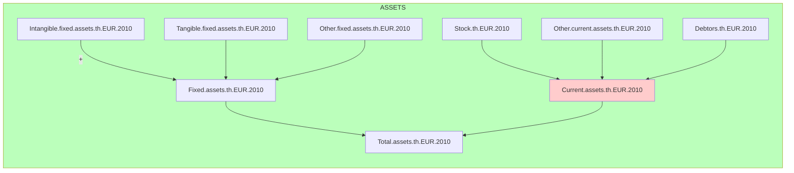
```mermaid
graph LR
subgraph A[ASSETS]
    intF[Intangible.fixed.assets.th.EUR.2010] --> |+| F[Fixed.assets.th.EUR.2010]
    tF[Tangible.fixed.assets.th.EUR.2010] --> F
    oF[Other.fixed.assets.th.EUR.2010]-->F
    S[Stock.th.EUR.2010] --> C[Current.assets.th.EUR.2010]
    OC[Other.current.assets.th.EUR.2010]--> C
    D[Debtors.th.EUR.2010]--> C
    F--> assets[Total.assets.th.EUR.2010]
	C-->assets
end


style A fill:#bfb
style C fill:#fcc
```


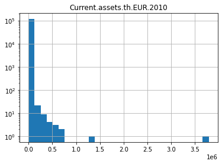

```
outlier:
BvD.ID.number
GB07450219    LONG ISLAND ASSETS LIMITED
Name: Company.name, dtype: string
```

```
HGF vs non-HGF for Current.assets.th.EUR.2010
Welch's t-test statistic = 6.732
p-value = 1.687e-11
```

```
Optimization terminated successfully.
         Current function value: 0.155487
         Iterations 11
                           Logit Regression Results                           
==============================================================================
Dep. Variable:                    HGF   No. Observations:               115840
Model:                          Logit   Df Residuals:                   115838
Method:                           MLE   Df Model:                            1
Date:                Mon, 29 Jun 2020   Pseudo R-squ.:                0.001126
Time:                        15:30:01   Log-Likelihood:                -18012.
converged:                       True   LL-Null:                       -18032.
Covariance Type:            nonrobust   LLR p-value:                 1.856e-10
==============================================================================
                 coef    std err          z      P>|z|      [0.025      0.975]
------------------------------------------------------------------------------
Intercept     -3.2613      0.016   -201.717      0.000      -3.293      -3.230
CA            -0.0001    2.7e-05     -4.235      0.000      -0.000   -6.15e-05
==============================================================================
```

#### Stock.th.EUR.2010

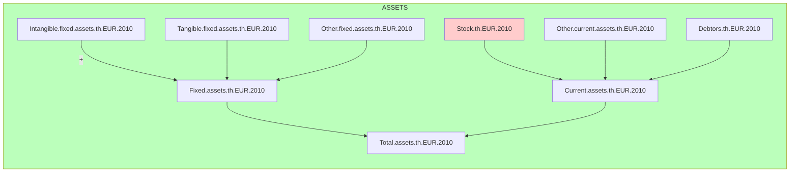
```mermaid
graph LR
subgraph A[ASSETS]
    intF[Intangible.fixed.assets.th.EUR.2010] --> |+| F[Fixed.assets.th.EUR.2010]
    tF[Tangible.fixed.assets.th.EUR.2010] --> F
    oF[Other.fixed.assets.th.EUR.2010]-->F
    S[Stock.th.EUR.2010] --> C[Current.assets.th.EUR.2010]
    OC[Other.current.assets.th.EUR.2010]--> C
    D[Debtors.th.EUR.2010]--> C
    F--> assets[Total.assets.th.EUR.2010]
	C-->assets
end


style A fill:#bfb
style S fill:#fcc
```


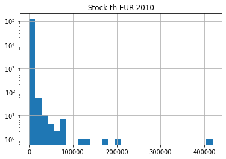

outlier:

```
BvD.ID.number
IT07099900966    MILANOSESTO S.P.A.
Name: Company.name, dtype: string
```

```
HGF vs non-HGF for Stock.th.EUR.2010
Welch's t-test statistic = 10.69
p-value = 1.155e-26

Optimization terminated successfully.
         Current function value: 0.155221
         Iterations 11
                           Logit Regression Results                           
==============================================================================
Dep. Variable:                    HGF   No. Observations:               115840
Model:                          Logit   Df Residuals:                   115838
Method:                           MLE   Df Model:                            1
Date:                Mon, 29 Jun 2020   Pseudo R-squ.:                0.002831
Time:                        15:30:21   Log-Likelihood:                -17981.
converged:                       True   LL-Null:                       -18032.
Covariance Type:            nonrobust   LLR p-value:                 5.302e-24
==============================================================================
                 coef    std err          z      P>|z|      [0.025      0.975]
------------------------------------------------------------------------------
Intercept     -3.2474      0.016   -201.604      0.000      -3.279      -3.216
S             -0.0015      0.000     -6.485      0.000      -0.002      -0.001
==============================================================================
```

#### Debtors.th.EUR.2010

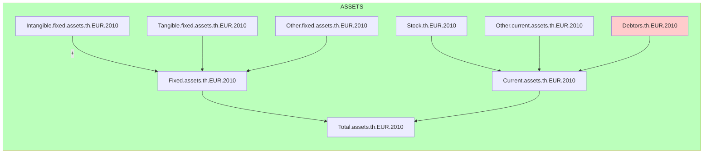
```mermaid
graph LR
subgraph A[ASSETS]
    intF[Intangible.fixed.assets.th.EUR.2010] --> |+| F[Fixed.assets.th.EUR.2010]
    tF[Tangible.fixed.assets.th.EUR.2010] --> F
    oF[Other.fixed.assets.th.EUR.2010]-->F
    S[Stock.th.EUR.2010] --> C[Current.assets.th.EUR.2010]
    OC[Other.current.assets.th.EUR.2010]--> C
    D[Debtors.th.EUR.2010]--> C
    F--> assets[Total.assets.th.EUR.2010]
	C-->assets
end


style A fill:#bfb
style D fill:#fcc
```

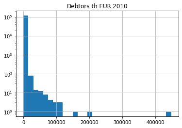

outlier: 

```
BvD.ID.number
GB07246104    MACSCO 22 LIMITED
Name: Company.name, dtype: string
```

```
HGF vs non-HGF for Debtors.th.EUR.2010
Welch's t-test statistic = 7.135
p-value = 1.014e-12

Optimization terminated successfully.
         Current function value: 0.155553
         Iterations 10
                           Logit Regression Results                           
==============================================================================
Dep. Variable:                    HGF   No. Observations:               115840
Model:                          Logit   Df Residuals:                   115838
Method:                           MLE   Df Model:                            1
Date:                Mon, 29 Jun 2020   Pseudo R-squ.:               0.0007008
Time:                        15:30:49   Log-Likelihood:                -18019.
converged:                       True   LL-Null:                       -18032.
Covariance Type:            nonrobust   LLR p-value:                 4.972e-07
==============================================================================
                 coef    std err          z      P>|z|      [0.025      0.975]
------------------------------------------------------------------------------
Intercept     -3.2697      0.016   -204.720      0.000      -3.301      -3.238
DEB           -0.0002    7.3e-05     -3.356      0.001      -0.000      -0.000
==============================================================================
```

#### Other.current.assets.th.EUR.2010


```mermaid
graph LR
subgraph A[ASSETS]
    intF[Intangible.fixed.assets.th.EUR.2010] --> |+| F[Fixed.assets.th.EUR.2010]
    tF[Tangible.fixed.assets.th.EUR.2010] --> F
    oF[Other.fixed.assets.th.EUR.2010]-->F
    S[Stock.th.EUR.2010] --> C[Current.assets.th.EUR.2010]
    OC[Other.current.assets.th.EUR.2010]--> C
    D[Debtors.th.EUR.2010]--> C
    F--> assets[Total.assets.th.EUR.2010]
	C-->assets
end


style A fill:#bfb
style OC fill:#fcc
```


outlier:

```
BvD.ID.number
GB07450219    LONG ISLAND ASSETS LIMITED
Name: Company.name, dtype: string
```

```
HGF vs non-HGF for Other.current.assets.th.EUR.2010
Welch's t-test statistic = 4.135
p-value = 3.56e-05

Optimization terminated successfully.
         Current function value: 0.155609
         Iterations 10
                           Logit Regression Results                           
==============================================================================
Dep. Variable:                    HGF   No. Observations:               115840
Model:                          Logit   Df Residuals:                   115838
Method:                           MLE   Df Model:                            1
Date:                Mon, 29 Jun 2020   Pseudo R-squ.:               0.0003421
Time:                        15:31:18   Log-Likelihood:                -18026.
converged:                       True   LL-Null:                       -18032.
Covariance Type:            nonrobust   LLR p-value:                 0.0004442
==============================================================================
                 coef    std err          z      P>|z|      [0.025      0.975]
------------------------------------------------------------------------------
Intercept     -3.2750      0.016   -206.020      0.000      -3.306      -3.244
OCA        -6.435e-05   2.72e-05     -2.366      0.018      -0.000   -1.11e-05
==============================================================================
```

#### Total.assets.th.EUR.2010


```mermaid
graph LR
subgraph A[ASSETS]
    intF[Intangible.fixed.assets.th.EUR.2010] --> |+| F[Fixed.assets.th.EUR.2010]
    tF[Tangible.fixed.assets.th.EUR.2010] --> F
    oF[Other.fixed.assets.th.EUR.2010]-->F
    S[Stock.th.EUR.2010] --> C[Current.assets.th.EUR.2010]
    OC[Other.current.assets.th.EUR.2010]--> C
    D[Debtors.th.EUR.2010]--> C
    F--> assets[Total.assets.th.EUR.2010]
	C-->assets
end

style A fill:#bfb
style assets fill:#fcc
```


outlier:

```
BvD.ID.number
GB07450219    LONG ISLAND ASSETS LIMITED
Name: Company.name, dtype: string
```

```
HGF vs non-HGF for Total.assets.th.EUR.2010
Welch's t-test statistic = 5.512
p-value = 3.645e-08

Optimization terminated successfully.
         Current function value: 0.155604
         Iterations 10
                           Logit Regression Results                           
==============================================================================
Dep. Variable:                    HGF   No. Observations:               115840
Model:                          Logit   Df Residuals:                   115838
Method:                           MLE   Df Model:                            1
Date:                Mon, 29 Jun 2020   Pseudo R-squ.:               0.0003744
Time:                        15:31:50   Log-Likelihood:                -18025.
converged:                       True   LL-Null:                       -18032.
Covariance Type:            nonrobust   LLR p-value:                 0.0002385
==============================================================================
                 coef    std err          z      P>|z|      [0.025      0.975]
------------------------------------------------------------------------------
Intercept     -3.2751      0.016   -206.277      0.000      -3.306      -3.244
TA         -1.137e-05   4.72e-06     -2.406      0.016   -2.06e-05   -2.11e-06
==============================================================================
```

#### Shareholders.funds.th.EUR.2010


```mermaid
graph LR

subgraph 2EL[EQUITY AND LIABILITIES]
 	subgraph EQ[EQUITY]
  		subgraph SHF[SHAREHOLDERS FUNDS]
   			Ca[Capital.th.EUR.2010]-->sf[Shareholders.funds.th.EUR.2010]
   			osf[Other.shareholders.funds.th.EUR.2010]-->sf
  		end
  		pl[P.L.for.period...Net.income..th.EUR.2010]
     end
     subgraph LI[LIABILITIES]
     	
	end
end

style LI fill:#cfd, stroke:#000
style EQ fill:#cfd, stroke:#000
style SHF fill:#dfc, stroke:#000
style 2EL fill:#bfb, stroke:#000
style sf fill:#fcc

```


![img]()


```
outlier:

BvD.ID.number
GB07450219    LONG ISLAND ASSETS LIMITED
Name: Company.name, dtype: string

HGF vs non-HGF for Shareholders.funds.th.EUR.2010
Welch's t-test statistic = 1.909
p-value = 0.05634

Optimization terminated successfully.
         Current function value: 0.155657
         Iterations 8
                           Logit Regression Results                           
==============================================================================
Dep. Variable:                    HGF   No. Observations:               115840
Model:                          Logit   Df Residuals:                   115838
Method:                           MLE   Df Model:                            1
Date:                Mon, 29 Jun 2020   Pseudo R-squ.:               3.438e-05
Time:                        15:32:19   Log-Likelihood:                -18031.
converged:                       True   LL-Null:                       -18032.
Covariance Type:            nonrobust   LLR p-value:                    0.2655
==============================================================================
                 coef    std err          z      P>|z|      [0.025      0.975]
------------------------------------------------------------------------------
Intercept     -3.2812      0.016   -208.351      0.000      -3.312      -3.250
SHA        -2.844e-06   3.41e-06     -0.834      0.404   -9.53e-06    3.84e-06
==============================================================================
```

### Equity

Equity represents the difference between assets and liabilities, or the amount of money that should be returned to shareholders if all assets were to be sold, and all the debts paid off.

#### Capital.th.EUR.2010


```mermaid
graph LR

subgraph 2EL[EQUITY AND LIABILITIES]
 	subgraph EQ[EQUITY]
  		subgraph SHF[SHAREHOLDERS FUNDS]
   			Ca[Capital.th.EUR.2010]-->sf[Shareholders.funds.th.EUR.2010]
   			osf[Other.shareholders.funds.th.EUR.2010]-->sf
  		end
  		pl[P.L.for.period...Net.income..th.EUR.2010]
     end
     subgraph LI[LIABILITIES]
     	
	end
end

style LI fill:#cfd, stroke:#000
style EQ fill:#cfd, stroke:#000
style SHF fill:#dfc, stroke:#000
style 2EL fill:#bfb, stroke:#000
style Ca fill:#fcc

```


![img]()


outlier: 

```
BvD.ID.number
FR519720643    IRIDIUM FRANCE
Name: Company.name, dtype: string
```

```
HGF vs non-HGF for Capital.th.EUR.2010
Welch's t-test statistic = 4.127
p-value = 3.699e-05

Optimization terminated successfully.
         Current function value: 0.155645
         Iterations 9
                           Logit Regression Results                           
==============================================================================
Dep. Variable:                    HGF   No. Observations:               115840
Model:                          Logit   Df Residuals:                   115838
Method:                           MLE   Df Model:                            1
Date:                Mon, 29 Jun 2020   Pseudo R-squ.:               0.0001079
Time:                        15:32:46   Log-Likelihood:                -18030.
converged:                       True   LL-Null:                       -18032.
Covariance Type:            nonrobust   LLR p-value:                   0.04852
==============================================================================
                 coef    std err          z      P>|z|      [0.025      0.975]
------------------------------------------------------------------------------
Intercept     -3.2801      0.016   -208.097      0.000      -3.311      -3.249
CAP        -1.822e-05   1.36e-05     -1.337      0.181   -4.49e-05    8.49e-06
==============================================================================
```

#### Other.shareholders.funds.th.EUR.2010


```mermaid
graph LR

subgraph 2EL[EQUITY AND LIABILITIES]
 	subgraph EQ[EQUITY]
  		subgraph SHF[SHAREHOLDERS FUNDS]
   			Ca[Capital.th.EUR.2010]-->sf[Shareholders.funds.th.EUR.2010]
   			osf[Other.shareholders.funds.th.EUR.2010]-->sf
  		end
  		pl[P.L.for.period...Net.income..th.EUR.2010]
     end
     subgraph LI[LIABILITIES]
     	
	end
end

style LI fill:#cfd, stroke:#000
style EQ fill:#cfd, stroke:#000
style SHF fill:#dfc, stroke:#000
style 2EL fill:#bfb, stroke:#000
style osf fill:#fcc

```


42359 companies has negative values in the range (-)

outlier:

```
BvD.ID.number
GB07450219    LONG ISLAND ASSETS LIMITED
Name: Company.name, dtype: string
```

Distribution of negative values:


outlier:

```
vD.ID.number
FR519720643    IRIDIUM FRANCE
Name: Company.name, dtype: string BvD.ID.number
FR519720643   -502140.0
Name: Other.shareholders.funds.th.EUR.2010, dtype: float64
```

```
HGF vs non-HGF for Other.shareholders.funds.th.EUR.2010
Welch's t-test statistic = 0.8908
p-value = 0.3731

Optimization terminated successfully.
         Current function value: 0.155661
         Iterations 7
                           Logit Regression Results                           
==============================================================================
Dep. Variable:                    HGF   No. Observations:               115840
Model:                          Logit   Df Residuals:                   115838
Method:                           MLE   Df Model:                            1
Date:                Mon, 29 Jun 2020   Pseudo R-squ.:               4.778e-06
Time:                        15:33:13   Log-Likelihood:                -18032.
converged:                       True   LL-Null:                       -18032.
Covariance Type:            nonrobust   LLR p-value:                    0.6781
==============================================================================
                 coef    std err          z      P>|z|      [0.025      0.975]
------------------------------------------------------------------------------
Intercept     -3.2818      0.016   -208.591      0.000      -3.313      -3.251
OSF        -6.672e-07      2e-06     -0.334      0.739   -4.59e-06    3.25e-06
==============================================================================

```

### Liabilities

Liabilities are what a company typically owes or needs to pay to keep the company  running. Debt, including long-term debt, is a liability, as are rent, taxes, utilities, salaries, wages, and dividends payable.

#### Non.current.liabilities.th.EUR.2010


```mermaid
graph LR

subgraph 2EL[EQUITY AND LIABILITIES]
 	subgraph EQ[EQUITY]
  		
     end
     subgraph LI[LIABILITIES]
     	ltd[Long.term.debt.th.EUR.2010]--> ncl[Non.current.liabilities.th.EUR.2010]
     	oncl[Other.non.current.liabilities.th.EUR.2010] --> ncl
     	cr[Creditors.th.EUR.2010] --> cl[Current.liabilities.th.EUR.2010]
     	ocl[Other.current.liabilities.th.EUR.2010]-->cl
	end
end

style LI fill:#cfd, stroke:#000
style EQ fill:#cfd, stroke:#000
style 2EL fill:#bfb, stroke:#000
style ncl fill:#fcc
```


```
HGF vs non-HGF for Non.current.liabilities.th.EUR.2010
Welch's t-test statistic = 7.868
p-value = 3.731e-15

Optimization terminated successfully.
         Current function value: 0.155577
         Iterations 10
                           Logit Regression Results                           
==============================================================================
Dep. Variable:                    HGF   No. Observations:               115840
Model:                          Logit   Df Residuals:                   115838
Method:                           MLE   Df Model:                            1
Date:                Mon, 29 Jun 2020   Pseudo R-squ.:               0.0005448
Time:                        15:34:00   Log-Likelihood:                -18022.
converged:                       True   LL-Null:                       -18032.
Covariance Type:            nonrobust   LLR p-value:                 9.307e-06
==============================================================================
                 coef    std err          z      P>|z|      [0.025      0.975]
------------------------------------------------------------------------------
Intercept     -3.2743      0.016   -206.612      0.000      -3.305      -3.243
NCL        -5.339e-05   1.92e-05     -2.774      0.006   -9.11e-05   -1.57e-05
==============================================================================

```

#### Long.term.debt.th.EUR.2010


```mermaid
graph LR

subgraph 2EL[EQUITY AND LIABILITIES]
 	subgraph EQ[EQUITY]
  		
     end
     subgraph LI[LIABILITIES]
     	ltd[Long.term.debt.th.EUR.2010]--> ncl[Non.current.liabilities.th.EUR.2010]
     	oncl[Other.non.current.liabilities.th.EUR.2010] --> ncl
     	cr[Creditors.th.EUR.2010] --> cl[Current.liabilities.th.EUR.2010]
     	ocl[Other.current.liabilities.th.EUR.2010]-->cl
	end
end

style LI fill:#cfd, stroke:#000
style EQ fill:#cfd, stroke:#000
style 2EL fill:#bfb, stroke:#000
style ltd fill:#fcc
```


outlier:

```
BvD.ID.number
GB07251526    TESCO PROPERTY FINANCE 3 PLC
Name: Company.name, dtype: string
```

```
Optimization terminated successfully.
         Current function value: 0.143145
         Iterations 10
                           Logit Regression Results                           
==============================================================================
Dep. Variable:                    HGF   No. Observations:                83074
Model:                          Logit   Df Residuals:                    83072
Method:                           MLE   Df Model:                            1
Date:                Mon, 29 Jun 2020   Pseudo R-squ.:               0.0004459
Time:                        15:34:25   Log-Likelihood:                -11892.
converged:                       True   LL-Null:                       -11897.
Covariance Type:            nonrobust   LLR p-value:                  0.001125
==============================================================================
                 coef    std err          z      P>|z|      [0.025      0.975]
------------------------------------------------------------------------------
Intercept     -3.3885      0.020   -172.120      0.000      -3.427      -3.350
LTD        -4.824e-05   2.41e-05     -1.998      0.046   -9.56e-05   -9.12e-07
==============================================================================
```

#### Other.non.current.liabilities.th.EUR.2010


```mermaid
graph LR

subgraph 2EL[EQUITY AND LIABILITIES]
 	subgraph EQ[EQUITY]
  		
     end
     subgraph LI[LIABILITIES]
     	ltd[Long.term.debt.th.EUR.2010]--> ncl[Non.current.liabilities.th.EUR.2010]
     	oncl[Other.non.current.liabilities.th.EUR.2010] --> ncl
     	cr[Creditors.th.EUR.2010] --> cl[Current.liabilities.th.EUR.2010]
     	ocl[Other.current.liabilities.th.EUR.2010]-->cl
	end
end

style LI fill:#cfd, stroke:#000
style EQ fill:#cfd, stroke:#000
style 2EL fill:#bfb, stroke:#000
style oncl fill:#fcc
```


outliers:

```
vD.ID.number
IE487769       SCF CAPITAL DESIGNATED ACTIVITY COMPANY
FR521029926                             DIACINE FRANCE
NO995633604                   INDUSTRIINVESTERINGER AS

Optimization terminated successfully.
         Current function value: 0.143132
         Iterations 10
                           Logit Regression Results                           
==============================================================================
Dep. Variable:                    HGF   No. Observations:                83074
Model:                          Logit   Df Residuals:                    83072
Method:                           MLE   Df Model:                            1
Date:                Mon, 29 Jun 2020   Pseudo R-squ.:               0.0005412
Time:                        15:34:51   Log-Likelihood:                -11891.
converged:                       True   LL-Null:                       -11897.
Covariance Type:            nonrobust   LLR p-value:                 0.0003325
==============================================================================
                 coef    std err          z      P>|z|      [0.025      0.975]
------------------------------------------------------------------------------
Intercept     -3.3869      0.020   -171.972      0.000      -3.426      -3.348
ONCL          -0.0001   4.63e-05     -2.467      0.014      -0.000   -2.35e-05
==============================================================================
```

#### Current.liabilities.th.EUR.2010


```mermaid
graph LR

subgraph 2EL[EQUITY AND LIABILITIES]
 	subgraph EQ[EQUITY]
  		
     end
     subgraph LI[LIABILITIES]
     	ltd[Long.term.debt.th.EUR.2010]--> ncl[Non.current.liabilities.th.EUR.2010]
     	oncl[Other.non.current.liabilities.th.EUR.2010] --> ncl
     	cr[Creditors.th.EUR.2010] --> cl[Current.liabilities.th.EUR.2010]
     	ocl[Other.current.liabilities.th.EUR.2010]-->cl
	end
end

style LI fill:#cfd, stroke:#000
style EQ fill:#cfd, stroke:#000
style 2EL fill:#bfb, stroke:#000
style cl fill:#fcc
```


outliers:

```
BvD.ID.number
IE480184          ESB FINANCE DESIGNATED ACTIVITY COMPANY
IE486122                      ICG EOS LOAN FUND I LIMITED
GB07193500           PREMIER LOTTERIES CAPITAL UK LIMITED
GB07202475       PREMIER LOTTERIES INVESTMENTS UK LIMITED
IT10319310016                    INFRATRASPORTI.TO S.R.L.
Name: Company.name, dtype: string
```

```
HGF vs non-HGF for Current.liabilities.th.EUR.2010
Welch's t-test statistic = 7.677
p-value = 1.691e-14

Optimization terminated successfully.
         Current function value: 0.155527
         Iterations 10
                           Logit Regression Results                           
==============================================================================
Dep. Variable:                    HGF   No. Observations:               115840
Model:                          Logit   Df Residuals:                   115838
Method:                           MLE   Df Model:                            1
Date:                Mon, 29 Jun 2020   Pseudo R-squ.:               0.0008644
Time:                        15:35:15   Log-Likelihood:                -18016.
converged:                       True   LL-Null:                       -18032.
Covariance Type:            nonrobust   LLR p-value:                 2.359e-08
==============================================================================
                 coef    std err          z      P>|z|      [0.025      0.975]
------------------------------------------------------------------------------
Intercept     -3.2648      0.016   -202.670      0.000      -3.296      -3.233
CL          -9.74e-05   2.52e-05     -3.868      0.000      -0.000    -4.8e-05
==============================================================================
```

#### Creditors.th.EUR.2010


```mermaid
graph LR

subgraph 2EL[EQUITY AND LIABILITIES]
 	subgraph EQ[EQUITY]
  		
     end
     subgraph LI[LIABILITIES]
     	ltd[Long.term.debt.th.EUR.2010]--> ncl[Non.current.liabilities.th.EUR.2010]
     	oncl[Other.non.current.liabilities.th.EUR.2010] --> ncl
     	cr[Creditors.th.EUR.2010] --> cl[Current.liabilities.th.EUR.2010]
     	ocl[Other.current.liabilities.th.EUR.2010]-->cl
	end
end

style LI fill:#cfd, stroke:#000
style EQ fill:#cfd, stroke:#000
style 2EL fill:#bfb, stroke:#000
style cr fill:#fcc
```


outliers:

```
BvD.ID.number
GB07254605        ED BROKING GROUP LIMITED
IT10969001006    LOTTERIE NAZIONALI S.R.L.
Name: Company.name, dtype: string

Optimization terminated successfully.
         Current function value: 0.149458
         Iterations 10
                           Logit Regression Results                           
==============================================================================
Dep. Variable:                    HGF   No. Observations:                98541
Model:                          Logit   Df Residuals:                    98539
Method:                           MLE   Df Model:                            1
Date:                Mon, 29 Jun 2020   Pseudo R-squ.:                0.001558
Time:                        15:35:36   Log-Likelihood:                -14728.
converged:                       True   LL-Null:                       -14751.
Covariance Type:            nonrobust   LLR p-value:                 1.211e-11
==============================================================================
                 coef    std err          z      P>|z|      [0.025      0.975]
------------------------------------------------------------------------------
Intercept     -3.3077      0.018   -183.576      0.000      -3.343      -3.272
CR            -0.0005      0.000     -4.689      0.000      -0.001      -0.000
==============================================================================
```

#### Other.current.liabilities.th.EUR.2010


```mermaid
graph LR

subgraph 2EL[EQUITY AND LIABILITIES]
 	subgraph EQ[EQUITY]
  		
     end
     subgraph LI[LIABILITIES]
     	ltd[Long.term.debt.th.EUR.2010]--> ncl[Non.current.liabilities.th.EUR.2010]
     	oncl[Other.non.current.liabilities.th.EUR.2010] --> ncl
     	cr[Creditors.th.EUR.2010] --> cl[Current.liabilities.th.EUR.2010]
     	ocl[Other.current.liabilities.th.EUR.2010]-->cl
	end
end

style LI fill:#cfd, stroke:#000
style EQ fill:#cfd, stroke:#000
style 2EL fill:#bfb, stroke:#000
style ocl fill:#fcc
```


outlier:

```
BvD.ID.number
IT10319310016    INFRATRASPORTI.TO S.R.L.
Name: Company.name, dtype: string

Optimization terminated successfully.
         Current function value: 0.148949
         Iterations 10
                           Logit Regression Results                           
==============================================================================
Dep. Variable:                    HGF   No. Observations:                97463
Model:                          Logit   Df Residuals:                    97461
Method:                           MLE   Df Model:                            1
Date:                Mon, 29 Jun 2020   Pseudo R-squ.:               0.0006357
Time:                        15:36:15   Log-Likelihood:                -14517.
converged:                       True   LL-Null:                       -14526.
Covariance Type:            nonrobust   LLR p-value:                 1.727e-05
==============================================================================
                 coef    std err          z      P>|z|      [0.025      0.975]
------------------------------------------------------------------------------
Intercept     -3.3277      0.018   -185.296      0.000      -3.363      -3.292
OCL           -0.0001   4.46e-05     -3.012      0.003      -0.000   -4.69e-05
==============================================================================
```

#### Cash...cash.equivalent.th.EUR.2010


outliers:

400+K bin: 

```
BvD.ID.number
NO995216604    WALLENIUS WILHELMSEN ASA
Name: Company.name, dtype: string
```

300K bin:

```
BvD.ID.number
GB07123187            ACACIA MINING PLC
Name: Company.name, dtype: string
```

200K+ bin:

```
BvD.ID.number
BE0831465984                           XIX-INVEST
GB07145051      CAPITAL & COUNTIES PROPERTIES PLC
GB07254605               ED BROKING GROUP LIMITED
GB07283266              HIGHBRIDGE COBALT LIMITED
Name: Company.name, dtype: string

Optimization terminated successfully.
         Current function value: 0.157093
         Iterations 9
                           Logit Regression Results                           
==============================================================================
Dep. Variable:                    HGF   No. Observations:               110446
Model:                          Logit   Df Residuals:                   110444
Method:                           MLE   Df Model:                            1
Date:                Mon, 29 Jun 2020   Pseudo R-squ.:               0.0001870
Time:                        15:36:36   Log-Likelihood:                -17350.
converged:                       True   LL-Null:                       -17354.
Covariance Type:            nonrobust   LLR p-value:                   0.01086
==============================================================================
                 coef    std err          z      P>|z|      [0.025      0.975]
------------------------------------------------------------------------------
Intercept     -3.2645      0.016   -201.981      0.000      -3.296      -3.233
OCL        -9.186e-05   5.11e-05     -1.797      0.072      -0.000    8.33e-06
==============================================================================
```

## Income statement

Income statement is a company core financial statement that shows they profit and loss (P&L) over a period of time, defined as the composition of all expenses, profits and revenues, from operating and non-operating activities. It can has different granularity (year, month, season). For our dataset, yearly data are aggregated. It includes the Earnings Before Interest and Taxes (EBIT) and taxation. The following graph represent the composition of different variables belonging to the income statement.


```mermaid
graph TB
subgraph BS[INCOME STATEMENT]
	
	
    
    subgraph EB[EBIT]
    	subgraph Fin[FINANCIAL]
            Fr[Financial.revenue.th.EUR.2010] --> FPL[Financial.P.L.th.EUR.2010]
            Fe[Financial.expenses.th.EUR.2010] --> FPL
        end
        EBIT[Operating.P.L...EBIT..th.EUR.2010]
        oc[non-operating revenue] --> EBIT
        EBIT --> PLbt[P.L.before.tax.th.EUR.2010]
    	Sal[Sales.th.EUR.2010] --> Rt
    	boh[?]--> Rt
    	Rt[Operating.revenue..Turnover..th.EUR.2010  ????] --> EBIT
    end
    
    FPL --> PLbt
    subgraph T[TAXATION]
    	Tax[Taxation.th.EUR.2010] 
    end
    Tax -->PLat[P.L.after.tax.th.EUR.2010]
    PLbt-->PLat    
end

style BS fill:#cfd, stroke:#000
style Fin fill:#dfc, stroke:#000
style EB fill:#dfc, stroke:#000
style T fill:#dfc, stroke:#000
style oc stroke-dasharray: 3, 7, fill:#dfc
style boh stroke-dasharray: 3, 7, fill:#dfc
```

### Earnings Before Interest and Taxes (EBIT)

#### Operating.revenue..Turnover..th.EUR.2010

```mermaid
graph TB
subgraph BS[INCOME STATEMENT]
	
	
    
    subgraph EB[EBIT]
    	subgraph Fin[FINANCIAL]
            FPL[Financial.P.L.th.EUR.2010]
            
        end
        EBIT[Operating.P.L...EBIT..th.EUR.2010]
        oc[non-operating revenue] --> EBIT
        EBIT --> PLbt[P.L.before.tax.th.EUR.2010]
    	Sal[Sales.th.EUR.2010] --> Rt
    	boh[?]--> Rt
    	Rt[Operating.revenue..Turnover..th.EUR.2010  ????] --> EBIT
    end
    
    FPL --> PLbt
    subgraph T[TAXATION]
    	Tax[Taxation.th.EUR.2010] 
    end
    Tax -->PLat[P.L.after.tax.th.EUR.2010]
    PLbt-->PLat    
end

style BS fill:#cfd, stroke:#000
style Fin fill:#dfc, stroke:#000
style EB fill:#dfc, stroke:#000
style T fill:#dfc, stroke:#000
style oc stroke-dasharray: 3, 7, fill:#dfc
style boh stroke-dasharray: 3, 7, fill:#dfc
style Rt fill:#fcc, stroke:#000
```


```
HGF vs non-HGF for Operating.revenue..Turnover..th.EUR.2010
Welch's t-test statistic = 9.251
p-value = 2.661e-20

Optimization terminated successfully.
         Current function value: 0.155219
         Iterations 11
                           Logit Regression Results                           
==============================================================================
Dep. Variable:                    HGF   No. Observations:               115840
Model:                          Logit   Df Residuals:                   115838
Method:                           MLE   Df Model:                            1
Date:                Mon, 29 Jun 2020   Pseudo R-squ.:                0.002844
Time:                        15:37:05   Log-Likelihood:                -17981.
converged:                       True   LL-Null:                       -18032.
Covariance Type:            nonrobust   LLR p-value:                 4.183e-24
==============================================================================
                 coef    std err          z      P>|z|      [0.025      0.975]
------------------------------------------------------------------------------
Intercept     -3.2318      0.017   -193.739      0.000      -3.265      -3.199
ORT           -0.0003   4.57e-05     -6.834      0.000      -0.000      -0.000
==============================================================================
```

#### Sales.th.EUR.2010

```mermaid
graph TB
subgraph BS[INCOME STATEMENT]
	
	
    
    subgraph EB[EBIT]
    	subgraph Fin[FINANCIAL]
            FPL[Financial.P.L.th.EUR.2010]
            
        end
        EBIT[Operating.P.L...EBIT..th.EUR.2010]
        oc[non-operating revenue] --> EBIT
        EBIT --> PLbt[P.L.before.tax.th.EUR.2010]
    	Sal[Sales.th.EUR.2010] --> Rt
    	boh[?]--> Rt
    	Rt[Operating.revenue..Turnover..th.EUR.2010  ????] --> EBIT
    end
    
    FPL --> PLbt
    subgraph T[TAXATION]
    	Tax[Taxation.th.EUR.2010] 
    end
    Tax -->PLat[P.L.after.tax.th.EUR.2010]
    PLbt-->PLat    
end

style BS fill:#cfd, stroke:#000
style Fin fill:#dfc, stroke:#000
style EB fill:#dfc, stroke:#000
style T fill:#dfc, stroke:#000
style oc stroke-dasharray: 3, 7, fill:#dfc
style boh stroke-dasharray: 3, 7, fill:#dfc
style Sal fill:#fcc, stroke:#000
```


![img]()


outliers:

```
BvD.ID.number
CYC266578        HMS HYDRAULIC MACHINES & SYSTEMS GROUP PLC
GB07123187                                ACACIA MINING PLC
IT10813301008                                    EOS S.R.L.
Name: Company.name, dtype: string

Optimization terminated successfully.
         Current function value: 0.160957
         Iterations 11
                           Logit Regression Results                           
==============================================================================
Dep. Variable:                    HGF   No. Observations:               102550
Model:                          Logit   Df Residuals:                   102548
Method:                           MLE   Df Model:                            1
Date:                Mon, 29 Jun 2020   Pseudo R-squ.:                0.005149
Time:                        15:37:31   Log-Likelihood:                -16506.
converged:                       True   LL-Null:                       -16592.
Covariance Type:            nonrobust   LLR p-value:                 4.804e-39
==============================================================================
                 coef    std err          z      P>|z|      [0.025      0.975]
------------------------------------------------------------------------------
Intercept     -3.1452      0.018   -177.808      0.000      -3.180      -3.111
SAL           -0.0007   8.11e-05     -9.127      0.000      -0.001      -0.001
==============================================================================
```

#### Operating.P.L...EBIT..th.EUR.2010

```mermaid
graph TB
subgraph BS[INCOME STATEMENT]
	
	
    
    subgraph EB[EBIT]
    	subgraph Fin[FINANCIAL]
            FPL[Financial.P.L.th.EUR.2010]
            
        end
        EBIT[Operating.P.L...EBIT..th.EUR.2010]
        oc[non-operating revenue] --> EBIT
        EBIT --> PLbt[P.L.before.tax.th.EUR.2010]
    	Sal[Sales.th.EUR.2010] --> Rt
    	boh[?]--> Rt
    	Rt[Operating.revenue..Turnover..th.EUR.2010  ????] --> EBIT
    end
    
    FPL --> PLbt
    subgraph T[TAXATION]
    	Tax[Taxation.th.EUR.2010] 
    end
    Tax -->PLat[P.L.after.tax.th.EUR.2010]
    PLbt-->PLat    
end

style BS fill:#cfd, stroke:#000
style Fin fill:#dfc, stroke:#000
style EB fill:#dfc, stroke:#000
style T fill:#dfc, stroke:#000
style oc stroke-dasharray: 3, 7, fill:#dfc
style boh stroke-dasharray: 3, 7, fill:#dfc
style EBIT fill:#fcc, stroke:#000
```


![img]()


Positive outliers:

```
BvD.ID.number
GB07123187                   ACACIA MINING PLC
NL50397931     ATLANTIC AURUM INVESTMENTS B.V.
NO995216604           WALLENIUS WILHELMSEN ASA
PT509444229     MOTA-ENGIL AFRICA - SGPS, S.A.
Name: Company.name, dtype: string
```

Negative outliers:

```
BvD.ID.number
IE507678             HORIZON THERAPEUTICS PUBLIC LIMITED COMPANY
PL301339040    SAMSUNG ELECTRONICS POLAND MANUFACTURING SP. Z...
RU65519055                 AKTSIONERNOE OBSHCHESTVO TATTEPLOSBYT
Name: Company.name, dtype: string
```

```
HGF vs non-HGF for Operating.P.L...EBIT..th.EUR.2010
Welch's t-test statistic = 4.539
p-value = 5.771e-06

Optimization terminated successfully.
         Current function value: 0.155585
         Iterations 7
                           Logit Regression Results                           
==============================================================================
Dep. Variable:                    HGF   No. Observations:               115840
Model:                          Logit   Df Residuals:                   115838
Method:                           MLE   Df Model:                            1
Date:                Mon, 29 Jun 2020   Pseudo R-squ.:               0.0004971
Time:                        15:37:58   Log-Likelihood:                -18023.
converged:                       True   LL-Null:                       -18032.
Covariance Type:            nonrobust   LLR p-value:                 2.296e-05
==============================================================================
                 coef    std err          z      P>|z|      [0.025      0.975]
------------------------------------------------------------------------------
Intercept     -3.2814      0.016   -208.555      0.000      -3.312      -3.251
EBIT          -0.0001   3.08e-05     -4.079      0.000      -0.000   -6.54e-05
==============================================================================
```

#### Financial.revenue.th.EUR.2010

```mermaid
graph TB
subgraph BS[INCOME STATEMENT]
	
	
    
    subgraph EB[EBIT]
    	subgraph Fin[FINANCIAL]
            Fr[Financial.revenue.th.EUR.2010] --> FPL[Financial.P.L.th.EUR.2010]
            Fe[Financial.expenses.th.EUR.2010] --> FPL
            
        end
        EBIT[Operating.P.L...EBIT..th.EUR.2010]
        
        EBIT --> PLbt[P.L.before.tax.th.EUR.2010]
    	
    end
    
    FPL --> PLbt
    subgraph T[TAXATION]
    	Tax[Taxation.th.EUR.2010] 
    end
    Tax -->PLat[P.L.after.tax.th.EUR.2010]
    PLbt-->PLat    
end

style BS fill:#cfd, stroke:#000
style Fin fill:#dfc, stroke:#000
style EB fill:#dfc, stroke:#000
style T fill:#dfc, stroke:#000
style Fr fill:#fcc, stroke:#000
```


outliers:

50K cluster:

```
BvD.ID.number
FR527925143                     SOFAQUE
NO996031454           DOLPHIN INVEST AS
Name: Company.name, dtype: string
```

200K cluster:

```
BvD.ID.number
NO995633604    INDUSTRIINVESTERINGER AS
Name: Company.name, dtype: string

Optimization terminated successfully.
         Current function value: 0.155644
         Iterations 9
                           Logit Regression Results                           
==============================================================================
Dep. Variable:                    HGF   No. Observations:               115840
Model:                          Logit   Df Residuals:                   115838
Method:                           MLE   Df Model:                            1
Date:                Mon, 29 Jun 2020   Pseudo R-squ.:               0.0001129
Time:                        15:38:23   Log-Likelihood:                -18030.
converged:                       True   LL-Null:                       -18032.
Covariance Type:            nonrobust   LLR p-value:                   0.04361
==============================================================================
                 coef    std err          z      P>|z|      [0.025      0.975]
------------------------------------------------------------------------------
Intercept     -3.2807      0.016   -208.461      0.000      -3.312      -3.250
FR            -0.0003      0.000     -1.646      0.100      -0.001    5.98e-05
==============================================================================
```

#### Financial.expenses.th.EUR.2010

```mermaid
graph TB
subgraph BS[INCOME STATEMENT]
	
	
    
    subgraph EB[EBIT]
    	subgraph Fin[FINANCIAL]
            Fr[Financial.revenue.th.EUR.2010] --> FPL[Financial.P.L.th.EUR.2010]
            Fe[Financial.expenses.th.EUR.2010] --> FPL
            
        end
        EBIT[Operating.P.L...EBIT..th.EUR.2010]
        
        EBIT --> PLbt[P.L.before.tax.th.EUR.2010]
    	
    end
    
    FPL --> PLbt
    subgraph T[TAXATION]
    	Tax[Taxation.th.EUR.2010] 
    end
    Tax -->PLat[P.L.after.tax.th.EUR.2010]
    PLbt-->PLat    
end

style BS fill:#cfd, stroke:#000
style Fin fill:#dfc, stroke:#000
style EB fill:#dfc, stroke:#000
style T fill:#dfc, stroke:#000
style Fe fill:#fcc, stroke:#000
```


positive outlier:

```
BvD.ID.number
FR519720643    IRIDIUM FRANCE
Name: Company.name, dtype: string
```

negative outlier:

```
BvD.ID.number
GB07145051    CAPITAL & COUNTIES PROPERTIES PLC
Name: Company.name, dtype: string
```

```
HGF vs non-HGF for Financial.expenses.th.EUR.2010
Welch's t-test statistic = 2.789
p-value = 0.005292

Optimization terminated successfully.
         Current function value: 0.155655
         Iterations 7
                           Logit Regression Results                           
==============================================================================
Dep. Variable:                    HGF   No. Observations:               115840
Model:                          Logit   Df Residuals:                   115838
Method:                           MLE   Df Model:                            1
Date:                Mon, 29 Jun 2020   Pseudo R-squ.:               4.376e-05
Time:                        15:38:43   Log-Likelihood:                -18031.
converged:                       True   LL-Null:                       -18032.
Covariance Type:            nonrobust   LLR p-value:                    0.2090
==============================================================================
                 coef    std err          z      P>|z|      [0.025      0.975]
------------------------------------------------------------------------------
Intercept     -3.2817      0.016   -208.616      0.000      -3.313      -3.251
FE         -2.787e-05   1.96e-05     -1.425      0.154   -6.62e-05    1.05e-05
==============================================================================
```

#### Financial.P.L.th.EUR.2010

```mermaid
graph TB
subgraph BS[INCOME STATEMENT]
	
	
    
    subgraph EB[EBIT]
    	subgraph Fin[FINANCIAL]
            Fr[Financial.revenue.th.EUR.2010] --> FPL[Financial.P.L.th.EUR.2010]
            Fe[Financial.expenses.th.EUR.2010] --> FPL
            
        end
        EBIT[Operating.P.L...EBIT..th.EUR.2010]
        
        EBIT --> PLbt[P.L.before.tax.th.EUR.2010]
    	
    end
    
    FPL --> PLbt
    subgraph T[TAXATION]
    	Tax[Taxation.th.EUR.2010] 
    end
    Tax -->PLat[P.L.after.tax.th.EUR.2010]
    PLbt-->PLat    
end

style BS fill:#cfd, stroke:#000
style Fin fill:#dfc, stroke:#000
style EB fill:#dfc, stroke:#000
style T fill:#dfc, stroke:#000
style FPL fill:#fcc, stroke:#000
```


Outlier:

```
BvD.ID.number
FR519720643    IRIDIUM FRANCE
Name: Company.name, dtype: string
```

```
HGF vs non-HGF for Financial.P.L.th.EUR.2010
Welch's t-test statistic =  -1.5
p-value = 0.1337

Optimization terminated successfully.
         Current function value: 0.155661
         Iterations 7
                           Logit Regression Results                           
==============================================================================
Dep. Variable:                    HGF   No. Observations:               115840
Model:                          Logit   Df Residuals:                   115838
Method:                           MLE   Df Model:                            1
Date:                Mon, 29 Jun 2020   Pseudo R-squ.:               5.126e-06
Time:                        15:39:06   Log-Likelihood:                -18032.
converged:                       True   LL-Null:                       -18032.
Covariance Type:            nonrobust   LLR p-value:                    0.6672
==============================================================================
                 coef    std err          z      P>|z|      [0.025      0.975]
------------------------------------------------------------------------------
Intercept     -3.2819      0.016   -208.633      0.000      -3.313      -3.251
FPL         6.226e-06   1.53e-05      0.408      0.684   -2.37e-05    3.62e-05
==============================================================================
```

#### P.L.before.tax.th.EUR.2010

```mermaid
graph TB
subgraph BS[INCOME STATEMENT]
	
	
    
    subgraph EB[EBIT]
    	subgraph Fin[FINANCIAL]
            Fr[Financial.revenue.th.EUR.2010] --> FPL[Financial.P.L.th.EUR.2010]
            Fe[Financial.expenses.th.EUR.2010] --> FPL
            
        end
        EBIT[Operating.P.L...EBIT..th.EUR.2010]
        
        EBIT --> PLbt[P.L.before.tax.th.EUR.2010]
    	
    end
    
    FPL --> PLbt
    subgraph T[TAXATION]
    	Tax[Taxation.th.EUR.2010] 
    end
    Tax -->PLat[P.L.after.tax.th.EUR.2010]
    PLbt-->PLat    
end

style BS fill:#cfd, stroke:#000
style Fin fill:#dfc, stroke:#000
style EB fill:#dfc, stroke:#000
style T fill:#dfc, stroke:#000
style PLbt fill:#fcc, stroke:#000
```


outlier: 

```
BvD.ID.number
FR519720643    IRIDIUM FRANCE
Name: Company.name, dtype: string
```

```
HGF vs non-HGF for P.L.before.tax.th.EUR.2010
Welch's t-test statistic = 3.793
p-value = 0.000149

Optimization terminated successfully.
         Current function value: 0.155659
         Iterations 7
                           Logit Regression Results                           
==============================================================================
Dep. Variable:                    HGF   No. Observations:               115840
Model:                          Logit   Df Residuals:                   115838
Method:                           MLE   Df Model:                            1
Date:                Mon, 29 Jun 2020   Pseudo R-squ.:               1.779e-05
Time:                        15:39:22   Log-Likelihood:                -18032.
converged:                       True   LL-Null:                       -18032.
Covariance Type:            nonrobust   LLR p-value:                    0.4232
==============================================================================
                 coef    std err          z      P>|z|      [0.025      0.975]
------------------------------------------------------------------------------
Intercept     -3.2819      0.016   -208.631      0.000      -3.313      -3.251
FPL        -4.184e-06   4.37e-06     -0.957      0.339   -1.28e-05    4.39e-06
==============================================================================
```

### Taxation

This single voice aggregates all expenses for taxes.

#### Taxation.th.EUR.2010

```mermaid
graph TB
subgraph BS[INCOME STATEMENT]
	
	
    
    subgraph EB[EBIT]
    	subgraph Fin[FINANCIAL]
            Fr[Financial.revenue.th.EUR.2010] --> FPL[Financial.P.L.th.EUR.2010]
            Fe[Financial.expenses.th.EUR.2010] --> FPL
            
        end
        EBIT[Operating.P.L...EBIT..th.EUR.2010]
        
        EBIT --> PLbt[P.L.before.tax.th.EUR.2010]
    	
    end
    
    FPL --> PLbt
    subgraph T[TAXATION]
    	Tax[Taxation.th.EUR.2010] 
    end
    Tax -->PLat[P.L.after.tax.th.EUR.2010]
    PLbt-->PLat    
end

style BS fill:#cfd, stroke:#000
style Fin fill:#dfc, stroke:#000
style EB fill:#dfc, stroke:#000
style T fill:#dfc, stroke:#000
style Tax fill:#fcc, stroke:#000
```


outlier:

```
BvD.ID.number
GB07123187    ACACIA MINING PLC
Name: Company.name, dtype: string
```

```
HGF vs non-HGF for Taxation.th.EUR.2010
Welch's t-test statistic = 5.486
p-value = 4.128e-08

Optimization terminated successfully.
         Current function value: 0.155649
         Iterations 7
                           Logit Regression Results                           
==============================================================================
Dep. Variable:                    HGF   No. Observations:               115840
Model:                          Logit   Df Residuals:                   115838
Method:                           MLE   Df Model:                            1
Date:                Mon, 29 Jun 2020   Pseudo R-squ.:               8.533e-05
Time:                        15:39:38   Log-Likelihood:                -18030.
converged:                       True   LL-Null:                       -18032.
Covariance Type:            nonrobust   LLR p-value:                   0.07940
==============================================================================
                 coef    std err          z      P>|z|      [0.025      0.975]
------------------------------------------------------------------------------
Intercept     -3.2814      0.016   -208.591      0.000      -3.312      -3.251
FPL           -0.0002      0.000     -1.794      0.073      -0.000    1.68e-05
==============================================================================
```

### Net profits &loss 

#### P.L.after.tax.th.EUR.2010

```mermaid
graph TB
subgraph BS[INCOME STATEMENT]
	
	
    
    subgraph EB[EBIT]
    	subgraph Fin[FINANCIAL]
            Fr[Financial.revenue.th.EUR.2010] --> FPL[Financial.P.L.th.EUR.2010]
            Fe[Financial.expenses.th.EUR.2010] --> FPL
            
        end
        EBIT[Operating.P.L...EBIT..th.EUR.2010]
        
        EBIT --> PLbt[P.L.before.tax.th.EUR.2010]
    	
    end
    
    FPL --> PLbt
    subgraph T[TAXATION]
    	Tax[Taxation.th.EUR.2010] 
    end
    Tax -->PLat[P.L.after.tax.th.EUR.2010]
    PLbt-->PLat    
end

style BS fill:#cfd, stroke:#000
style Fin fill:#dfc, stroke:#000
style EB fill:#dfc, stroke:#000
style T fill:#dfc, stroke:#000
style PLat fill:#fcc, stroke:#000
```


outlier:

```
BvD.ID.number
FR519720643    IRIDIUM FRANCE
Name: Company.name, dtype: string
```

```
HGF vs non-HGF for P.L.after.tax.th.EUR.2010
Welch's t-test statistic = 3.352
p-value = 0.0008042

Optimization terminated successfully.
         Current function value: 0.155660
         Iterations 7
                           Logit Regression Results                           
==============================================================================
Dep. Variable:                    HGF   No. Observations:               115840
Model:                          Logit   Df Residuals:                   115838
Method:                           MLE   Df Model:                            1
Date:                Mon, 29 Jun 2020   Pseudo R-squ.:               1.429e-05
Time:                        15:40:03   Log-Likelihood:                -18032.
converged:                       True   LL-Null:                       -18032.
Covariance Type:            nonrobust   LLR p-value:                    0.4728
==============================================================================
                 coef    std err          z      P>|z|      [0.025      0.975]
------------------------------------------------------------------------------
Intercept     -3.2819      0.016   -208.632      0.000      -3.313      -3.251
PL         -3.991e-06   4.65e-06     -0.858      0.391   -1.31e-05    5.13e-06
==============================================================================
```

#### P.L.for.period...Net.income..th.EUR.2010


outlier:

```
BvD.ID.number
FR519720643    IRIDIUM FRANCE
Name: Company.name, dtype: string
```

```
HGF vs non-HGF for P.L.for.period...Net.income..th.EUR.2010
Welch's t-test statistic = 3.123
p-value = 0.001791

Optimization terminated successfully.
         Current function value: 0.155660
         Iterations 7
                           Logit Regression Results                           
==============================================================================
Dep. Variable:                    HGF   No. Observations:               115840
Model:                          Logit   Df Residuals:                   115838
Method:                           MLE   Df Model:                            1
Date:                Mon, 29 Jun 2020   Pseudo R-squ.:               1.267e-05
Time:                        15:40:20   Log-Likelihood:                -18032.
converged:                       True   LL-Null:                       -18032.
Covariance Type:            nonrobust   LLR p-value:                    0.4991
==============================================================================
                 coef    std err          z      P>|z|      [0.025      0.975]
------------------------------------------------------------------------------
Intercept     -3.2819      0.016   -208.632      0.000      -3.313      -3.251
PL          -3.82e-06   4.75e-06     -0.804      0.421   -1.31e-05    5.49e-06
==============================================================================
```

### Other Income Statement variables

### Cash.flow.th.EUR.2010 


outliers:

```
BvD.ID.number
GB07123187                     ACACIA MINING PLC
GB07145051     CAPITAL & COUNTIES PROPERTIES PLC
GB07140891                           ENQUEST PLC
PT509444229       MOTA-ENGIL AFRICA - SGPS, S.A.
Name: Company.name, dtype: string

Optimization terminated successfully.
         Current function value: 0.162521
         Iterations 7
                           Logit Regression Results                           
==============================================================================
Dep. Variable:                    HGF   No. Observations:                68021
Model:                          Logit   Df Residuals:                    68019
Method:                           MLE   Df Model:                            1
Date:                Mon, 29 Jun 2020   Pseudo R-squ.:               0.0007085
Time:                        15:40:47   Log-Likelihood:                -11055.
converged:                       True   LL-Null:                       -11063.
Covariance Type:            nonrobust   LLR p-value:                 7.517e-05
==============================================================================
                 coef    std err          z      P>|z|      [0.025      0.975]
------------------------------------------------------------------------------
Intercept     -3.2206      0.020   -161.248      0.000      -3.260      -3.181
CF            -0.0001   3.46e-05     -4.110      0.000      -0.000   -7.44e-05
==============================================================================

```

# Appendix 2: other compared metrics

In this section we will show tables of results, analogue to the ones shown in Chapter 6.2, for other computed metrics on the same experimental setup.

## ROC-AUC


## $F_1$ score (mean of the two classes)


# Appendix 3: benchmark datasets descriptions

This appendix includes the information on the benchmark datasets, as reported from the source websites. Descriptions has been written by the dataset's author, so every "we" here is referred to the original authors.

## ecoli

**Data Set Information:**

The references below describe a predecessor to this  dataset and its development. They also give results (not cross-validated) for classification by a rule-based expert system with  that version of the dataset. 

Reference: "Expert Sytem for Predicting Protein Localization Sites  in Gram-Negative Bacteria", Kenta Nakai & Minoru Kanehisa,   PROTEINS: Structure, Function, and Genetics 11:95-110, 1991. 

Reference: "A Knowledge Base for Predicting Protein Localization  Sites in Eukaryotic Cells", Kenta Nakai & Minoru Kanehisa, Genomics  14:897-911, 1992.

**Attribute Information:**

1. Sequence Name: Accession number for the SWISS-PROT database 
1. mcg: McGeoch's method for signal sequence recognition.
1. gvh: von Heijne's method for signal sequence recognition. 
1. lip: von Heijne's Signal Peptidase II conensus sequence score. Binary attribute. 
1. chg: Presence of charge on N-terminus of predicted lipoproteins. Binary attribute. 
1. aac: score of discriminant analysis of the amino acid content of outer membrane and periplasmic proteins. 
1. alm1: score of the ALOM membrane spanning region prediction program. 
1. alm2: score of ALOM program after excluding putative cleavable signal regions from the sequence.


**Relevant Papers:**

[^1]: Paul Horton & Kenta Nakai: "A Probablistic Classification System for Predicting the Cellular Localization Sites of  Proteins".Intelligent Systems in Molecular Biology, 109-115. St. Louis,  USA 1996. 
## optical_digits

**Data Set Information:**

We used preprocessing programs made available by NIST  to extract normalized bitmaps of handwritten digits from a preprinted  form. From a total of 43 people, 30 contributed to the training set and  different 13 to the test set. 32x32 bitmaps are divided into  nonoverlapping blocks of 4x4 and the number of on pixels are counted in  each block. This generates an input matrix of 8x8 where each element is  an integer in the range 0..16. This reduces dimensionality and gives  invariance to small distortions. 

For info on NIST preprocessing routines, see M. D. Garris, J. L.  Blue, G. T. Candela, D. L. Dimmick, J. Geist, P. J. Grother, S. A.  Janet, and C. L. Wilson, NIST Form-Based Handprint Recognition System,  NISTIR 5469, 1994.

**Attribute Information:**

All input attributes are integers in the range 0..16. 
The last attribute is the class code 0..9

**Relevant Papers:**

[^1]: C. Kaynak (1995): Methods of Combining Multiple  Classifiers and Their Applications to Handwritten Digit Recognition, MSc Thesis, Institute of Graduate Studies in Science and Engineering,  Bogazici University. 
[^2]: E. Alpaydin, C. Kaynak (1998) Cascading Classifiers, Kybernetika. 
## satimage

**Dataset informations**

The database consists of the multi-spectral values of pixels in 3x3  neighbourhoods in a satellite image, and the classification associated  with the central pixel in each neighbourhood. The aim is to predict this classification, given the multi-spectral values. In the sample  database, the class of a pixel is coded as a number.

One frame of Landsat MSS imagery consists of four digital images of  the same scene in different spectral bands. Two of these are in the  visible region (corresponding approximately to green and red regions of  the visible spectrum) and two are in the (near) infra-red. Each pixel is a 8-bit binary word, with 0 corresponding to black and 255 to white.  The spatial resolution of a pixel is about 80m x 80m. Each image  contains 2340 x 3380 such pixels.

The database is a (tiny) sub-area of a scene, consisting of 82 x 100  pixels. Each line of data corresponds to a 3x3 square neighbourhood of  pixels completely contained within the 82x100 sub-area. Each line  contains the pixel values in the four spectral bands (converted to  ASCII) of each of the 9 pixels in the 3x3 neighbourhood and a number  indicating the classification label of the central pixel.

Each pixel is categorized as one of the following classes:

1. red soil
1. cotton crop
1. grey soil
1. damp grey soil
1. soil with vegetation stubble
1. mixture class (all types present)
1. very damp grey soil

NB. There are no examples with class 6 in this dataset.

The data is given in random order and certain lines of data have been removed so you cannot reconstruct the original image from this dataset.

**Attribute information** 

There are 36 predictive attributes (= 4 spectral bands x 9 pixels in  neighborhood). In each line of data the four spectral values for the top-left pixel are given first followed by the four spectral values for the top-middle  pixel and then those for the top-right pixel, and so on with the pixels  read out in sequence left-to-right and top-to-bottom. Thus, the four  spectral values for the central pixel are given by attributes 17,18,19  and 20. If you like you can use only these four attributes, while  ignoring the others. This avoids the problem which arises when a 3x3  neighbourhood straddles a boundary.

In this version, the pixel values 0…255 are normalized around 0.

Note: it is unclear why the attributes are named Aattr - Fattr in  this version, since there are only 4 bands and 9 pixels, naming them A1, B1, C1, D1, A2, B2, C2, D2, … would have made more sense.

## pen_digits

**Data Set Information:**

Authors created a digit database by collecting 250 samples  from 44 writers. The samples written by 30 writers are used for  training, cross-validation and writer dependent testing, and the digits  written by the other 14 are used for writer independent testing. This database is also available in the UNIPEN format. 

Authors used a WACOM PL-100V pressure sensitive tablet with an integrated LCD display and a cordless stylus. The input and display areas are  located in the same place. Attached to the serial port of an Intel 486  based PC, it allows us to collect handwriting samples. The tablet sends  $x$ and $y$ tablet coordinates and pressure level values of the pen at  fixed time intervals (sampling rate) of 100 milliseconds.  

These writers are asked to write 250 digits in random order inside  boxes of 500 by 500 tablet pixel resolution.  Subject are monitored only during the first entry screens. Each screen contains five boxes with  the digits to be written displayed above. Subjects are told to write  only inside these boxes.  If they make a mistake or are unhappy with  their writing, they are instructed to clear the content of a box by  using an on-screen button. The first ten digits are ignored because most writers are not familiar with this type of input devices, but subjects  are not aware of this.  

In their study, authors use only ($x, y$) coordinate information. The stylus pressure level values are ignored. First we apply normalization  to make our representation invariant to translations and scale  distortions. The raw data that we capture from the tablet consist of  integer values between 0 and 500 (tablet input box resolution). The new  coordinates are such that the coordinate which has the maximum range  varies between 0 and 100. Usually $x$ stays in this range, since most  characters are taller than they are wide.   

In order to train and test our classifiers, authors need to represent digits as constant length feature vectors. A commonly used technique  leading to good results is resampling the $( x_t, y_t)$ points. Temporal resampling (points regularly spaced in time) or spatial resampling  (points regularly spaced in arc length) can be used here. Raw point data are already regularly spaced in time but the distance between them is  variable. Previous research showed that spatial resampling to obtain a  constant number of regularly spaced points on the trajectory yields much better performance, because it provides a better alignment between  points. Our resampling algorithm uses simple linear interpolation  between pairs of points. The resampled digits are represented as a sequence of T points $( x_t, y_t )_{t=1}^T$, regularly spaced in arc  length, as opposed to the input sequence, which is regularly spaced in  time. 

So, the input vector size is $2*T$, two times the number of points resampled. We considered spatial resampling to $T=8,12,16$ points in the experiments and found that T=8 gave the best trade-off between accuracy and complexity.

**Attribute Information:**

All input attributes are integers in the range 0..100. The last attribute is the class code 0..9

**Relevant Papers:**

[^1]: F. Alimoglu (1996)Combining Multiple Classifiers for  Pen-Based Handwritten Digit Recognition, MSc Thesis, Institute of  Graduate Studies in Science and Engineering, Bogazici University. 
[^2]: F. Alimoglu, E. Alpaydin "Methods of Combining Multiple Classifiers Based on Different Representations for Pen-based Handwriting  Recognition," Proceedings of the Fifth Turkish Artificial Intelligence  and Artificial Neural Networks Symposium (TAINN 96), June 1996,  Istanbul, Turkey. 

## abalone

**Data Set Information:**

Predicting the age of abalone from physical  measurements.  The age of abalone is determined by cutting the shell  through the cone, staining it, and counting the number of rings through a microscope -- a boring and time-consuming task.  Other measurements,  which are easier to obtain, are used to predict the age.  Further  information, such as weather patterns and location (hence food  availability) may be required to solve the problem. 

From the original data examples with missing values were removed  (the majority having the predicted value missing), and the ranges of the continuous values have been scaled for use with an ANN (by dividing by  200).

**Attribute Information:**

Given is the attribute name, attribute type, the measurement unit and a brief description.  The number of rings is the  value to predict: either as a continuous value or as a classification  problem. 

| Name           | Data Type   | Measurement Unit | Description               |
| -------------- | ----------- | ---------------- | ------------------------- |
| Sex            | nominal     |                  | {M, F, I}                 |
| Diameter       | continuous  | mm               | perpendicular to length   |
| Height         | continuous  | mm               | with meat in shell        |
| Whole weight   | continuous  | g                | whole abalone             |
| Shucked weight | continuous  | g                | weight of meat            |
| Viscera weight | continuouos | g                | gut weight after bleeding |
| Shell weight   | continuous  | g                | after dried               |
| Rings          | integer     |                  | +1.5 gives age in years   |

**Relevant Papers:**

[^1]: Sam Waugh (1995) "Extending and benchmarking  Cascade-Correlation", PhD thesis, Computer Science Department,  University of Tasmania.
[^2]: David Clark Zoltan Schreter, Anthony Adams "A Quantitative Comparison of  Dystal and Backpropagation", submitted to the Australian Conference on  Neural Networks (ACNN'96).

## sick_euthyroid

**Data Set Information:**

​	A Thyroid database suited for training ANNs. It is one of a set of different datasets, for which only a general description is given. 2800 training (data) instances and 972 test instances. Plenty of missing data. 29 or so attributes, either Boolean or continuously-valued.  

2 additional databases, also from Ross Quinlan, are also here 

Hypothyroid.data and sick-euthyroid.data (the one we used). 
Quinlan believes that these databases have been corrupted.
Their format is highly similar to the other databases.  

**Attribute Information:**

N/A

**Relevant Papers:**

[^1]:Quinlan,J.R., Compton,P.J., Horn,K.A., &  Lazurus,L. (1986). Inductive knowledge acquisition: A case study. In  Proceedings of the Second Australian Conference on Applications of  Expert Systems.  Sydney, Australia. 
[^2]: Quinlan,J.R. (1986). Induction of decision trees. Machine Learning, 1, 81--106. 

## spectrometer

**Data Set Information:**

The Infra-Red Astronomy Satellite (IRAS) was the first attempt to map the full sky at infra-red wavelengths.  This could not  be done from ground observatories because large portions of the  infra-red spectrum is absorbed by the atmosphere.  The primary observing program was the full high resolution sky mapping performed by scanning  at 4 frequencies. The Low Resolution Observation (IRAS-LRS) program  observed high intensity sources over two continuous spectral bands.   This database derives from a subset of the higher quality LRS  observations taken between 12h and 24h right ascension.  

This database contains 531 high quality spectra derived from the  IRAS-LRS database.  The original data contained 100 spectral  measurements in each of two overlapping bands.  Of these, 44 blue band  and 49 red band channels contain usable flux measurements.  Only these  are included here.  The original spectral intensities values are  compressed to 4-digits, and each spectrum includes 5 rescaling  parameters.  We have used the LRS specified algorithm to rescale these  to units of spectral intensity (Janskys).  Total intensity differences  have been eliminated by normalizing each spectrum to a mean value of  5000. 
	 
This database was originally obtained for use in development and  testing of our AutoClass system for Bayesian classification.  We have  not retained any results from this development, having concentrated our  efforts of a 5425 element version of the same data.  Our classifications were based upon simultaneous modeling of all 93 spectral intensities.  With the larger database we were able to find classes that correspond  well with known spectral types associated with particular stellar types. We also found classes that match with the spectra expected of certain  stellar processes under investigation by Ames astronomers.  These  classes have considerably enlarged the set of stars being investigated  by those researchers.   

Original Data: 

The original Fortran data file is given in spectra-2.data.  The file spectra-2.head contains information about the .data file contents and  how to rescale the compressed spectral intensities. 


**Attribute Information:**

1. LRS-name: (Suspected format: 5 digits, "+" or "-", 4 digits) 
1. LRS-class: integer - The LRS-class values range from 0 - 99  with the 10's digit giving the basic class and the 1's digit giving the  subclass. These classes are based on features (peaks, valleys, and  trends) of the spectral curves. 
1. ID-type: integer 
1. Right-Ascension: float - Astronomical longitude. 1h = 15deg 
1. Declination: float - Astronomical lattitude. -90 <= Dec <= 90 
1. Scale Factor: float - Proportional to source strength 
1. Blue base 1: integer - linear rescaling coefficient 
1. Blue base 2: integer - linear rescaling coefficient 
1. Red base 1: integer - linear rescaling coefficient 
1. Red base 2: integer - linear rescaling coefficient 
1. fluxes from the following 44 blue-band channel wavelengths: (all given as floating point numerals) 
1. from 12 onwards: different wavelength signals

**Relevant Papers:**

[^1]: A NASA-Ames research group concerned with unsupervised learning tasks may have used this database during their empirical  studies of their algorithm/system (AUTOCLASS II).  See the 1988 Machine  Learning Conference Proceedings, 54-64, for a description of their  algorithm.

## car_eval_34

Similar to car_eval_4 (see below), but with 21 variables.

## isolet

**Data Set Information:**

This data set was generated as follows. 150 subjects spoke the name of each letter of the alphabet twice. Hence, we have 52 training examples from each speaker. The speakers are grouped into sets  of 30 speakers each, and are referred to as isolet1, isolet2, isolet3,  isolet4, and isolet5. The data appears in isolet1+2+3+4.data in  sequential order, first the speakers from isolet1, then isolet2, and so  on.  The test set, isolet5, is a separate file. 

You will note that 3 examples are missing.  I believe they were dropped due to difficulties in recording. I believe this is a good domain for a noisy, perceptual task.  It is also a very good domain for testing the scaling abilities of  algorithms. For example, C4.5 on this domain is slower than backpropagation!  I have formatted the data for C4.5 and provided a C4.5-style names file as well.

**Attribute Information:**

The features are described in the paper by Cole and  Fanty cited above.  The features include spectral coefficients; contour  features, sonorant features, pre-sonorant features, and post-sonorant  features.  Exact order of appearance of the features is not known.

**Relevant Papers:**

[^1]:  Fanty, M., Cole, R. (1991). Spoken letter  recognition.  In Lippman, R. P., Moody, J., and Touretzky, D. S. (Eds).  Advances in Neural Information Processing Systems 3.  San Mateo, CA:  Morgan Kaufmann. 
[^2]:  Dietterich, T. G., Bakiri, G. (1991) Error-correcting output codes: A general method for improving multiclass inductive learning programs.  Proceedings of the Ninth National Conference on Artificial Intelligence (AAAI-91), Anaheim, CA: AAAI Press. 
[^3]: Dietterich, T. G., Bakiri, G. (1994) Solving Multiclass Learning Problems via Error-Correcting Output Codes. 

## us_crime

**Data Set Information:**

  Many variables are included so that algorithms that  select or learn weights for attributes could be tested. However, clearly unrelated attributes were not included; attributes were picked if there was any plausible connection to crime (N=122), plus the attribute to be predicted (Per Capita Violent Crimes). The variables included in the  dataset involve the community, such as the percent of the population  considered urban, and the median family income, and involving law  enforcement, such as per capita number of police officers, and percent  of officers assigned to drug units.  

 The per capita violent crimes variable was calculated using  population and the sum of crime variables considered violent crimes in  the United States: murder, rape, robbery, and assault. There was  apparently some controversy in some states concerning the counting of  rapes. These resulted in missing values for rape, which resulted in  incorrect values for per capita violent crime. These cities are not  included in the dataset. Many of these omitted communities were from the midwestern USA. 

  Data is described below based on original values. All numeric data was normalized into the decimal range  0.00-1.00 using an Unsupervised, equal-interval binning method. Attributes retain their distribution and skew (hence for example the population attribute has a mean value of   0.06 because most communities are small). E.g. An attribute described as 'mean people per household' is actually the normalized (0-1) version of that value. 

  The normalization preserves rough ratios of values WITHIN an  attribute (e.g. double the value for double the population within the  available precision - except for extreme values (all values more than 3  SD above the mean are normalized to 1.00; all values more than 3 SD  below the mean are nromalized to  0.00)). 

  However, the normalization does not preserve relationships between values BETWEEN attributes (e.g. it would not be meaningful to compare  the value for whitePerCap with the value for blackPerCap for a  community) 

  A limitation was that the LEMAS survey was of the police  departments with at least 100 officers, plus a random sample of smaller  departments. For our purposes, communities not found in both census and  crime datasets were omitted. Many communities are missing LEMAS data. 

**Attribute informations**

There are too many attributes to report here. For details, check the dataset UCI repository at http://archive.ics.uci.edu/ml/datasets/communities+and+crime.

**Relevant Papers:**

  No published results using this specific dataset.  

  Related dataset used in Redmond and Baveja 'A data-driven software tool for enabling cooperative information sharing among police  departments' in European Journal of Operational Research 141 (2002)  660-678;  
  That article includes a description of the integration of the  three sources of data, however, this data is normalized differently and  more/different attributes are included. 

## yeast_ml8

**Data Set Information:**

Predicted Attribute: Localization site of protein. (non-numeric). The references below describe a predecessor to this dataset and its  development. They also give results (not cross-validated) for  classification by a rule-based expert system with that version of the  dataset. 

**Attribute Information:**

| Attribute     | Description                                                  |
| ------------- | ------------------------------------------------------------ |
| Sequence Name | Accession number for the SWISS-PROT database                 |
| mcg           | McGeoch's method for signal sequence recognition             |
| gvh           | von Heijne's method for signal sequence recognition          |
| alm           | Score of the ALOM membrane spanning region prediction program |
| mit           | Score of discriminant analysis of the amino acid content  of the N-terminal region (20 residues long) of mitochondrial and  non-mitochondrial proteins |
| erl           | Presence of "HDEL" substring (thought to act as a signal  for retention in the endoplasmic reticulum lumen). Binary attribute |
| pox           | Peroxisomal targeting signal in the C-terminus               |
| vac           | Score of discriminant analysis of the amino acid content of vacuolar and extracellular proteins. |
| nuc           | Score of discriminant analysis of nuclear localization signals of nuclear and non-nuclear proteins |

**Relevant Papers:**

[^1]: "Expert Sytem for Predicting Protein Localization Sites  in Gram-Negative Bacteria", Kenta Nakai & Minoru Kanehisa,  PROTEINS: Structure, Function, and Genetics 11:95-110, 1991. 
[^2]: "A Knowledge Base for Predicting Protein Localization  Sites in Eukaryotic Cells", Kenta Nakai & Minoru Kanehisa, Genomics  14:897-911, 1992.http://rexa.info/paper/fbb500f26399f3ca970053524afd131478039353)


## scene

No additional information provided by the source.

[^1]:Matthew R. Boutell, Jiebo Luo, Xipeng Shen, and Christopher M. Brown.  Learning multi-label scene classification.  *Pattern Recognition*, 37(9):1757-1771, 2004.

## libras_move

**Data Set Information:**

The dataset (movement_libras) contains 15 classes of 24 instances each, where each class references to a hand movement type in LIBRAS. 

In the video pre-processing, a time normalization is carried out selecting 45 frames from each video, in according to an uniform distribution. In each frame, the centroid pixels of the segmented objects (the hand) are found, which compose the discrete version of the curve F with 45 points. All curves are normalized in the unitary space. 

In order to prepare these movements to be analysed by algorithms, we have carried out a mapping operation, that is, each curve F is mapped in a representation with 90 features, with representing the coordinates of movement. Some sub-datasets are offered in order to support comparisons of results. 

**Attribute Information:**

90 numeric (double) and 1 for the class (integer)

**Relevant Papers:**

[^1]:DIAS, D. B.; MADEO, R. C. B.; ROCHA, T.; BÍSCARO, H. H.; PERES, S. M..  
Hand Movement Recognition for Brazilian Sign Language: A Study Using Distance-Based Neural Networks. In: 2009 International Joint Conference on Neural Networks, 2009, Atlanta, GA.  
Proceedings of 2009 International Joint Conference on Neural Networks. Eau Claire, WI, USA : Documation LLC, 2009. p. 697-704.  Digital Object Identifier 10.1109/IJCNN.2009.5178917 

## thyroid_sick

Another of sick_thyroid data sets. For description, see at §12.6.

## coil_2000

**Data Set Information:**

Information about customers consists of 86 variables  and includes product usage data and socio-demographic data derived from  zip area codes. The data was supplied by the Dutch data mining company  Sentient Machine Research and is based on a real world business problem. The training set contains over 5000 descriptions of customers,  including the information of whether or not they have a caravan  insurance policy. A test set contains 4000 customers of whom only the  organisers know if they have a caravan insurance policy.  

The data dictionary at http://kdd.ics.uci.edu/databases/tic/dictionary.txt describes the variables used and their values.  

Note: All the variables starting with M are zipcode variables. They  give information on the distribution of that variable, e.g. Rented  house, in the zipcode area of the customer.  

One instance per line with tab delimited fields.  

TICDATA2000.txt: Dataset to train and validate prediction models and build a description (5822 customer records). Each record consists of 86 attributes, containing sociodemographic data (attribute 1-43) and  product ownership (attributes 44-86).The sociodemographic data is  derived from zip codes. All customers living in areas with the same zip  code have the same sociodemographic attributes. Attribute 86,  "CARAVAN:Number of mobile home policies", is the target variable.  

TICEVAL2000.txt: Dataset for predictions (4000 customer records). It has the same format as TICDATA2000.txt, only the target is missing.  Participants are supposed to return the list of predicted targets only.  All datasets are in tab delimited format. The meaning of the attributes  and attribute values is given below.  

TICTGTS2000.txt Targets for the evaluation set.  

**Attribute Information:**

N/A

**Relevant Papers:**

[^1]:P. van der Putten and M. van Someren (eds). CoIL  Challenge 2000: The Insurance Company Case. Published by Sentient  Machine Research, Amsterdam. Also a Leiden Institute of Advanced  Computer Science Technical Report 2000-09. June 22, 2000. 

## arrhythmia

**Data Set Information:**

This database contains 279 attributes, 206 of which are linear valued and the rest are nominal.  

Concerning the study of H. Altay Guvenir: "The aim is to distinguish between the presence and absence of cardiac arrhythmia and to classify  it in one of the 16 groups. Class 01 refers to 'normal' ECG classes 02  to 15 refers to different classes of arrhythmia and class 16 refers to  the rest of unclassified ones. For the time being, there exists a  computer program that makes such a classification. However there are  differences between the cardiolog's and the programs classification.  Taking the cardiolog's as a gold standard we aim to minimise this  difference by means of machine learning tools." 

The names and id numbers of the patients were recently removed from the database. 

**Attribute Information:**

Different attributes for ECG measurement.

**Relevant Papers:**

[^1]: H. Altay Guvenir, Burak Acar, Gulsen Demiroz, Ayhan  Cekin "A Supervised Machine Learning Algorithm for Arrhythmia Analysis."  Proceedings of the Computers in Cardiology Conference, Lund, Sweden,  1997. 

## solar_flare_m0

**Data Set Information:**

Notes: 

   -- The database contains 3 potential classes, one for the number  of times a certain type of solar flare occured in a 24 hour period. 
   -- Each instance represents captured features for 1 active region on the sun. 
   -- The data are divided into two sections. The second section  (flare.data2) has had much more error correction applied to the it, and  has consequently been treated as more reliable.


**Attribute Information:**

| Attribute                                                    | values                                                       |
| ------------------------------------------------------------ | ------------------------------------------------------------ |
| Code for class (modified Zurich class)                       | (A,B,C,D,E,F,H)                                              |
| Code for largest spot size                                   | (X,R,S,A,H,K)                                                |
| Code for spot distribution                                   | (X,O,I,C)                                                    |
| Activity                                                     | (1 = reduced, 2 = unchanged)                                 |
| Evolution                                                    | (1 = decay, 2 = no growth, 3 = growth)                       |
| Previous 24 hour flare activity code                         | (1 = nothing as big as an M1, 2 = one M1, 3 = more activity than one M1) |
| Historically-complex                                         | (1 = Yes, 2 = No)                                            |
| Did region become historically complex  on this pass across the sun's disk | (1 = yes, 2 = no)                                            |
| Area                                                         | (1 = small, 2 = large)                                       |
| Area of the largest spot                                     | (1 = <=5, 2 = >5)                                            |
| **targets:**                                                 |                                                              |
| C-class flares production by this region in the following 24 hours (common flares) | Number                                                       |
| M-class flares production by this region in the following 24 hours (moderate flares) | Number                                                       |
| X-class flares production by this region in the following 24 hours (severe flares) | Number                                                       |

## oil

**Data Set Information:**

To the best of its authors' knowledge, this is the  first realistic and public dataset with rare undesirable real events in  oil wells that can be readily used as a benchmark dataset for  development of machine learning techniques related to inherent  difficulties of actual data. 

More information about the theory behind this dataset is available  in the paper 'A realistic and public dataset with rare undesirable real  events in oil wells' published in the Journal of Petroleum Science and  Engineering. Specific challenges (benchmarks) that practitioners and researchers can use together with the 3W dataset are defined and proposed in this  paper. 

The 3W dataset consists of 1,984 CSV files structured as follows.  Due to the limitation of GitHub, this dataset is kept in 7z files splitted automatically and saved in the data directory. Before using 3W  dataset, they must be decompressed. After that, the subdirectory names  are the instances' labels. Each file represents one instance. The  filename reveals its source. All files are standardized as follow. There are one observation per line and one series per column. Columns are  separated by commas and decimals are separated by periods. The first  column contains timestamps, the last one reveals the observations'  labels, and the other columns are the Multivariate Time Series (MTS)  (i.e. the instance itself). 

The 3W dataset's files are in [[Web Link\]](https://github.com/ricardovvargas/3w_dataset), but we believe that the 3W dataset's publication in the UCI Machine  Learning Repository benefits the machine learning community.

**Attribute Information:**

Pressure at the Permanent Downhole Gauge (PDG); 
Pressure at the Temperature and Pressure Transducer (TPT); 
Temperature at the TPT; 
Pressure upstream of the Production Choke (PCK); 
Temperature downstream of the PCK; 
Pressure downstream of the Gas Lift Choke (GLCK); 
Temperature downstream of the GLCK; 
Gas Lift flow.

**Relevant Papers:**

[^1]:Vargas, Ricardo Emanuel Vaz, et al. "A realistic and public dataset with rare undesirable real events in oil wells." *Journal of Petroleum Science and Engineering* 181 (2019): 106223. 

## car_eval_4

**Data Set Information:**

The model evaluates cars according  to the following concept nested structure: 

1. CAR: car acceptability
   1. PRICE: overall price 
      1. buying               buying price 
      1. maint                price of the maintenance 
   1. TECH                   technical characteristics 
      1. COMFORT              comfort 
         1. doors              number of doors 
         1. persons            capacity in terms of persons to carry 
         1. lug_boot           the size of luggage boot 
      1. safety               estimated safety of the car 

Input attributes are printed in lowercase. Besides the target  concept (CAR), the model includes three intermediate concepts: PRICE,  TECH, COMFORT. Every concept is in the original model related to its  lower level descendants by a set of examples. 

The Car Evaluation Database contains examples with the structural  information removed, i.e., directly relates CAR to the six input  attributes: buying, maint, doors, persons, lug_boot, safety. 

Because of known underlying concept structure, this database may be  particularly useful for testing constructive induction and structure  discovery methods. 

**Attribute Information:**

Class Values: : unacc, acc, good, vgood 

Attributes: 

| Attribute | values                |
| --------- | --------------------- |
| buying    | vhigh, high, med, low |
| maint     | vhigh, high, med, low |
| doors     | 2,3,4,5more           |
| persons   | 2,4,more              |
| lug_boot  | small, med, big       |
| safety    | low, med, high        |

**Relevant Papers:**

[^1]: M. Bohanec and V. Rajkovic. Knowledge acquisition and  explanation for multi-attribute decision making. In 8th Intl Workshop on Expert Systems and their Applications, Avignon, France. pages 59-78,  1988. 
[^2]: B. Zupan, M. Bohanec, I. Bratko, J. Demsar. Machine learning by function decomposition. ICML-97, Nashville, TN. 1997 (to appear) 

## wine_quality

**Data Set Information:**

The two datasets are related to red and white variants of the Portuguese "Vinho Verde" wine.  Due to privacy and logistic  issues, only physicochemical (inputs) and sensory (the output) variables are available (e.g. there is no data about grape types, wine brand,  wine selling price, etc.).

These datasets can be viewed as  classification or regression tasks.  The classes are ordered and not  balanced (e.g. there are many more normal wines than excellent or poor  ones). Outlier detection algorithms could be used to detect the few  excellent or poor wines. Also, we are not sure if all input variables  are relevant. So it could be interesting to test feature selection  methods.


**Attribute Information:**

For more information, read [Cortez et al., 2009]. 
Input variables (based on physicochemical tests): 
   1 - fixed acidity 
   2 - volatile acidity 
   3 - citric acid 
   4 - residual sugar 
   5 - chlorides 
   6 - free sulfur dioxide 
   7 - total sulfur dioxide 
   8 - density 
   9 - pH 
   10 - sulphates 
   11 - alcohol 
Output variable (based on sensory data):  
   12 - quality (score between 0 and 10)


**Relevant Papers:****Data Set Information:**

The objective is to identify each of a large number of black-and-white rectangular pixel displays as one of the 26 capital  letters in the English alphabet.  The character images were based on 20  different fonts and each letter within these 20 fonts was randomly  distorted to produce a file of 20,000 unique stimuli.  Each stimulus was converted into 16 primitive numerical attributes (statistical moments  and edge counts) which were then scaled to fit into a range of integer  values from 0 through 15.  We typically train on the first 16000 items  and then use the resulting model to predict the letter category for the  remaining 4000.  See the article cited above for more details.


**Attribute Information:**

​	 

1.	lettr	capital letter	(26 values from A to Z) 
2.	x-box	horizontal position of box	(integer) 
3.	y-box	vertical position of box	(integer) 
4.	width	width of box			(integer) 
5.	high 	height of box			(integer) 
6.	onpix	total # on pixels		(integer) 
7.	x-bar	mean x of on pixels in box	(integer) 
8.	y-bar	mean y of on pixels in box	(integer) 
9.	x2bar	mean x variance			(integer) 
10.	y2bar	mean y variance			(integer) 
11.	xybar	mean x y correlation		(integer) 
12.	x2ybr	mean of x * x * y		(integer) 
13.	xy2br	mean of x * y * y		(integer) 
14.	x-ege	mean edge count left to right	(integer) 
15.	xegvy	correlation of x-ege with y	(integer) 
16.	y-ege	mean edge count bottom to top	(integer) 
17.	yegvx	correlation of y-ege with x	(integer)


**Relevant Papers:**

[^1]: P. W. Frey and D. J. Slate. "Letter Recognition Using Holland-style Adaptive Classifiers". (Machine Learning Vol 6 #2 March 91)
[^2]: P. Cortez, A. Cerdeira, F. Almeida, T. Matos and J.  Reis. Modeling wine preferences by data mining from physicochemical  properties.  In Decision Support Systems, Elsevier, 47(4):547-553, 2009. 

## letter_img

**Data Set Information:**

The objective is to identify each of a large number of black-and-white rectangular pixel displays as one of the 26 capital  letters in the English alphabet.  The character images were based on 20  different fonts and each letter within these 20 fonts was randomly  distorted to produce a file of 20,000 unique stimuli.  Each stimulus was converted into 16 primitive numerical attributes (statistical moments  and edge counts) which were then scaled to fit into a range of integer  values from 0 through 15.  We typically train on the first 16000 items  and then use the resulting model to predict the letter category for the  remaining 4000.  See the article cited above for more details.

**Attribute Information:**

	 1.	lettr	capital letter	(26 values from A to Z) 	 
  	 2.	x-box	horizontal position of box	(integer) 
    	 3.	y-box	vertical position of box	(integer) 
      	 4.	width	width of box			(integer) 
        	 5.	high 	height of box			(integer) 
          	 6.	onpix	total # on pixels		(integer) 
            	 7.	x-bar	mean x of on pixels in box	(integer)
              	 8.	y-bar	mean y of on pixels in box	(integer) 
                	 9.	x2bar	mean x variance			(integer) 
                  	 10.	y2bar	mean y variance			(integer) 
                    	 11.	xybar	mean x y correlation		(integer) 
                      	 12.	x2ybr	mean of x * x * y		(integer)
                        	 13.	xy2br	mean of x * y * y		(integer) 
                          	 14.	x-ege	mean edge count left to right	(integer) 
                            	 15.	xegvy	correlation of x-ege with y	(integer)
                              	 16.	y-ege	mean edge count bottom to top	(integer) 
                                	 17.	yegvx	correlation of y-ege with x	(integer)


**Relevant Papers:**

[^1]: P. W. Frey and D. J. Slate. "Letter Recognition Using Holland-style Adaptive Classifiers". (Machine Learning Vol 6 #2 March 91) 

## yeast_me2

a different version of the yeast_ml8 dataset, with a different number of variables.

## webpage

**Data Set Information:**

One of the challenges faced by our research was the  unavailability of reliable training datasets. In fact this challenge  faces any researcher in the field. However, although plenty of articles  about predicting phishing websites have been disseminated these days, no reliable training dataset has been published publically, may be because there is no agreement in literature on the definitive features that  characterize phishing webpages, hence it is difficult to shape a dataset that covers all possible features.  
In this dataset, we shed light on the important features that have  proved to be sound and effective in predicting phishing websites. In  addition, we propose some new features.

**Attribute Information:**

N/A

**Relevant Papers:**

[^1] Mohammad, Rami, McCluskey, T.L. and Thabtah, Fadi  (2012) An Assessment of Features Related to Phishing Websites using an  Automated Technique. In: International Conferece For Internet Technology And Secured Transactions. ICITST 2012 . IEEE, London, UK, pp. 492-497.  ISBN 978-1-4673-5325-0

## ozone_level

**Data Set Information:**

For a list of attributes, please refer to those two .names files.  They use the following naming convention.  All the attribute start with T means the temperature measured at  different time throughout the day; and those starts with WS indicate the wind speed at various time. 

WSR_PK:     continuous. peek wind speed -- resultant (meaning average of wind vector) 
WSR_AV:     continuous. average wind speed 
T_PK:     continuous. Peak T 
T_AV:     continuous. Average T 
T85:     continuous. T at 850 hpa level (or about 1500 m height) 
RH85:     continuous. Relative Humidity at 850 hpa 
U85:     continuous. (U wind - east-west direction wind at 850 hpa) 
V85:     continuous. V wind - N-S direction wind at 850 
HT85:     continuous. Geopotential height at 850 hpa, it is about the same as height at low altitude 
T70:     continuous. T at 700 hpa level (roughly 3100 m height) 

RH70:     continuous. 
U70:     continuous. 
V70:     continuous. 
HT70:     continuous. 

T50:     continuous. T at 500 hpa level (roughly at 5500 m height) 

RH50:     continuous. 
U50:     continuous. 
V50:     continuous. 
HT50:     continuous. 

KI:     continuous. K-Index [[Web Link\]](http://www.weather.gov/glossary/index.php?letter=k) 
TT:     continuous. T-Totals [[Web Link\]](http://www.theweatherprediction.com/habyhints/302/) 
SLP:     continuous. Sea level pressure 
SLP_:     continuous. SLP change from previous day 

Precp:    continuous. -- precipitation


**Attribute Information:**

The following are specifications for several most  important attributes that are highly valued by Texas Commission on  Environmental Quality (TCEQ). More details can be found in the two  relevant papers. 

| Attribute | Description                                               |
| --------- | --------------------------------------------------------- |
| O3        | Local ozone peak prediction                               |
| Upwind    | Upwind ozone background level                             |
| EmFactor  | Precursor emissions related factor                        |
| Tmax      | Maximum temperature in degrees F                          |
| Tb        | Base temperature where net ozone production begins (50 F) |
| SRd       | Base temperature where net ozone production begins (50 F) |
| WSa       | Wind speed near sunrise (using 09-12 UTC forecast mode)   |
| WSp       | Wind speed mid-day (using 15-21 UTC forecast mode)        |

**Relevant Papers:**

[^1]: Forecasting skewed biased stochastic ozone days:  analyses, solutions and beyond, Knowledge and Information Systems, Vol.  14, No. 3, 2008. 

## mammography

**Data Set Information:**

Mammography is the most effective method for breast cancer screening available today. However, the low positive predictive value of breast biopsy resulting from mammogram interpretation leads to approximately 70% unnecessary biopsies with benign outcomes. To reduce the high number of unnecessary breast biopsies, several computer-aided diagnosis (CAD) systems have been proposed in the last years.These systems help physicians in their decision to perform a breast biopsy on a suspicious lesion seen in a mammogram or to perform a short term follow-up 
examination instead. 

This data set can be used to predict the severity (benign or malignant) of a mammographic mass lesion from BI-RADS attributes and the patient's age. It contains a BI-RADS assessment, the patient's age and three BI-RADS attributes together with the ground truth (the severity field) for 516 benign and 445 malignant masses that have been identified on full field digital mammograms collected at the Institute of Radiology of the University Erlangen-Nuremberg between 2003 and 2006. 

Each instance has an associated BI-RADS assessment ranging from 1 (definitely benign) to 5 (highly suggestive of malignancy) assigned in a double-review process by physicians. Assuming that all cases with BI-RADS assessments greater or equal a given value (varying from 1 to 5), are malignant and the other cases benign, sensitivities and associated specificities can be calculated. These can be an indication of how well a CAD system performs compared to the radiologists. 

**Attribute Information:**

6 Attributes in total (1 goal field, 1 non-predictive, 4 predictive attributes) 


1. BI-RADS assessment: 1 to 5 (ordinal, non-predictive!)   
1. Age: patient's age in years (integer) 
1. Shape: mass shape: round=1 oval=2 lobular=3 irregular=4 (nominal) 
1. Margin: mass margin: circumscribed=1 microlobulated=2 obscured=3 ill-defined=4 spiculated=5 (nominal) 
1. Density: mass density high=1 iso=2 low=3 fat-containing=4 (ordinal) 
1. Severity: benign=0 or malignant=1 (binominal, goal field!) 

Missing Attribute Values: 
    \- BI-RADS assessment :    2 
    \- Age:                   	     5 
    \- Shape:                         31 
    \- Margin:                       48 
    \- Density:                       76 
    \- Severity:                       0 

**Relevant Papers:**

[^1]: M. Elter, R. Schulz-Wendtland and T. Wittenberg (2007)  The prediction of breast cancer biopsy outcomes using two CAD approaches that both emphasize an intelligible decision process. Medical Physics 34(11), pp. 4164-4172

## protein_homo

Despite being included  in the proposed benchmark dataset set, no information could be retrieved for this dataset.

## abalone_19

A different version of the abalone dataset.